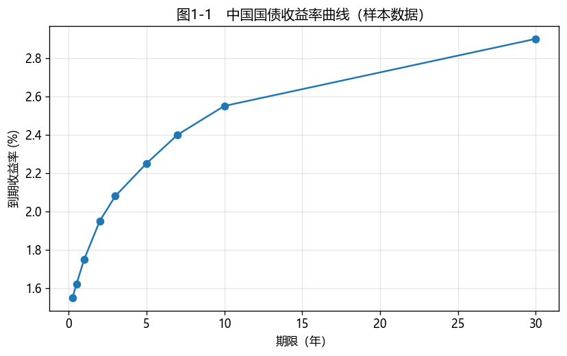

# 第1章　固定收益证券与中国债券市场概述

[](https://colab.research.google.com/github/albertandking/fixed-income/blob/main/notebooks/ch01_fi_overview.ipynb) [](https://mybinder.org/v2/gh/albertandking/fixed-income/main?labpath=notebooks/ch01_fi_overview.ipynb)

!!! info "配套代码"
    本章末尾用 `fi.data` 加载内置国债收益率曲线样本并画出第一张图；环境搭建详见[附录A](../appendix/a-setup.md)。

## 1.1 本章导读与学习目标

**欢迎来到固定收益的世界。** 如果说股票是"分享企业成长的不确定收益"，那么债券就是"约定好的、白纸黑字的现金流"。正是这份"确定性"，让债券市场成为现代金融体系的**地基**：政府和企业在这里融资，全社会的利率在这里定价，货币政策从这里传导到实体经济。本章先俯瞰全景——固定收益市场是什么、在中国如何组织、由谁监管、利率体系如何运转——再带你搭好 Python 环境，画出本书的第一张收益率曲线。

!!! abstract "学习目标"
    学完本章，你应能：

    1. 说明固定收益市场在中国金融体系中的**地位与四大核心功能**（融资、定价基准、流动性管理、货币政策传导）；
    2. 归纳固定收益证券的**三类特征**（基础性、现金流、风险收益）；
    3. 描述中国债券市场的**结构**（银行间 vs 交易所）、**主要品种**与**多头监管**格局；
    4. 认识中国的**政策利率与基准利率体系**（OMO、MLF、LPR、SHIBOR、DR007、利率走廊）；
    5. 搭好可复现的 Python 计算环境（uv + akshare/tushare + QuantLib），并完成第一张收益率曲线图。

---

!!! note "本章知识结构"
    **市场地位与四大功能**（1.2，融资/定价基准/流动性管理/货币政策传导）
    　↓
    **三类特征**（1.3，基础性/现金流/风险收益）
    　↓
    **市场结构与品种**（1.4，银行间为主体、利率债/信用债）→ **多头监管**（1.5）
    　↓
    **政策利率与基准体系**（1.6，OMO/MLF/LPR/SHIBOR/DR007/利率走廊）→ 环境搭建与第一张曲线（1.7）

## 1.2 固定收益市场在中国金融体系中的地位

**固定收益证券**是发行人承诺按约定的时间、金额，向投资者支付利息并偿还本金的债务工具。与股权"分享剩余收益、承担经营风险"不同，债券是**债权**：现金流事先约定、求偿顺序优先。

中国债券市场的存量规模已达**百万亿元量级，位居全球第二**（仅次于美国），是实体经济最重要的直接融资渠道之一。它承担四大核心功能：

| 功能 | 含义 |
|---|---|
| **融资** | 政府（国债、地方债）与企业（信用债）直接从市场获得中长期资金 |
| **定价基准** | 国债收益率曲线是全社会的**无风险利率基准**，股票、贷款、衍生品等无不以它为锚 |
| **流动性管理** | 机构通过回购、货币市场工具调剂短期头寸（第8章） |
| **货币政策传导** | 央行通过公开市场操作影响债市利率，再传导到信贷与实体经济 |

!!! note "为什么学固收要从“基准”二字理解"
    国债收益率曲线被称为"金融市场的标尺"。任何带风险的资产，其要求回报都可拆成"无风险利率 + 风险溢价"。学好固定收益，本质是学会读懂并使用这把标尺。

### 1.2.1 直接融资与中国的"贷款主导"特征

实体经济获得资金有两条路：**间接融资**（通过银行贷款）与**直接融资**（在市场上发债、发股）。长期以来中国是典型的**银行主导、间接融资为主**的金融体系，但债券作为直接融资的主力，占社会融资规模的比重持续上升——债券市场的发育程度，某种意义上衡量着一国金融市场化的深度。

理解这一背景很重要：它解释了为什么中国债市的**银行间市场**（机构间批发市场，由银行主导）远比交易所零售市场更重要（1.4 节），也解释了为什么**货币政策通过债市与银行体系传导**的链条如此关键（1.6 节）。

!!! warning "误区：债券 = 无风险？"
    初学者常把"固定收益"误读为"保本保收益"。**这是错的。** "固定"指的是现金流的**约定方式**（事先约定金额与时点），不是"没有风险"。即便是国债，价格也会随利率波动（**利率风险**，第6章）；信用债还面临**违约风险**（第12章）。把"固定收益"理解成"收益确定"，是固收投资亏损的第一来源。

---

## 1.3 固定收益证券的三类特征

### 1.3.1 基础性特征

- **票面面值（Face/Par）**：到期偿还的本金，国内多为每张 100 元。
- **票面利率与付息方式**：固定利率、浮动利率（基准 + 利差，第9章）、零息（贴现发行）；付息频率有按年、按半年、按季。
- **到期期限**：短期（≤1 年）、中期（1–10 年）、长期（>10 年）。

### 1.3.2 现金流特征

- **现金流的确定性**：理论上无违约时，利息与本金事先确定；实践中受**嵌入期权**（可赎回/可转，第10–11章）与**信用风险**（第12章）影响。
- **现金流的分布模式**：
    - **子弹型**：到期一次还本，期间付息（最常见）；
    - **分期偿还型**：到期前分期还本（如 MBS/ABS，第13章）；
    - **年金型**：每期等额本息。

### 1.3.3 风险收益特征

- **收益相对稳定**：相比股票，波动更小；收益来自**票息**与**资本利得**两部分。
- **优先偿付地位**：破产清算中，债权人求偿顺序优先于股东。
- **主要风险**：利率风险（价格与利率反向，第6章）、信用风险（第12章）、流动性风险、购买力（通胀）风险、再投资风险（第4章）。

!!! example "例1.1：一只国债的现金流"
    面值 100 元、票面利率 3%、年付息、剩余 3 年的国债，其约定现金流为：

    | 时间（年） | 现金流 | 构成 |
    |---|---|---|
    | 1 | 3 | 票息 |
    | 2 | 3 | 票息 |
    | 3 | 103 | 票息 + 本金 |

    "给这串事先约定的现金流定价"就是第3章的全部内容；"这串现金流对利率有多敏感"则是第6章的久期。

---

## 1.4 中国债券市场结构与主要品种

### 1.4.1 按市场划分

| 市场 | 参与者 | 地位 |
|---|---|---|
| **银行间债券市场** | 银行、保险、基金、券商等机构 | **绝对主体**（存量与成交占比约九成） |
| **交易所市场**（沪/深） | 机构 + 个人投资者 | 公司债、可转债、部分国债与地方债 |
| 商业银行柜台 | 个人/企业 | 储蓄国债等零售渠道 |

### 1.4.2 按发行人划分

固定收益证券通常先按信用属性分为**利率债**与**信用债**：

- **利率债**（几乎无信用风险，以国家信用为背书）：
    - 国债（财政部）、地方政府债、政策性金融债（国开行、农发行、进出口行）、央行票据。
- **信用债**（含信用风险，需评级与利差补偿）：
    - 商业银行金融债、企业债、公司债、中期票据（MTN）、短融/超短融（CP/SCP）、资产支持证券（ABS）。

利率债与信用债的收益率之差，就是**信用利差（credit spread）**——它是市场对违约风险与流动性差异的定价，也是信用债投资的核心收益与风险来源（第12章）。一个有趣的中间地带是**国开债（政策性金融债）**：它几乎无信用风险，却因税收待遇与流动性差异，收益率系统性高于同期限国债，二者之差（"国开—国债利差"）本身就是一个被广泛交易的标的（第3章案例）。

### 1.4.3 按计息方式划分

固定利率债、浮动利率债（第9章）、零息（贴现）债。

---

## 1.5 中国债券市场的发展与多头监管

中国债券市场的发展，是一部"从无到有、从分割到统一、从封闭到开放"的历史：

- **1981 年**恢复国债发行，债券市场重新起步；
- **1997 年**商业银行退出交易所、成立**银行间债券市场**，奠定了"银行间为主体"的格局延续至今；
- **2000 年代**品种持续创新——短融、中票、企业债、公司债、ABS 陆续登场，信用债市场成形；
- **2014 年**"11 超日债"成为公募债首单实质性违约，**打破刚性兑付**，信用风险定价开始真正发挥作用（第12章）；
- **2017 年**"债券通"（北向通）开通，境外机构可经香港便捷投资内地债市，对外开放提速；
- 此后中国国债被纳入彭博巴克莱、摩根大通、富时罗素等主要国际债券指数，外资配置持续增加。

市场监管呈**多头格局**，不同品种归口不同部门：

| 监管/自律主体 | 主要职责品种 |
|---|---|
| 中国人民银行 | 银行间市场、货币政策 |
| 财政部 | 国债、地方政府债 |
| 国家发改委 | 企业债 |
| 中国证监会 | 交易所市场、公司债 |
| 交易商协会（NAFMII） | 中票、短融/超短融（注册制自律管理） |

!!! note "多头格局的影响"
    同样是"企业借钱"，公司债（证监会）、企业债（发改委）、中票（交易商协会）的发行与监管规则不同。理解这套分工，才能看懂中国信用债的品种谱系与定价差异。

---

## 1.6 中国政策利率与基准利率体系

利率是固定收益的灵魂。中国已形成一套**政策利率 → 市场基准利率**的传导体系：

| 层次 | 利率 | 角色 |
|---|---|---|
| **政策利率** | 7 天逆回购（OMO）利率 | **主要政策利率**，央行公开市场操作的中枢 |
| | 中期借贷便利（MLF） | 投放中期流动性 |
| **市场基准** | DR007 / R007 | 银行间质押回购利率，资金面指标（第8章） |
| | SHIBOR | 上海银行间同业拆放利率 |
| | LPR | 贷款市场报价利率，由报价行在 OMO 利率基础上加点形成 |
| | 国债收益率曲线 | 无风险利率基准（第5章） |

**利率走廊**框定短端利率的波动区间：

- **上限**：常备借贷便利（SLF）利率——机构缺钱时向央行融资的"封顶"成本；
- **下限**：超额存款准备金利率——机构把钱放央行的"保底"收益；
- **中枢**：7 天逆回购（OMO）利率，DR007 围绕它波动。

!!! note "LPR 的"锚"在变：从 MLF 到公开市场操作"
    2019 年 LPR 改革后，LPR 长期"在 1 年期 MLF 利率基础上加点"形成；但 2024 年央行进一步淡化 MLF 的政策利率色彩，明确以 **7 天逆回购利率为主要政策利率**，LPR 的报价参考也更多转向公开市场操作利率。这一演变说明：利率体系是**动态的制度安排**，读本书时若与最新政策表述有出入，应以央行当期口径为准——但"政策利率 → 市场基准 → 实体利率"的**传导骨架**长期稳定。

!!! tip "把利率体系和后续章节连起来"
    - DR007 / 回购利率 → 第8章货币市场与套息；
    - LPR / SHIBOR → 第9章浮息债基准；
    - 国债收益率曲线 → 第5章期限结构、第14–16章衍生品定价。

---

## 1.7 Python 计算环境与第一张收益率曲线

本书用 **uv** 管理环境与依赖，数据优先使用**免费**的 akshare/tushare 与内置离线样本，衍生品定价用 QuantLib。完整安装见[附录A](../appendix/a-setup.md)，一行命令装齐：

```bash
uv sync --extra all     # 装齐 data + quantlib + opt + book + pytest
```

复用包 `fi` 把全书共用的逻辑（数据、定价、风险、绘图等）封装起来，正文与每章 notebook 都通过 `from fi import ...` 调用。下面是本书的"Hello, World"——加载内置的中国国债收益率曲线样本并画出来：

```python
from fi import data, plotting

curve = data.load_sample("cgb_yield_curve")   # 内置离线样本：期限 vs 到期收益率(%)
plotting.use_chinese_style()

fig, ax = plotting.new_axes()
ax.plot(curve["tenor"], curve["yield_pct"], marker="o")
ax.set_xlabel("期限（年）"); ax.set_ylabel("到期收益率 (%)")
ax.set_title("图1-1　中国国债收益率曲线（样本数据）")
```

<figure markdown>
  { width="640" }
  <figcaption>图1-1　中国国债收益率曲线（样本数据）</figcaption>
</figure>

运行后你会看到一条**向上倾斜**的曲线：短端利率低、长端利率高——这是收益率曲线最常见的形态，背后是期限溢价与对未来利率的预期（第5章详解）。这条曲线，就是后面所有定价与风险分析的起点。

!!! note "样本数据 vs 真实数据"
    内置样本用于离线教学演示，并非真实行情。要抓取真实的中国国债收益率，可用 akshare（见[附录C](../appendix/c-data-sources.md)），把案例换成最新市场数据。

---

## 1.8 习题与编程实验

**概念题**

1. 用一句话区分债券与股票，并说明为什么国债收益率曲线被称为"无风险利率基准"。
2. 列举固定收益市场的四大核心功能，并各举一个中国市场的例子。
3. 同样是企业借钱，公司债、企业债、中期票据分别归哪个部门监管？这种多头格局对投资者意味着什么？
4. 画出中国利率走廊的"上限—中枢—下限"，分别对应哪个利率？DR007 在其中扮演什么角色？

**编程实验**

5. 完成环境搭建（`uv sync --extra all`），运行 1.7 的代码画出国债收益率曲线，并用 `print` 确认 `fi`、`numpy`、`pandas`、`QuantLib` 均可导入及其版本。
6. 修改 1.7 的代码，在同一张图上叠加一条"假设全曲线整体上行 50bp"的曲线，直观感受平行移动。
7. 用 akshare 抓取一条**真实**的中国国债收益率曲线（见附录C），与内置样本对比形态差异。

---

## 1.9 习题参考答案与详解

!!! tip "完整可运行解答 notebook"
    本节编程实验的**完整可运行代码**见 [`notebooks/solutions/ch01_solutions.ipynb`](https://colab.research.google.com/github/albertandking/fixed-income/blob/main/notebooks/solutions/ch01_solutions.ipynb)（点击徽章可在 Colab 直接运行）。

!!! success "概念题 1"
    **债券是债权、股票是股权**：债券是发行人承诺按约定时间/金额还本付息的**债务合同**（现金流事先约定、求偿优先、收益相对确定），股票是分享企业剩余收益、承担经营风险的**所有权凭证**。
    国债收益率曲线被称为**无风险利率基准**，是因为国债以国家信用背书、几乎无违约风险，其收益率代表"纯粹的时间价值"；任何带风险资产的要求回报都可拆成"无风险利率 + 风险溢价"，国债曲线就是那把度量一切资产的"标尺"。

!!! success "概念题 2"
    四大核心功能与中国例子：① **融资**——财政部发国债、企业发信用债直接募资；② **定价基准**——10 年期国债收益率是房贷、理财、股票估值的锚；③ **流动性管理**——机构用质押式回购、同业存单调剂头寸（第8章）；④ **货币政策传导**——央行通过公开市场操作（7 天逆回购）影响 DR007，再传导到 LPR 与信贷。

!!! success "概念题 3"
    **公司债→证监会**（交易所），**企业债→发改委**，**中期票据→交易商协会**（银行间，注册制自律管理）。这种**多头监管**意味着：同样是企业借钱，不同品种的发行门槛、信息披露、投资者结构、流动性都不同；投资者要看清"品种归口"才能理解其定价与利差差异（如同一发行人的公司债与中票可能利差不同）。

!!! success "概念题 4"
    中国**利率走廊**：**上限 = 常备借贷便利（SLF）利率**（机构缺钱时向央行融资的封顶成本）；**下限 = 超额存款准备金利率**（资金放央行的保底收益）；**中枢 = 7 天逆回购（OMO）利率**。**DR007**（存款类机构利率债质押回购利率）围绕中枢波动，是观察"资金面"松紧最重要的市场指标，也是央行重点培育的基准。

!!! success "编程实验 5–7（思路与要点）"
    - **实验 5**：`uv sync --extra all` 后运行 1.7 代码即得国债曲线；版本自检见 notebook ch01 第一格（应打印 Python 3.14、fi 0.1.0、numpy/pandas/QuantLib 版本号）。
    - **实验 6**：把 `curve["yield_pct"] + 0.50` 再画一条线即得平行上移 50bp 的曲线——两条线上下平移、形状不变，直观展示"平行移动"（第6章久期度量的正是这种移动）。
    - **实验 7**：用 `akshare`（附录C）取真实中债国债收益率，与内置样本对比：真实曲线形态会随市场变化（可能更平、倒挂或驼峰），而内置样本是固定的示意上行曲线。重点观察**短端、长端利差**与**曲线斜率**的差异。

---

## 1.10 本章小结

- 固定收益证券是**约定现金流的债权工具**；中国债券市场规模全球第二，承担**融资、定价基准、流动性管理、货币政策传导**四大功能。
- 债券有**基础性、现金流、风险收益**三类特征；现金流分子弹型、分期偿还型、年金型。
- 中国债市以**银行间市场为主体**、交易所为补充；品种先分**利率债 / 信用债**；监管呈**多头格局**。
- 政策利率以 **7 天逆回购利率**为中枢，经 DR007、SHIBOR、LPR、国债收益率曲线传导；**利率走廊**以 SLF 为上限、超额准备金利率为下限。
- 本书用 **uv + akshare/tushare + QuantLib** 搭建可复现环境，复用包 `fi` 贯穿全书；你已经画出了第一张收益率曲线。

下一章（第2章）将打牢定价的数学地基——货币时间价值、计息惯例与应计利息，为第3章的债券定价做准备。

!!! note "知识点自测清单"
    学完本章，逐条自检（能流利讲出即过关）：

    - [ ] 一句话区分债券与股票，并解释为何国债收益率曲线是"无风险利率基准"
    - [ ] 列举固定收益市场的**四大核心功能**，各举一个中国例子
    - [ ] 说清**利率债 vs 信用债**、**银行间 vs 交易所市场**的区别
    - [ ] 公司债 / 企业债 / 中票分别归哪个部门监管（多头格局）
    - [ ] 画出**利率走廊**上限/中枢/下限，说明 DR007 的角色
    - [ ] 一行命令搭好环境并画出国债收益率曲线
    - [ ] 破除"固定收益 = 无风险"的误区

!!! quote "延伸阅读"
    - Fabozzi, *Bond Markets, Analysis, and Strategies*，第 1 章"Introduction"与关于债券市场参与者、品种的章节；
    - 中国人民银行《中国金融市场发展报告》、《货币政策执行报告》——了解中国债市规模、结构与政策利率体系的权威口径；
    - 中央结算公司（中债登）、上海清算所年度统计——中国债券市场存量、品种与持有者结构数据。
