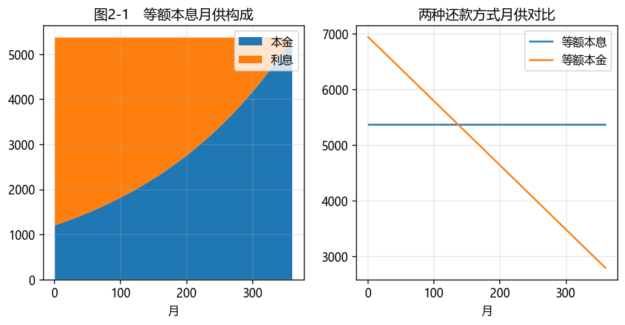

# 第2章　计息惯例、现金流与货币时间价值

[](https://colab.research.google.com/github/albertandking/fixed-income/blob/main/notebooks/ch02_time_value.ipynb) [](https://mybinder.org/v2/gh/albertandking/fixed-income/main?labpath=notebooks/ch02_time_value.ipynb)

!!! info "配套代码"
    本章时间价值、计息惯例与应计利息均由 `fi.cashflow` 实现，并与 QuantLib 的 `DayCounter` 对拍；案例（房贷计算器、国债应计利息）可离线运行。

## 2.1 本章导读与学习目标

**第3章要给债券定价，但定价的两块地基必须先打牢。** 第一块是**货币的时间价值**——"今天的 1 元钱比明年的 1 元钱值钱"，这是所有折现的出发点。第二块是看似琐碎、实则处处是坑的**计息惯例（day count）**：同样持有 184 天，按不同惯例算出来的利息可以差好几分钱；交易对手报的是**净价**，你实际付的却是**全价**，差额就是**应计利息**。本章把这两块地基夯实，第3章的定价才稳。

!!! abstract "学习目标"
    学完本章，你应能：

    1. 掌握**现值、终值与年金**的离散复利公式，并用 Python 折现任意现金流；
    2. 用年金公式计算**等额本息还款额**（房贷计算器）；
    3. 说清主流**计息惯例**（ACT/ACT、ACT/365、ACT/360、30/360）的差异，知道中国债市的惯例；
    4. 区分**净价、全价与应计利息**，计算给定结算日的应计利息与全价；
    5. 用 `fi.cashflow` 与 QuantLib `Schedule`/`DayCounter` 两条路径计算并相互验证。

---

## 2.2 现值、终值与折现

设年利率 $r$、每年复利 $k$ 次，则每期利率为 $r/k$，$t$ 年共 $kt$ 期。

**终值（Future Value）**——今天的 $PV$ 在 $t$ 年后变成：

$$FV=PV\left(1+\frac{r}{k}\right)^{kt}$$

**现值（Present Value）**——$t$ 年后的 $FV$ 折回今天：

$$\boxed{\;PV=\frac{FV}{\left(1+\dfrac{r}{k}\right)^{kt}}\;}$$

折现是定价的核心动作：**把不同时点的现金流，统一折算到今天再比较或加总**。对一串现金流 $CF_i$（发生在 $t_i$ 年），其现值就是逐笔折现之和 $\sum_i CF_i(1+r/k)^{-k t_i}$——这正是第3章债券定价公式的来源。

!!! example "例2.1：终值与现值"
    年利率 5%、按年复利（$k=1$）：

    - 100 元 3 年后的终值：$FV=100\times1.05^{3}=115.7625$ 元；
    - 反过来，3 年后的 115.7625 元，今天的现值：$PV=115.7625/1.05^{3}=100.0000$ 元。

    复利次数 $k$ 越大，终值越高（利滚利更频繁）；这也是为什么比较利率必须说清复利频率。

---

## 2.3 年金与等额本息

**普通年金**指每期末等额支付。每期支付 $\text{pmt}$、共 $N$ 期、每期利率 $i=r/k$。把每期支付各自折现再相加：

$$PV=\sum_{j=1}^{N}\frac{\text{pmt}}{(1+i)^{j}}=\text{pmt}\sum_{j=1}^{N}(1+i)^{-j}$$

括号内是首项 $(1+i)^{-1}$、公比 $(1+i)^{-1}$ 的等比数列，求和得到**闭式解**：

$$\boxed{\;PV=\text{pmt}\cdot\frac{1-(1+i)^{-N}}{i}\;}$$

这个公式把"$N$ 笔等额现金流"压缩成一个表达式，避免逐笔累加——它是房贷、年金险、附息债票息部分定价（第3章年金法）的共同基石。

反过来，已知现值（如贷款本金）求每期还款额，就是**等额本息（等额年金）**：

$$\boxed{\;\text{pmt}=PV\cdot\frac{i}{1-(1+i)^{-N}}\;}$$

这正是房贷"等额本息"月供的计算公式。（"等额本金"则是每月还固定本金 + 剩余本金利息，月供递减，本章案例与习题对比二者。）

!!! example "例2.2：房贷月供"
    贷款 100 万元，期限 30 年，年利率 5%，按月还款（$k=12$，$N=360$，$i=0.05/12$）：

    $$\text{pmt}=1{,}000{,}000\times\frac{0.05/12}{1-(1+0.05/12)^{-360}}=5{,}368.22\text{ 元/月}$$

    30 年总还款约 $5{,}368.22\times360=1{,}932{,}557.84$ 元，其中利息约 93 万元——**利息几乎等于本金**，这就是长期复利的威力（与代价）。

---

## 2.4 计息惯例（Day Count Conventions）

利息 = 本金 × 利率 × **计息时间**。"计息时间"听起来简单，但"一年算 365 天还是 360 天""一个月算 30 天还是实际天数"——不同约定（**day count convention**）算出的年化分数不同，利息也就不同。常见惯例：

| 惯例 | 年化分数 = | 用途 |
|---|---|---|
| **ACT/ACT** | 实际天数 / 实际年天数（按年拆分，闰年 366） | 国债、政金债（中国银行间利率债主流） |
| **ACT/365**（Fixed） | 实际天数 / 365 | 部分货币市场 |
| **ACT/360** | 实际天数 / 360 | 货币市场、回购（部分） |
| **30/360** | 每月按 30 天、每年 360 天 | 部分信用债、互换固定端 |

!!! note "为什么会有"一年 360 天"这种奇怪约定"
    30/360 和 ACT/360 是历史的产物。在没有计算机的年代，"每月 30 天、每年 360 天"让利息计算变得极其简单——任意两个日期间的天数 $=360\times\Delta\text{年}+30\times\Delta\text{月}+\Delta\text{日}$，心算即可，且 360 能被 2/3/4/6/12 整除，分摊方便。这套"银行家惯例"沿用至今，成了某些券种与衍生品的合同标准。**它不是更准确，只是更省事**——这提醒我们：计息惯例是**约定**，不是自然规律，一切以合同为准。
    从 2026-03-15 到 2026-09-15，实际 184 天（2026 非闰年）：

    | 惯例 | 年化分数 |
    |---|---|
    | ACT/ACT | 0.504110 |
    | ACT/365 | 0.504110 |
    | ACT/360 | 0.511111 |
    | 30/360 | 0.500000 |

    注意：本例 **ACT/ACT 与 ACT/365 恰好相等**——因为整段都落在非闰年 2026 内，分母都是 365。**一旦计息区间跨越闰年或年度边界，二者就会分叉**（ACT/ACT 对闰年用 366 拆分）。这正是"30/360 与实际/实际在跨付息日时差异"这一问题的核心。

!!! warning "惯例选错 = 利息算错"
    计息惯例不是数学细节，而是合同条款。用错惯例会系统性地高估或低估利息与应计，金额虽小，但在大额、长期、跨闰年的交易里会累积成真金白银的差错。务必以发行条款 / 主协议约定为准。

---

## 2.5 净价、全价与应计利息

债券在两个付息日之间成交时，买方要把"卖方已持有但尚未到账的那段利息"补给卖方，这就是**应计利息（Accrued Interest, AI）**：

$$\text{AI}=\underbrace{\frac{\text{面值}\times\text{票面利率}}{k}}_{\text{当期票息}}\times\frac{\text{已计息天数（按惯例）}}{\text{完整付息期天数（按惯例）}}$$

于是有两个价格：

$$\boxed{\;P_{\text{全价（dirty）}}=P_{\text{净价（clean）}}+\text{AI}\;}$$

**中国债市惯例：净价报价、全价结算**——行情显示净价（剔除应计、便于横向比较），资金交收用全价。

!!! example "例2.4：国债应计利息"
    某国债面值 100、票面利率 3%、半年付息（$k=2$），上一付息日 2026-03-15、下一付息日 2026-09-15，结算日 2026-06-15，计息惯例 ACT/ACT。

    - 当期票息：$100\times3\%/2=1.50$ 元；
    - 已计息 92 天，完整付息期 184 天；
    - **应计利息**：$1.50\times\dfrac{92}{184}=0.75$ 元。

    若该券净价报 99.50，则全价 = $99.50+0.75=100.25$，买方每百元面值实付 100.25 元。

---

## 2.6 Python 实现：`fi.cashflow`

```python
import datetime as dt
from fi import cashflow as cf

# 时间价值（例2.1）
cf.future_value(100, 0.05, years=3)            # 115.7625
cf.present_value(115.7625, 0.05, years=3)      # 100.0

# 房贷等额本息月供（例2.2）
cf.annuity_payment(1_000_000, 0.05, n_periods=360, freq=12)   # 5368.22

# 计息惯例（例2.3）
s, e = dt.date(2026, 3, 15), dt.date(2026, 9, 15)
cf.year_fraction(s, e, "ACT/ACT")   # 0.504110
cf.year_fraction(s, e, "30/360")    # 0.500000

# 应计利息（例2.4）
cf.accrued_interest(dt.date(2026, 6, 15), dt.date(2026, 3, 15), dt.date(2026, 9, 15),
                    coupon_rate=0.03, freq=2, face=100, convention="ACT/ACT")   # 0.75
```

`year_fraction` 对 ACT/ACT 按日历年拆分（闰年用 366）；`accrued_interest` 用"已计息分数 / 完整付息期分数"折算当期票息，对任意惯例都自洽。

---

## 2.7 QuantLib 实现：`Schedule` 与 `DayCounter`

QuantLib 用 `DayCounter` 表示计息惯例、`Schedule` 生成付息日序列，可与 `fi.cashflow` 对拍：

```python
import QuantLib as ql

d1, d2 = ql.Date(15, 3, 2026), ql.Date(15, 9, 2026)
ql.ActualActual(ql.ActualActual.ISDA).yearFraction(d1, d2)   # 0.50411  ← 与 fi 一致
ql.Actual365Fixed().yearFraction(d1, d2)                     # 0.50411
ql.Thirty360(ql.Thirty360.USA).yearFraction(d1, d2)          # 0.5

# 生成半年付息的付息日序列（用 Unadjusted 保持名义付息日，便于与教科书应计对齐）
sched = ql.Schedule(ql.Date(15, 3, 2026), ql.Date(15, 3, 2029), ql.Period(ql.Semiannual),
                    ql.NullCalendar(), ql.Unadjusted, ql.Unadjusted,
                    ql.DateGeneration.Backward, False)
list(sched)   # [2026-03-15, 2026-09-15, 2027-03-15, ...]

bond = ql.FixedRateBond(0, 100.0, sched, [0.03], ql.ActualActual(ql.ActualActual.ISMA))
bond.accruedAmount(ql.Date(15, 6, 2026))   # 0.75，与 fi.accrued_interest 一致
```

!!! tip "两个对拍陷阱：子约定与营业日调整"
    1. **ACT/ACT 子约定**：`ActualActual` 区分 ISDA / ISMA(ICMA) / Bond，在跨期与末端处理上不同。做应计/定价对拍时两端务必用**同一子约定**。
    2. **营业日调整**：若用 `China(IB)` 日历 + `Following`，名义付息日 2026-03-15（周日）会被顺延到 03-16，付息期从 184 天变成 183 天，应计随之偏离教科书值。要复现"名义付息日"的应计，需用 `NullCalendar` + `Unadjusted`。定位这类差异本身就是很好的练习。

---

## 2.8 案例：房贷还款计算器与国债应计利息

配套 notebook 实现两个实用工具：

1. **房贷还款计算器**：输入贷款金额、年限、利率，输出等额本息月供与还款明细（本金/利息逐月拆分），并与**等额本金**方式对比总利息——直观看到"等额本息前期还的几乎全是利息"。
2. **国债应计利息计算器**：输入票面、票息、付息频率、上/下付息日与结算日，按 ACT/ACT 计算应计利息与全价，并与 QuantLib `bond.accruedAmount()` 对拍。

<figure markdown>
  { width="760" }
  <figcaption>图2-1　左：等额本息月供的本金/利息构成（前期几乎全是利息）；右：等额本息 vs 等额本金月供对比</figcaption>
</figure>

**要点**：

- 等额本息月供恒定但前期利息占比高；等额本金月供递减、总利息更少——选择取决于现金流偏好；
- 应计利息让"净价可比、全价交收"成为可能；跨闰年的付息期会让 ACT/ACT 与 ACT/365 的应计出现细微但真实的差异。

---

## 2.9 习题与编程实验

**概念题**

1. 解释"货币时间价值"，并说明为什么比较两个利率必须说清复利频率。
2. ACT/ACT 与 ACT/365 在什么情况下结果相同？什么情况下不同？为什么 30/360 与"实际/实际"在跨付息日时会产生差异？
3. 净价与全价相差什么？为什么中国债市采用"净价报价、全价结算"？

**计算题**

4. 年利率 4.9%、按月复利，存入 5 万元，10 年后的终值是多少？
5. 某国债面值 100、票面利率 2.8%、半年付息，上一付息日 2026-01-20、下一付息日 2026-07-20，结算日 2026-05-06，按 ACT/ACT 计算应计利息；若净价报 101.20，求全价。

**编程实验**

6. 用 `fi.cashflow` 写一个房贷计算器：给定金额/年限/利率，输出等额本息月供与逐月本金/利息明细，并画出"本金 vs 利息"的逐月构成图。
7. 用 `fi.cashflow.year_fraction` 复现例2.3，再取一段**跨闰年**的区间（如 2027-12-15 → 2028-06-15），比较 ACT/ACT 与 ACT/365 的差异并解释。
8. 实现一个支持多种计息惯例的应计利息函数，并对一只真实国债与 QuantLib `bond.accruedAmount()` 对拍，给出误差报告。

---

## 2.10 习题参考答案与详解

!!! tip "完整可运行解答 notebook"
    本节编程实验的**完整可运行代码**见 [`notebooks/solutions/ch02_solutions.ipynb`](https://colab.research.google.com/github/albertandking/fixed-income/blob/main/notebooks/solutions/ch02_solutions.ipynb)（点击徽章可在 Colab 直接运行）。

!!! success "概念题 1"
    **货币时间价值**：同等金额的钱，越早到手越值钱，因为它能再投资生息——所以未来现金流必须**折现**到今天才能比较与加总。
    比较两个利率必须说清**复利频率**，因为同一个名义年利率，复利越频繁、实际收益越高（如 12% 按月复利的实际年利率 ≈ 12.68% > 按年复利的 12%）。不指明频率的利率无法直接比较。

!!! success "概念题 2"
    - **ACT/ACT 与 ACT/365 何时相同**：当计息区间**完全落在同一非闰年内**时，二者分母都是 365，结果相同（如例2.3 的 2026 年内区间）。**何时不同**：区间**跨越闰年或年度边界**时，ACT/ACT 对闰年部分用 366 拆分，ACT/365 始终用 365，二者分叉（习题 7 的 2027-12-15→2028-06-15 即如此）。
    - **30/360 与实际/实际跨付息日差异**：30/360 把每月当 30 天、每年 360 天，而实际/实际数真实天数。当付息期实际天数 ≠ 180/360 时（多数情况），两者算出的应计分数不同——惯例是**约定**，不是事实。

!!! success "概念题 3"
    **全价 = 净价 + 应计利息**。净价剔除了"自上次付息以来累积、尚未支付"的利息，便于横向比较不同券的"干净"价格；全价才是实际资金交收额。中国债市**净价报价**（行情屏显示净价，可比性好）、**全价结算**（买方实付全价，把应计利息补给卖方）——这样报价干净、交收公平。

!!! success "计算题 4"
    按月复利，$k=12$、$n=10$ 年、$i=0.049/12$：

    $$FV=50000\times\left(1+\frac{0.049}{12}\right)^{120}=\mathbf{81{,}534.42}\text{ 元}$$

    （用 `fi.cashflow.future_value(50000, 0.049, 10, freq=12)` 验证。）

!!! success "计算题 5"
    当期票息 $=100\times2.8\%/2=1.40$ 元。从上一付息日 2026-01-20 到结算日 2026-05-06 实际 **106 天**，整个付息期 2026-01-20→2026-07-20 实际 **181 天**（ACT/ACT）：

    $$\text{应计利息}=1.40\times\frac{106}{181}=\mathbf{0.8199}\text{ 元},\qquad \text{全价}=101.20+0.8199=\mathbf{102.0199}$$

    （用 `fi.cashflow.accrued_interest(...)` 验证。）

!!! success "编程实验 6–8（要点）"
    - **实验 6**：用 `annuity_payment` 求月供，逐月 `利息=余额×i`、`本金=月供−利息`、`余额−=本金`；构成图见图2-1（前期几乎全是利息）。
    - **实验 7**：`year_fraction(2027-12-15, 2028-06-15, "ACT/ACT")` ≈ 0.5007、`"ACT/365"` ≈ 0.5014——因区间跨入闰年 2028，ACT/ACT 对 2028 部分按 366 折算，二者出现千分位差异。
    - **实验 8**：自写应计函数（票息 × 已计息分数 / 付息期分数）与 QuantLib `bond.accruedAmount()` 对拍——注意用 `NullCalendar`+`Unadjusted` 避免营业日调整，并对齐 ActualActual 子约定（见 2.7 节 tip），否则会有看似 bug 的差异。

---

## 2.11 本章小结

- **货币时间价值**是折现的基石：$PV=FV(1+r/k)^{-kt}$；一串现金流的现值就是逐笔折现之和（第3章定价的来源）。
- **年金**公式把等额现金流与现值连起来；等额本息月供 $=PV\cdot i/[1-(1+i)^{-N}]$。
- **计息惯例**决定"计息时间"：ACT/ACT、ACT/365、ACT/360、30/360 算出的年化分数不同；中国利率债主流用 **ACT/ACT**。
- 成交价分**净价（报价）与全价（结算）**，差额为**应计利息** = 当期票息 × 已计息分数 / 完整付息期分数。
- `fi.cashflow` 与 QuantLib `DayCounter`/`Schedule` 结果一致；注意 ACT/ACT 的子约定要对齐。

!!! quote "延伸阅读"
    - Tuckman & Serrat, *Fixed Income Securities*，关于现金流、计息惯例与应计利息的章节；
    - 全国银行间同业拆借中心 / 中央结算公司关于债券**应计利息计算规则**的业务说明；
    - ISDA 主协议中的 day count fraction 定义（ISDA 2006 Definitions）——衍生品计息惯例的权威出处。

下一章（第3章）将把这两块地基组合起来：用时间价值折现、按惯例处理应计，给中国国债与国开债**定价**。
