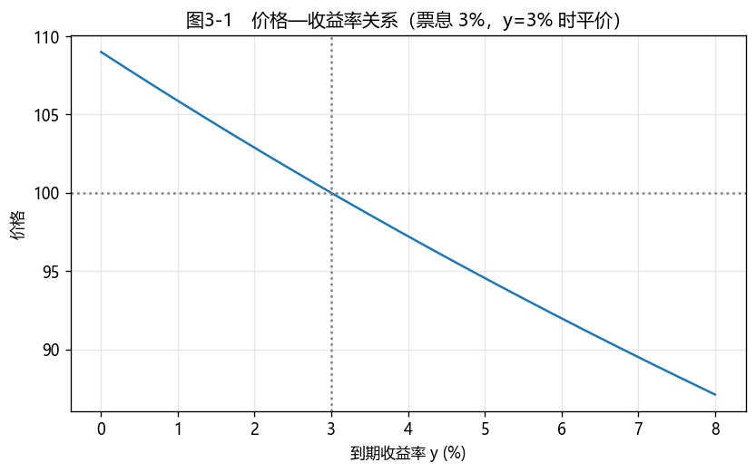
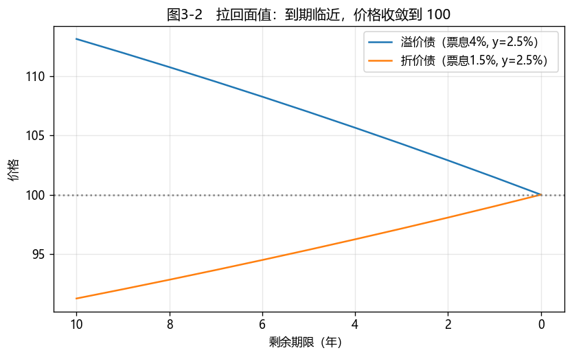

# 第3章　债券定价原理

[](https://colab.research.google.com/github/albertandking/fixed-income/blob/main/notebooks/ch03_bond_pricing.ipynb) [](https://mybinder.org/v2/gh/albertandking/fixed-income/main?labpath=notebooks/ch03_bond_pricing.ipynb)

!!! info "配套代码"
    本章定价均由复用包 `fi.pricing.price_bond` 实现，并与 QuantLib `FixedRateBond` 对拍；案例使用内置数据，离线即可运行。

## 3.1 本章导读与学习目标

**这是全书的第一块基石。** 第1章我们认识了债券这个"事先约定现金流的合同"，第2章学会了货币的时间价值与计息惯例。现在要回答最核心的问题：**一只债券到底值多少钱？** 答案朴素得惊人——**债券的价格，就是它未来全部现金流按合理利率折算到今天的现值之和**。本章把这句话写成公式、用 Python 实现、再用真实的中国国债验证。掌握它，你就握住了后面所有章节（收益率、久期、利差、衍生品）的总开关。

!!! abstract "学习目标"
    学完本章，你应能：

    1. 用**无套利 / 一价定律**解释债券为何等于其现金流现值之和；
    2. 推导附息债与零息债的定价公式，并写出附息债的**年金闭式解**；
    3. 说清**价格与收益率反向变动**，以及**溢价 / 平价 / 折价**三种状态与票息、收益率的关系；
    4. 理解**拉回面值（pull-to-par）**效应；
    5. 区分**净价、全价与应计利息**，了解中国债市"净价报价、全价结算"的惯例；
    6. 用 `fi.pricing.price_bond` 与 QuantLib `FixedRateBond` 两条路径定价并相互验证。

---

## 3.2 债券定价的基本原理：无套利与现金流折现

一只债券无非是一串**事先约定的现金流**：每期票息，到期还本。给它定价的逻辑只有一条——**一价定律（Law of One Price）**：在无套利的市场里，两笔现金流完全相同的资产必须卖同样的价。

**为什么一价定律必然成立？** 用反证法（套利论证）：假设一只债券的市价**低于**其现金流现值，套利者就可以"买入这只低估的债 + 卖出能复制其现金流的零息债组合"，立即锁定无风险利润；反向亦然。逐利的套利者会蜂拥而入，把价格推回到现值——除非市价恰好等于现值，套利机会才消失。**正是套利者的存在，逼着价格等于现值**。这套"复制 + 无套利"的逻辑，是整个固定收益乃至衍生品定价的总纲。

于是，债券的价值就等于"复制它的现金流"所需的成本，也就是把每一笔未来现金流**各自折现到今天再加总**：

$$P=\sum_{i=1}^{n}\frac{CF_i}{(1+r_i)^{t_i}}$$

这里每笔现金流 $CF_i$ 用与其期限 $t_i$ 对应的折现率 $r_i$ 折现。严格做法是用**即期利率曲线**上各期限的利率（第5章），即"逐笔用各自的零息利率折现"。

但实务中常用一个**统一的到期收益率（YTM）$y$** 来折现所有现金流——这就是第4章的主角。本章先采用单一收益率折现，把定价机制讲透。

!!! tip "两种折现率，先有个印象"
    - **逐笔即期利率折现**（第5章）：最严格，每笔现金流用对应期限的零息利率。
    - **单一收益率（YTM）折现**（本章 + 第4章）：用一个 $y$ 折现全部现金流，简洁通用，是报价与交易的语言。
    - 两者在"债券恰好按市价定价"时是自洽的；YTM 可视为对整条曲线的一个"加权平均"概括。

---

## 3.3 债券定价公式推导

### 3.3.1 附息债

设面值 $F$，年票面利率 $c$，每年付息 $k$ 次（每次票息 $C/k=Fc/k$），剩余 $n$ 年（共 $N=nk$ 期），年化到期收益率 $y$。把每期票息和到期本金折现：

$$P=\sum_{j=1}^{N}\frac{Fc/k}{\left(1+\dfrac{y}{k}\right)^{j}}+\frac{F}{\left(1+\dfrac{y}{k}\right)^{N}}$$

前一项是等比数列（年金），可求和得到**闭式解**：

$$\boxed{\;P=\frac{Fc}{k}\cdot\frac{1-\left(1+\dfrac{y}{k}\right)^{-N}}{\dfrac{y}{k}}+F\left(1+\frac{y}{k}\right)^{-N}\;}$$

第一项是"票息年金"的现值，第二项是"到期本金"的现值。

### 3.3.2 零息债

零息债不付息，只在到期日 $T$ 兑付面值 $F$，定价退化为一笔折现：

$$P=\frac{F}{\left(1+\dfrac{y}{k}\right)^{kT}}\quad\xrightarrow{\;k=1\;}\quad P=\frac{F}{(1+y)^{T}}$$

零息债是定价的"原子"——任何附息债都可拆成若干零息债之和（这正是 3.2 的逐笔折现）。

!!! example "例3.1：溢价、平价、折价（同一只债，三种收益率）"
    某国债：面值 100、年付息一次（$k=1$）、票面利率 $c=3\%$、剩余 3 年。分别在 $y=2\%,3\%,4\%$ 下定价。

    用闭式解（以 $y=2\%$ 为例）：

    $$P=3\cdot\frac{1-(1.02)^{-3}}{0.02}+100\,(1.02)^{-3}=3\times2.8839+94.2322=102.8839$$

    三种收益率的结果：

    | 收益率 $y$ | 与票息比较 | 价格 $P$ | 状态 |
    |---|---|---|---|
    | 2% | $y<c$ | **102.8839** | 溢价（premium） |
    | 3% | $y=c$ | **100.0000** | 平价（par） |
    | 4% | $y>c$ | **97.2249** | 折价（discount） |

    **规律**：票息率高于市场要求的收益率时，债券值钱（溢价）；反之折价；恰好相等则平价。

!!! example "例3.2：零息债定价"
    面值 100 的零息债，年化收益率 2.5%（$k=1$）：

    - 1 年期：$P=100/1.025=97.5610$
    - 3 年期：$P=100/1.025^{3}=92.8599$

    期限越长，同等收益率下折现越多、价格越低。

---

## 3.4 价格—收益率关系与拉回面值

### 3.4.1 反向变动

定价公式里 $y$ 在分母，$P$ 是 $y$ 的**减函数**：

$$y\uparrow\;\Longrightarrow\;P\downarrow,\qquad y\downarrow\;\Longrightarrow\;P\uparrow$$

这是固定收益最根本的一条直觉——**利率涨，债券价格跌**。这条曲线不是直线，而是向原点凸出的（凸性，第6章），但单调下降的方向永远成立。

<figure markdown>
  { width="640" }
  <figcaption>图3-1　价格随收益率单调下降；票息 3% 的债在 y=3% 时平价（价格=100）</figcaption>
</figure>

### 3.4.2 溢价/平价/折价的统一判据

$$c>y\Rightarrow P>F\ (\text{溢价}),\qquad c=y\Rightarrow P=F\ (\text{平价}),\qquad c<y\Rightarrow P<F\ (\text{折价})$$

!!! warning "误区：票面利率 ≠ 收益率"
    "票息 5% 的债，收益率就是 5%"——错。**票面利率（coupon rate）**是发行时定下、用来算票息的固定数字，写在债券条款里、永不改变；**到期收益率（yield）**是市场根据当前价格随时变动的折现率。只有当债券**恰好平价**时两者才相等。溢价买入一只高票息债，你的实际收益率低于票面（因为多付的溢价会随拉回面值而损耗）。把票面利率当成投资回报，是债券投资最常见的认知错误。

### 3.4.3 拉回面值（Pull-to-Par）

无论现在溢价还是折价，**只要收益率不变，随着到期日临近，债券价格都会平滑地收敛回面值**——因为到期那一刻偿付的就是面值 $F$。溢价债的价格逐步下行至 100，折价债逐步上行至 100。这个"向面值靠拢"的轨迹就是拉回面值效应，它告诉我们：**持有期收益不仅来自票息，也来自价格向面值的回归**。

<figure markdown>
  { width="640" }
  <figcaption>图3-2　收益率不变时，溢价债与折价债的价格随到期临近都收敛到面值 100</figcaption>
</figure>

!!! note "拉回面值 ≠ 没有风险"
    拉回面值描述的是"收益率不变"的理想轨迹。真实世界里收益率天天变，价格在这条轨迹附近上下波动；波动的幅度由久期决定（第6章）。

---

## 3.5 净价、全价与应计利息

债券在两个付息日之间成交时，买方要补偿卖方"已经持有但还没拿到的那部分利息"，即**应计利息（Accrued Interest, AI）**。于是有两个价格：

$$\underbrace{P_{\text{全价}}}_{\text{dirty / 结算}}=\underbrace{P_{\text{净价}}}_{\text{clean / 报价}}+\;\text{应计利息}$$

**中国债市惯例：净价报价、全价结算**——行情系统显示净价（剔除应计，便于比较），实际资金交收用全价。应计利息按计息惯例（第2章的 day count）计算。

!!! example "例3.3：全价与净价"
    某债净价报价 99.50，距上次付息已过若干天，按计息惯例算得应计利息 1.20，则：

    $$P_{\text{全价}}=99.50+1.20=100.70$$

    买方实际付 100.70（每百元面值），其中 1.20 是替卖方"垫付"的、到下次付息日会拿回的利息。

> 计息惯例与应计利息的精确计算见第2章；本章定价默认在付息日定价（应计为 0），聚焦定价机制本身。

---

## 3.6 Python 实现：`fi.pricing.price_bond`

本书把定价实现为复用函数 `fi.pricing.price_bond(cashflows, times, ytm, freq)`，对任意现金流折现：

```python
from fi.cashflow import make_cashflows
from fi.pricing import price_bond

# 例3.1：3 年期、年付息、票息 3% 的国债
cfs, ts = make_cashflows(coupon_rate=0.03, maturity=3, freq=1, face=100)

for y in (0.02, 0.03, 0.04):
    print(f"y={y:.0%}  P={price_bond(cfs, ts, y, freq=1):.4f}")
# y=2%  P=102.8839   （溢价）
# y=3%  P=100.0000   （平价）
# y=4%  P=97.2249    （折价）

# 例3.2：零息债 = 单笔现金流
price_bond([100], [3], ytm=0.025, freq=1)   # 92.8599
```

`make_cashflows` 生成子弹型附息债的现金流与时间，`price_bond` 用 $(1+y/k)^{-kt}$ 逐笔折现求和——与 3.3 的公式完全一致。

---

## 3.7 QuantLib 实现：`FixedRateBond` 类

QuantLib 用 `FixedRateBond` 封装固息债，定价走"曲线引擎"或"统一收益率"两条路。下面用统一收益率给例3.1 的债（$y=4\%$）算净价，与 `fi.price_bond` 对拍：

```python
import QuantLib as ql

today = ql.Date(15, 6, 2026)
ql.Settings.instance().evaluationDate = today
sched = ql.Schedule(today, today + ql.Period(3, ql.Years), ql.Period(ql.Annual),
                    ql.China(ql.China.IB), ql.Following, ql.Following,
                    ql.DateGeneration.Backward, False)
bond = ql.FixedRateBond(0, 100.0, sched, [0.03], ql.ActualActual(ql.ActualActual.ISDA))
rate = ql.InterestRate(0.04, ql.ActualActual(ql.ActualActual.ISDA), ql.Compounded, ql.Annual)

ql.BondFunctions.cleanPrice(bond, rate)   # 97.2249，与 fi.price_bond 一致
```

!!! tip "对拍是好习惯"
    自写函数 + 成熟库交叉验证，能同时抓出"公式写错"和"库用错"两类 bug。差异通常来自计息惯例、付息频率、结算天数——定位差异本身就是很好的学习。

---

## 3.8 案例：中国国债与国开债定价

我们对比两只 10 年期、年付息、票面利率均为 2.55% 的债：一只**国债（CGB）**，一只**国开债（CDB，政策性金融债）**。国开债因税收与流动性差异，收益率通常比同期限国债高出一个**利差**（约 10–30bp）。设国债收益率 2.55%、国开债收益率 2.75%：

| 券 | 票息 | 收益率 | 价格（每百元） | 状态 |
|---|---|---|---|---|
| 10Y CGB | 2.55% | 2.55% | **100.0000** | 平价 |
| 10Y CDB | 2.55% | 2.75% | **98.2720** | 折价 |

**解读**：

1. 同样的票息，国开债因收益率高 20bp，价格低了约 **1.73 元/百元面值**——这就是"利差"在价格上的体现；
2. 10 年期债对 20bp 利差如此敏感，背后是较长的久期（第6章会精确度量：价格变动 ≈ −久期 × 收益率变动）；
3. 投资国开债相当于多赚 20bp 收益、承担税收与流动性差异——**国债与国开债的利差**本身就是一个重要的交易标的。

配套 notebook 还会画出这只债的**价格—收益率曲线**与**拉回面值**轨迹，并把 `fi.price_bond` 与 QuantLib 的结果列成对拍表（编程实验）。

---

## 3.9 习题与编程实验

**概念题**

1. 用一价定律解释：为什么"债券价格 = 现金流现值之和"？若市价偏离现值，套利者会怎么做？
2. 说明溢价、平价、折价分别对应票息与收益率的什么关系，并解释拉回面值效应。
3. 净价与全价有何区别？中国债市为何"净价报价、全价结算"？

**计算题**

4. 一只 3 年期、年付息、票面利率 4%、面值 100 的国债，分别在 $y=3\%,4\%,5\%$ 下用闭式解手工定价，验证溢价/平价/折价，并与 `fi.price_bond` 对照。
5. 一只 5 年期零息国债，面值 100，市价 88.00，求其到期收益率（年复利）。

**编程实验**

6. 用 `fi.price_bond` 复现例3.1、例3.2，并画出该债券的价格—收益率曲线（$y$ 从 0% 到 8%），直观展示反向变动关系。
7. 取一只溢价债与一只折价债，固定收益率，画出二者价格随剩余期限从 10 年缩短到 0 年的轨迹，验证拉回面值。
8. 把例3.1 的债在 $y=2\%/3\%/4\%$ 下分别用 `fi.price_bond` 与 QuantLib `FixedRateBond` 定价，列出对拍误差表，并解释差异来源（计息惯例 / 频率 / 结算日）。

---

## 3.10 本章小结

- **债券价格 = 未来现金流的现值之和**，其根基是无套利的一价定律。
- 附息债有**年金闭式解**：票息年金现值 + 本金现值；零息债是定价的"原子"，$P=F(1+y)^{-T}$。
- **价格与收益率反向变动**；由票息与收益率的大小关系决定**溢价 / 平价 / 折价**；收益率不变时价格随到期临近**拉回面值**。
- 成交价分**净价（报价）**与**全价（结算）**，二者相差**应计利息**；中国债市净价报价、全价结算。
- 实现上，`fi.pricing.price_bond` 与 QuantLib `FixedRateBond` 结果一致；交叉对拍是排错与学习的好习惯。

下一章（第4章）将反过来问：给定市场价格，债券的**到期收益率**是多少？我们将用牛顿迭代法求解 YTM，并区分即期利率、远期利率与持有期收益率。

!!! quote "延伸阅读"
    - Fabozzi, *Bond Markets, Analysis, and Strategies*，"Pricing of Bonds" 一章；
    - Tuckman & Serrat, *Fixed Income Securities*，"Bond Prices, Discount Factors, and Arbitrage"——无套利定价与折现因子的系统论述；
    - 中央结算公司中债估值方法说明——了解中国市场净价/全价/应计的实务计算口径。
