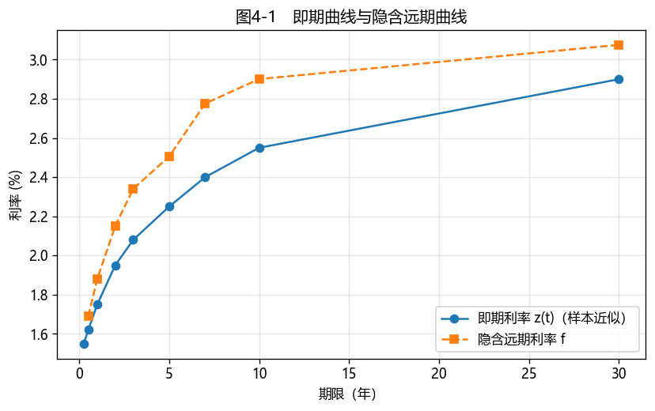

# 第4章　收益率计量

[](https://colab.research.google.com/github/albertandking/fixed-income/blob/main/notebooks/ch04_yield_measures.ipynb) [](https://mybinder.org/v2/gh/albertandking/fixed-income/main?labpath=notebooks/ch04_yield_measures.ipynb)

!!! info "配套代码"
    本章到期收益率由 `fi.pricing.ytm`（牛顿法 + 二分法回退）求解，远期利率由 `fi.pricing.forward_rate` 计算，并与 QuantLib 对拍；案例使用内置数据，离线即可运行。

## 4.1 本章导读与学习目标

**第3章是"给定收益率，算价格"；本章正好反过来——"给定价格，算收益率"。** 这是债券市场最日常的动作：行情屏幕上跳动的不是价格而是**收益率**，因为收益率把不同票息、不同期限的债券拉到同一把尺子上比较。但"收益率"其实有好几个面孔：到期收益率（YTM）、即期利率、远期利率、持有期收益率——它们各自回答不同的问题，混用会出大错。本章把这几个收益率讲清、算准，并戳破 YTM 最常见的一个误解：**它通常不等于你真正赚到的钱。**

!!! abstract "学习目标"
    学完本章，你应能：

    1. 把**到期收益率（YTM）**理解为债券的内部收益率（IRR），并用数值方法求解；
    2. 区分**票面收益率、当期收益率与到期收益率**；
    3. 说清 YTM 的**两大隐含假设**（持有到期、票息按 YTM 再投资）及其局限；
    4. 定义**即期利率与远期利率**，由无套利推导远期利率；
    5. 计算**持有期收益率**，解释**再投资风险**为何让实现收益偏离 YTM；
    6. 用 `fi.pricing.ytm`（牛顿 + 二分）与 QuantLib 两条路径求解并验证。

---

## 4.2 到期收益率（YTM）

### 4.2.1 YTM 就是债券的内部收益率

第3章的定价公式里，给定收益率 $y$ 求价格 $P$。现在倒过来：**已知市价 $P$，求那个让现金流现值恰好等于市价的单一折现率 $y$**——这个 $y$ 就是**到期收益率（Yield to Maturity, YTM）**：

$$P=\sum_{j=1}^{N}\frac{CF_j}{\left(1+\dfrac{y}{k}\right)^{j}}\quad\Longrightarrow\quad \text{求解 } y$$

它本质是债券现金流的**内部收益率（IRR）**：把买入价当作初始投资、把票息和本金当作回款，使净现值为零的那个利率。由于 $P$ 是 $y$ 的非线性函数，YTM 一般没有解析解，要用数值方法迭代求解（4.5 节）。

### 4.2.2 三个"收益率"别混淆

| 名称 | 定义 | 局限 |
|---|---|---|
| 票面收益率（nominal/coupon yield） | 票面利率 = 年票息 / 面值 | 与市价无关，几乎没有分析价值 |
| 当期收益率（current yield） | 年票息 / 市价 | 只看票息，**忽略资本利得与再投资** |
| 到期收益率（YTM） | 使现金流现值=市价的折现率 | 含两大假设（见下），但最常用 |

!!! example "例4.1：从价格反求 YTM"
    第3章那只 3 年期、年付息、票息 3% 的国债，若市价为 **97.2249**（折价），求其各类收益率：

    - **到期收益率**：解 $P(y)=97.2249$，得 $y=\mathbf{4.00\%}$（与第3章"$y=4\%$ 时价格 97.2249"互为逆运算）；
    - **当期收益率**：$3/97.2249=\mathbf{3.0856\%}$；
    - **票面收益率**：$3\%$。

    三者排序 **票面 < 当期 < YTM**——这是折价债的典型特征：市价低于面值，到期还能赚到"拉回面值"的资本利得，所以 YTM 最高。（溢价债则相反，YTM 最低。）

### 4.2.3 YTM 的两大假设与局限

YTM 看似精确，却建立在两个**经常不成立**的假设上：

1. **持有到期**：中途卖出，实际收益取决于卖出时的价格（利率风险）；
2. **所有票息按 YTM 再投资**：未来的再投资利率是未知的（再投资风险，4.4 节）。

加上"无违约"，三者共同决定：**只有当这些假设全部成立时，YTM 才等于你真正实现的年化收益**。这正是 4.4 节要量化的核心。

---

## 4.3 即期利率与远期利率

YTM 用**一个**利率折现所有现金流，简洁但粗糙。更精细的视角是：**不同期限的现金流，本就该用不同期限的利率折现**。

### 4.3.1 即期利率（spot rate）

**即期利率 $z_t$** 是期限为 $t$ 的**零息债**的到期收益率——它是"今天借出、$t$ 年后一次性收回"的纯利率，不含任何中间现金流。把各期限的即期利率连起来，就是**即期利率曲线**（零息曲线），它是债券定价最严格的折现基准（第5章构建）。

一只附息债的 YTM，可以看作其各笔现金流所对应即期利率的一种**复杂加权平均**——这解释了为什么不同票息、同期限的债券，YTM 会略有差异。

### 4.3.2 远期利率（forward rate）

**远期利率 $f(t_1,t_2)$** 是今天就锁定的、未来 $t_1$ 到 $t_2$ 期间的利率。它不是预测，而是由即期利率**无套利地**推出来的。

**无套利推导**：从今天投资到 $t_2$，有两条等价路径，终值必须相等——

- 直接投到 $t_2$：$(1+z_{2})^{t_2}$；
- 先投到 $t_1$，再按远期利率滚动到 $t_2$：$(1+z_{1})^{t_1}(1+f)^{t_2-t_1}$。

令两者相等，解出远期利率：

$$\boxed{\;f(t_1,t_2)=\left[\frac{(1+z_{2})^{t_2}}{(1+z_{1})^{t_1}}\right]^{\frac{1}{t_2-t_1}}-1\;}$$

!!! example "例4.2：由即期利率求远期利率"
    已知 1 年期即期利率 $z_1=2\%$、2 年期 $z_2=2.5\%$（年复利）。则未来"第 1 年末到第 2 年末"的 1 年期远期利率（记 1y1y）为：

    $$f(1,2)=\frac{(1+2.5\%)^2}{(1+2\%)^1}-1=\frac{1.050625}{1.02}-1=\mathbf{3.0025\%}$$

    **直觉**：即期曲线向上倾斜（$z_2>z_1$），意味着市场隐含的未来短期利率（远期）高于当前——远期利率永远"放大"即期曲线的斜率。

---

## 4.4 持有期收益率与再投资风险

### 4.4.1 持有期收益率

现实中很少有人把债券拿到到期。**持有期收益率（Holding Period Return / 实现复合收益率）**衡量你在实际持有期内真正赚到的年化回报，它由三块构成：

$$\text{总回报}=\underbrace{\text{票息收入}}_{\text{coupon}}+\underbrace{\text{票息再投资收益}}_{\text{reinvestment}}+\underbrace{\text{期末价格}-\text{买入价格}}_{\text{capital gain/loss}}$$

把期末总财富对买入价做年化，就是**实现复合收益率**。

### 4.4.2 再投资风险：YTM 的"谎言"

YTM 假设票息都按 YTM 再投资。一旦未来利率下行、票息只能以更低利率再投资，**实现收益就会低于 YTM**——这就是**再投资风险**。

!!! example "例4.3：实现收益为何偏离 YTM"
    平价买入那只 3 年期、票息 3% 的国债（买入价 100，YTM=3%），持有到期，把每年票息按利率 $r$ 再投资。第 3 年末的总财富与实现复合收益率：

    | 再投资利率 $r$ | 期末总财富 | 实现复合收益率 |
    |---|---|---|
    | 2%（下行） | 109.1812 | **2.971%** |
    | 3%（= YTM） | 109.2727 | **3.000%** |
    | 4%（上行） | 109.3648 | **3.029%** |

    **关键结论**：**只有当票息恰好按 YTM 再投资时，实现收益才等于 YTM。** 再投资利率更低，实现收益就低于 YTM；更高则高于。所以 YTM 是一个"假设性"收益，不是承诺。

!!! tip "再投资风险与价格风险此消彼长"
    利率下行：再投资收益↓（坏），但债券价格↑（好）；利率上行则相反。两种风险方向相反、可以相互抵消——当持有期恰好等于久期时，二者近似对冲，实现收益被"锁定"。这就是**免疫**的思想（第7章）。

---

## 4.5 Python 实现：牛顿迭代法求解 YTM（`fi.pricing.ytm`）

YTM 没有解析解，`fi.pricing.ytm` 用**牛顿法**快速迭代，并在不收敛时**回退二分法**保证稳健：

```python
from fi.cashflow import make_cashflows
from fi.pricing import price_bond, ytm, current_yield, forward_rate

cfs, ts = make_cashflows(coupon_rate=0.03, maturity=3, freq=1, face=100)

ytm(97.2249, cfs, ts, freq=1)          # 0.04      （例4.1）
current_yield(3, 97.2249)              # 0.030856
forward_rate(lambda t: {1:0.02, 2:0.025}[t], 1, 2, freq=1)   # 0.030025  （例4.2）
```

**牛顿法**：从初值 $y_0$ 出发，用 $y_{n+1}=y_n-\dfrac{P(y_n)-P_{\text{mkt}}}{P'(y_n)}$ 逐步逼近，通常几步就收敛到机器精度；若导数为 0 或发散，则切换到稳健但较慢的**二分法**（在区间内逐次折半）。编程实验会让你对比两者的收敛速度与稳健性。

---

## 4.6 QuantLib 实现：收益率与价格互算

QuantLib 用 `FixedRateBond` 在"价格 ↔ 收益率"之间互算，可与 `fi` 对拍：

```python
import QuantLib as ql

ql.Settings.instance().evaluationDate = ql.Date(15, 6, 2026)
sched = ql.Schedule(ql.Date(15, 6, 2026), ql.Date(15, 6, 2029), ql.Period(ql.Annual),
                    ql.NullCalendar(), ql.Unadjusted, ql.Unadjusted,
                    ql.DateGeneration.Backward, False)
bond = ql.FixedRateBond(0, 100.0, sched, [0.03], ql.ActualActual(ql.ActualActual.ISDA))

# 已知净价 97.2249，反求 YTM（净价用 BondPrice 包装）
price = ql.BondPrice(97.2249, ql.BondPrice.Clean)
bond.bondYield(price, ql.ActualActual(ql.ActualActual.ISDA), ql.Compounded, ql.Annual)   # ≈ 0.04
```

!!! note "为什么两边可能差几个 bp"
    `fi` 用"现金流 + 时间"的纯离散复利；QuantLib 走真实日历与计息惯例。在恰好整年、无营业日调整时两者高度一致；引入真实结算日后会有几个 bp 的差异——差异来源（计息惯例 / 结算天数）本身就是练习。

---

## 4.7 案例：中国国债的即期与远期曲线

我们用内置国债收益率曲线样本（`fi.data.load_sample("cgb_yield_curve")`），**近似地**把它当作即期利率曲线，由相邻期限推出隐含的**远期利率**，观察两条曲线的关系：

| 区间 | 即期 $z$ | 隐含远期 $f$ |
|---|---|---|
| 0.25→0.5 | 1.55%→1.62% | 1.69% |
| 1→2 | 1.75%→1.95% | 2.15% |
| 2→3 | 1.95%→2.08% | 2.34% |
| 5→7 | 2.25%→2.40% | 2.78% |
| 10→30 | 2.55%→2.90% | 3.08% |

**解读**：

1. 即期曲线**向上倾斜**时，**远期曲线始终位于即期曲线之上**——远期利率"放大"了即期曲线的斜率；
2. 隐含远期利率可解读为市场对**未来短期利率**的预期（加期限溢价）：上行的远期意味着市场隐含未来利率走高；
3. 注意这里把样本当即期是**近似**——真正的即期曲线要从附息债 bootstrap 出来（第5章），届时 YTM（到期收益率）、即期、远期三条曲线的区别会更清晰。

<figure markdown>
  { width="640" }
  <figcaption>图4-1　样本即期曲线与由其推出的隐含远期曲线：上行的即期曲线下，远期始终高于即期</figcaption>
</figure>

---

## 4.8 习题与编程实验

**概念题**

1. 用一句话说明票面收益率、当期收益率与到期收益率的区别；对折价债，三者大小如何排序？为什么？
2. 为什么说 YTM 不等于实际持有期收益？再投资风险与价格风险如何相互抵消？
3. 即期利率与远期利率有什么区别？远期利率是对未来利率的"预测"吗？

**计算题**

4. 一只 2 年期、年付息、票息 4%、面值 100 的国债，市价 102.00，估算其到期收益率（可手算两步牛顿迭代或试值）。
5. 已知 1 年期即期 2.2%、3 年期即期 2.8%（年复利），求未来"1 年末到 3 年末"的 2 年期远期利率。

**编程实验**

6. 用 `fi.pricing.ytm` 求例4.1 的 YTM；再自己实现一个纯**二分法**求解器，对同一只债比较牛顿法与二分法的**迭代次数**与稳健性（试一个很差的初值）。
7. 复现例4.3：对一只债，画出"实现复合收益率"关于再投资利率的曲线，标出 $r=\text{YTM}$ 时实现收益恰等于 YTM 的那一点。
8. 用内置样本复现 4.7 的即期/远期曲线图；再用 akshare 取真实国债收益率（附录C），重做并比较远期曲线形态。

---

## 4.9 本章小结

- **到期收益率（YTM）**是使现金流现值等于市价的折现率，即债券的**内部收益率**；一般无解析解，需数值求解。
- 别混淆**票面收益率、当期收益率、到期收益率**；折价债三者排序为票面 < 当期 < YTM。
- YTM 隐含**持有到期 + 票息按 YTM 再投资**两大假设；**实现收益只有在票息按 YTM 再投资时才等于 YTM**（再投资风险）。
- **即期利率**是零息债收益率；**远期利率**由即期利率无套利推出，上行即期曲线下远期高于即期。
- `fi.pricing.ytm`（牛顿 + 二分）与 QuantLib `bondYield` 结果一致；再投资风险与价格风险此消彼长，指向第7章的免疫。

下一章（第5章）将把"即期利率曲线"从近似变成精确——用 Bootstrap 从附息债价格逐期剥离出零息利率，构建中国国债的期限结构。
