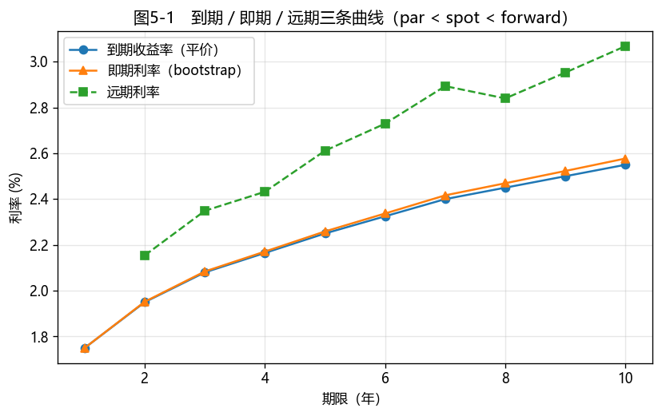

# 第5章　利率期限结构与曲线构建

[](https://colab.research.google.com/github/albertandking/fixed-income/blob/main/notebooks/ch05_term_structure.ipynb) [](https://mybinder.org/v2/gh/albertandking/fixed-income/main?labpath=notebooks/ch05_term_structure.ipynb)

!!! info "配套代码"
    本章 bootstrap、插值与远期曲线由 `fi.curve` 实现，并与 QuantLib `PiecewiseYieldCurve` 对拍；案例从内置中国国债样本构建期限结构，离线即可运行。

## 5.1 本章导读与学习目标

第4章我们用一个**单一的到期收益率**给整只债券折现，并提到这是一种"粗糙"的做法——把发生在不同时点的现金流，强行用同一个利率折现。本章要把这件事做精细：**承认"钱的时间价值随期限而变"，为每一个期限点找到它自己的利率**。这条"期限 → 利率"的关系，就是**利率期限结构（term structure of interest rates）**，画出来就是**收益率曲线**。

收益率曲线是固定收益市场最重要的一张图。它既是所有债券、衍生品定价的**输入**（折现要用它），又是宏观经济的**输出**（它的形态被认为蕴含市场对未来增长与通胀的预期）。本章要回答三个层层递进的问题：

1. **是什么**——到期、即期、远期三条曲线分别是什么，为什么形态各异（5.2、5.3）；
2. **怎么来**——如何从市场上能观测到的附息债价格，反推出看不见的零息利率曲线（Bootstrap，5.4、5.5）；
3. **怎么用**——用 Python/QuantLib 构建中国国债的期限结构并分析（5.6–5.8）。

!!! abstract "学习目标"
    学完本章，你应能：

    1. 区分**到期收益率曲线、即期（零息）曲线、远期曲线**，说清三者的定义与关系；
    2. 识别收益率曲线的**四种典型形态**，解释"倒挂"的经济含义；
    3. 复述四种**期限结构理论**（预期、流动性偏好、市场分割、优先聚集地）及其对曲线形态的解释；
    4. 推导并手算 **Bootstrap**，从平价票息曲线逐期剥离出即期利率；
    5. 说明不同**插值方法**（线性、样条、参数化）的取舍，理解为何要关注"远期利率的光滑性"；
    6. 用 `fi.curve` 与 QuantLib `PiecewiseYieldCurve` 构建中国国债期限结构并相互验证。

!!! note "本章知识结构"
    **三条曲线**（5.2，到期 / 即期 / 远期，par < spot < forward）
    　↓ 曲线为何这形状
    **曲线形态 + 四种期限结构理论**（5.3，预期/流动性偏好/市场分割/优先聚集地）
    　↓ 即期曲线看不见，怎么得到
    **Bootstrap 剥离即期利率**（5.4）+ **插值**（5.5，远期光滑性）
    　↓
    构建中国国债期限结构（5.6–5.8）→ 为第6章久期、第14–16章衍生品提供折现基准

---

## 5.2 三条曲线：到期、即期、远期

初学者最容易混淆的，是"收益率曲线"其实有三条，它们回答不同的问题。

### 5.2.1 到期收益率曲线（par / yield curve）

把市场上一系列**附息债**的到期收益率（YTM），按期限画出来，就是**到期收益率曲线**。当这些债恰好是平价发行（价格=面值）时，其 YTM 等于票面利率，这条曲线又称**平价收益率曲线（par yield curve）**。它最容易观测——直接来自市场报价——但每个点都是"一整只附息债的平均收益率"，是混合了不同期限现金流的**综合结果**，并不"纯粹"。

### 5.2.2 即期利率曲线（spot / zero curve）

**即期利率 $z_t$** 是期限为 $t$ 的**零息债**的到期收益率：今天投入、$t$ 年后一次性收回，中间没有任何现金流。它是某一期限"最纯粹"的时间价值，是债券定价**唯一正确的折现基准**——给任意债券定价，都应把它的每笔现金流用对应期限的即期利率折现：

$$P=\sum_{i}\frac{CF_i}{(1+z_{t_i})^{t_i}}$$

这里存在一个现实落差：我们**最需要**的即期利率，恰恰是市场上**最难直接观测**的。短端有国库券、央票、贴现工具等天然的零息品种，可直接读出 1 年以内的即期利率；但一旦超过一年，市场上交易的几乎全是**附息债**——它们每半年或每年支付一笔票息，价格中混合了"早期票息的低折现率"与"末期本金的高折现率"，相当于多个期限利率的综合结果，无法直接分离出某一个期限的纯利率。美国虽有把附息债的本金与票息拆分后分别交易的"国债剥离债（STRIPS）"来制造长期零息债，但中国市场这类工具有限、流动性不足，长期即期利率基本**无法直接观测**。因此只剩一条路径：从可观测的附息债价格中，把零息利率逐层**反推**出来——这正是 Bootstrap 所要完成的工作（5.4）。

### 5.2.3 远期利率曲线（forward curve）

**远期利率 $f(t_1,t_2)$** 是今天就锁定的、未来 $t_1$ 到 $t_2$ 期间的利率，由即期利率无套利地决定（第4章已推导）。它是即期曲线的"边际斜率"：

$$1+f(t_1,t_2)\text{（单期）}=\frac{(1+z_{t_2})^{t_2}}{(1+z_{t_1})^{t_1}}$$

### 5.2.4 三者关系：一句话记住

!!! tip "par ≤ spot ≤ forward（当曲线上行时）"
    当即期曲线**向上倾斜**时，三条曲线呈 **到期收益率 < 即期 < 远期** 的排序；曲线下行时则反过来。直觉是一个"边际 vs 平均"的关系：

    - **即期**是各期限的"边际"利率；**到期收益率**是一只附息债所有现金流即期利率的"加权平均"，因此被前期较低的利率"拖住"，低于同期限即期；
    - **远期**是即期曲线的"边际增量"，比即期更陡，因此在上行曲线中位于即期之上。

    记住这个排序，能在分析中迅速判断"哪条曲线在上面"，并对计算结果的合理性做心算校验。

---

## 5.3 收益率曲线的形态与期限结构理论

### 5.3.1 四种典型形态

| 形态 | 描述 | 常见解读 |
|---|---|---|
| **正常（上行）** | 长端利率高于短端 | 经济扩张预期 + 期限溢价；最常见 |
| **倒挂（下行）** | 长端低于短端 | 市场预期未来降息 / 经济走弱；常被视作**衰退先行指标** |
| **平坦** | 各期限接近 | 经济周期转折点，方向不明 |
| **驼峰** | 中段最高、两端较低 | 短期紧、长期宽松预期并存 |

!!! note "收益率曲线倒挂为什么受关注"
    在美国，"10 年期 − 2 年期"国债利差转负（倒挂）历史上多次领先于经济衰退，因此被广泛当作宏观信号。中国债市虽然驱动因素不同（货币政策框架、机构行为、供求结构都有差异），但收益率曲线的**陡峭化 / 平坦化**同样是判断货币政策松紧与经济预期的重要窗口。读曲线，先读它的"形状变化"。

### 5.3.2 四种期限结构理论

为什么曲线会呈现这些形态？金融学给出四种互补的理论，核心分歧在于"**远期利率到底反映了什么**"。

**（1）纯预期理论（Pure Expectations）**：远期利率等于市场对未来即期利率的**无偏预期**。若市场预期未来短端利率上升，则远期利率上行、曲线上行。该理论简洁，但忽略了风险。

$$f(t,t+1)=E[\,z_{t,t+1}\,]$$

**（2）流动性偏好理论（Liquidity Preference）**：投资者偏好流动性强的短债，要持有长债必须给**期限溢价（term premium）**作为补偿。于是远期利率 = 预期未来即期利率 **+ 正的期限溢价**，这解释了为何曲线"天然偏向上行"——即使预期未来利率不变，长端也会更高。

$$f(t,t+1)=E[\,z_{t,t+1}\,]+\underbrace{\pi_t}_{\text{期限溢价}>0}$$

**（3）市场分割理论（Market Segmentation）**：不同期限由不同投资者群体主导（如银行偏短端、保险与养老金偏超长端），各期限的供求**相对独立**地决定其利率，曲线形态是各段供求拼接的结果。它能解释某些期限的"异常凸起/凹陷"。

**（4）优先聚集地理论（Preferred Habitat）**：是前两者的折中——投资者**有偏好的期限**（habitat），但只要溢价足够，愿意离开自己的"地盘"。因此曲线既受预期与溢价影响，也受各期限供求影响。

!!! tip "四种理论怎么用"
    它们不是互斥的对错关系，而是**不同侧重的解释框架**。实务中：用预期/流动性偏好理解曲线的**整体水平与斜率**；用市场分割/优先聚集地理解**局部凸凹**（如中国超长端因保险配置需求而被压低）。分析中国曲线时，尤其要重视机构行为与供求——这是"市场分割/优先聚集地"视角最有解释力的地方。

---

## 5.4 Bootstrap：从附息债剥离即期利率

### 5.4.1 核心思想：逐期剥离

我们能观测到的是**附息债**的价格（或平价收益率），想要的是**即期利率**。Bootstrap 的思路是**自短及长、逐期剥离**：最短的那只债只剩一笔现金流，可直接定出第一个即期利率；有了它，再处理下一只债时，除最后一笔外的现金流都能用已知即期利率折现，于是又能解出一个新的即期利率。如此递推，把整条即期曲线一层层"自举"出来——这正是 "bootstrap"（拔靴带）一词的由来。

这个名称源自一个贴切的隐喻。英文成语"pull oneself up by one's bootstraps"（拽着自己的靴带把自己提起来）形容一种看似不可能的自力更生，而 Bootstrap 算法所做的正是如此：它**不依赖任何外部给定的零息利率**，全靠"已经解出的短期利率"求解"下一个更长期的利率"——第 1 年的即期利率一旦确定，便成为求解第 2 年的基础；第 2 年解出后，又成为求解第 3 年的基础。每一步都建立在前一步的结果之上，整条曲线就这样从一组附息债价格中被逐层"提取"出来。理解了这层递推依赖，也就理解了该方法的**关键弱点**：任何一个早期节点的报价误差或缺失，都会沿着递推链**逐级放大**到所有更长的期限。这正是 5.4.2 末尾要强调"现金流必须对齐、节点不能有缺口"的根本原因。

### 5.4.2 推导

设期限 $1,2,\dots,N$ 年各有一只**年付息的平价附息债**，面值归一为 1，则第 $n$ 年期债的票面利率等于其平价收益率 $c_n$，价格为 1。用折现因子 $DF_j=(1+z_j)^{-j}$ 写出定价等式：

$$1=c_n\sum_{j=1}^{n-1}DF_j+(1+c_n)\,DF_n$$

把已知的 $DF_1,\dots,DF_{n-1}$ 代入，解出唯一未知量 $DF_n$，再换算成即期利率：

$$\boxed{\;DF_n=\frac{1-c_n\sum_{j=1}^{n-1}DF_j}{1+c_n},\qquad z_n=DF_n^{-1/n}-1\;}$$

从 $n=1$（此时求和为空，$DF_1=1/(1+c_1)$，$z_1=c_1$）开始递推即可。

!!! example "例5.1：手算 Bootstrap"
    已知 1/2/3 年期平价收益率分别为 $c_1=2.0\%,\;c_2=2.5\%,\;c_3=2.8\%$，逐期剥离即期利率：

    **第 1 年**（单笔现金流，即期=平价）：

    $$DF_1=\frac{1}{1.02}=0.980392,\qquad z_1=2.0000\%$$

    **第 2 年**：

    $$DF_2=\frac{1-0.025\times0.980392}{1.025}=\frac{0.975490}{1.025}=0.951698,\quad z_2=DF_2^{-1/2}-1=2.5063\%$$

    **第 3 年**：

    $$DF_3=\frac{1-0.028\times(0.980392+0.951698)}{1.028}=\frac{0.945901}{1.028}=0.920138,\quad z_3=DF_3^{-1/3}-1=2.8132\%$$

    | 期限 | 平价收益率 $c$ | 即期利率 $z$ | 折现因子 $DF$ |
    |---|---|---|---|
    | 1 | 2.00% | 2.0000% | 0.980392 |
    | 2 | 2.50% | 2.5063% | 0.951698 |
    | 3 | 2.80% | 2.8132% | 0.920138 |

    **观察**：曲线上行时，即期利率**高于**同期限平价收益率（$z_3=2.81\%>c_3=2.80\%$），且期限越长、偏离越大——这正是 5.2.4 "par < spot" 排序的数值印证。

!!! warning "Bootstrap 的两个前提与常见误区"
    1. **现金流要对齐**：标准 Bootstrap 假设各债的付息日落在同一套时间网格上。真实债券付息日参差不齐、期限不连续，直接套用会出错——实务中先用插值（5.5）补齐网格，或改用带 RateHelper 的数值求解（5.7 的 QuantLib 做法）。
    2. **平价 ≠ 任意价**：上面的简洁公式用了"价格=1、票息=平价收益率"。若用非平价债，公式仍成立，但要代入真实价格与票息，别想当然地把市场 YTM 当即期利率。

---

## 5.5 插值与曲线构建方法

Bootstrap 只在有报价的少数关键期限上给出即期利率，但定价需要**任意期限**的利率，因此要在节点间**插值**。方法的选择不是细节，它会显著影响**远期利率**（即期曲线的导数）的稳定性。

初学者容易把插值视为"连点成线"的作图细节，仅凭直观选用三次样条——这恰恰隐含风险。问题的关键在于：定价使用的是即期利率本身，但**风险与相对价值分析使用的是它的导数（远期利率）**。求导是一种放大噪声的运算：即期曲线上一处肉眼难辨的弯曲，求导后可能在远期曲线上形成一个剧烈的尖峰，甚至出现**负的远期利率**——这意味着市场愿意以负利率出借资金，违背了无套利原则。换言之，一条插值曲线在即期层面"穿过了所有报价点、看似完美"，却可能在远期层面存在明显缺陷。因此专业机构编制曲线时，评判标准并非"即期曲线是否美观"，而是"**远期曲线是否干净**"——这也是实务中常对"对数折现因子"而非"即期利率"做插值的原因（前者天然对应分段常数的正远期）。**由此可见，插值方法的选择，本质上是在保证整条曲线的无套利性。**

| 方法 | 做法 | 优点 | 缺点 |
|---|---|---|---|
| **线性（收益率）** | 对即期利率分段线性 | 简单直观 | 远期利率呈锯齿、不光滑 |
| **线性（对数折现因子）** | 对 $\ln DF$ 分段线性 | 等价于分段常数远期，无套利性好 | 远期呈阶梯 |
| **三次样条** | 对即期/折现因子做样条 | 曲线光滑 | 可能产生不合理的远期振荡 |
| **参数化（Nelson–Siegel 等）** | 用少数参数拟合整条曲线 | 平滑、抗噪、可外推 | 拟合误差，不必精确穿过节点 |

!!! note "为什么盯着"远期光滑性""
    一条看起来平滑的即期曲线，求导（算远期）后可能剧烈抖动甚至出现负远期利率——这是无套利性的破坏。中债等估值机构在编制曲线时，会专门权衡"贴合报价"与"远期光滑"。本书 `fi.curve` 默认提供线性与三次样条两种插值，编程实验会让你直观对比它们的远期曲线差异。

---

## 5.6 Python 实现：`fi.curve`

```python
import numpy as np
from fi import curve

# 例5.1：从平价收益率 bootstrap 即期利率与折现因子
zeros, dfs = curve.bootstrap([0.02, 0.025, 0.028])
# zeros ≈ [0.020000, 0.025063, 0.028132]

# 在节点间插值（线性 / 三次样条）
curve.interpolate([1, 2, 3], zeros, t=2.5, method="linear")
curve.interpolate([1, 2, 3], zeros, t=2.5, method="cubic")

# 由即期曲线求相邻期限的远期利率
fwd_t, fwd = curve.forward_curve(zeros)        # 远期始终高于即期（上行曲线）
```

`bootstrap` 严格按 5.4.2 的递推实现；`forward_curve` 复用第4章的无套利远期公式。可用"把 bootstrap 出的折现因子代回去给平价债定价，应精确回到面值 1"来自检实现正确性（见配套 notebook）。

---

## 5.7 QuantLib 实现：`PiecewiseYieldCurve`

QuantLib 用 **RateHelper + PiecewiseYieldCurve** 构建曲线：把每个市场工具（存款、债券、互换）包装成 helper，曲线对象在内部对全部工具做**联立 bootstrap**，自动处理真实日历、计息惯例与不规则现金流——这正是 5.4.2 简洁公式在工程上的稳健版本。

```python
import QuantLib as ql

today = ql.Date(15, 6, 2026)
ql.Settings.instance().evaluationDate = today
helpers = []
for tenor_years, par in [(1, 0.02), (2, 0.025), (3, 0.028)]:
    sched = ql.Schedule(today, today + ql.Period(tenor_years, ql.Years), ql.Period(ql.Annual),
                        ql.NullCalendar(), ql.Unadjusted, ql.Unadjusted,
                        ql.DateGeneration.Backward, False)
    helpers.append(ql.FixedRateBondHelper(
        ql.QuoteHandle(ql.SimpleQuote(100.0)), 0, 100.0, sched, [par],
        ql.ActualActual(ql.ActualActual.ISDA), ql.Unadjusted))

yc = ql.PiecewiseLogLinearDiscount(today, helpers, ql.ActualActual(ql.ActualActual.ISDA))
d3 = today + ql.Period(3, ql.Years)
yc.zeroRate(d3, ql.ActualActual(ql.ActualActual.ISDA), ql.Compounded, ql.Annual).rate()  # ≈ 0.0281，与 fi 一致
```

!!! tip "为什么两边会有小差异"
    `fi.curve` 用整年、年复利的教科书离散公式；QuantLib 走真实日历、连续/复利折现与不同插值。在整年、无营业日调整的设定下两者很接近，但插值方式（log-linear-discount vs 线性即期）会带来小数后几位的差异。**关键是理解差异来源，而非追求最后一位相同。**

---

## 5.8 案例：中国国债收益率曲线构建与分析

我们用内置国债收益率曲线样本（`fi.data.load_sample("cgb_yield_curve")`），把它**线性插值到整数年（1–10 年）**作为平价收益率，再 Bootstrap 出即期曲线、推出远期曲线，最终把**三条曲线画在一起**：

1. **构建**：样本平价收益率 → 整数年网格 → `fi.curve.bootstrap` → 即期 → `forward_curve` → 远期；
2. **形态**：样本曲线上行，故三条曲线呈 **平价 < 即期 < 远期**，且期限越长、三者差距越大；
3. **应用**：用 bootstrap 出的即期曲线给一只非标准期限的国债**逐笔折现定价**，并与"单一 YTM 折现"对比，量化"精确折现 vs 近似折现"的差别。

<figure markdown>
  { width="660" }
  <figcaption>图5-1　由中国国债样本构建的平价（到期）、即期、远期三条曲线：上行曲线下呈 par < spot < forward</figcaption>
</figure>

**解读要点**：

- 三条曲线的**排序与间距**直接反映曲线斜率：斜率越陡，即期对平价的上抬、远期对即期的上抬都越明显；
- 即期曲线才是**定价的正确折现基准**；用单一 YTM 折现是一种便利的近似，对非平价、长期限债券会引入可观察的误差；
- 中国市场实务中，权威曲线由**中债登（中央结算公司）**每日编制（中债国债收益率曲线），是估值与风控的基准；本案例的简化构建有助于理解其底层逻辑。

---

## 5.9 习题与编程实验

**概念题**

1. 用自己的话说明到期收益率曲线、即期曲线、远期曲线的区别；为什么即期曲线才是"正确"的折现基准？
2. 收益率曲线倒挂意味着什么？分别从"纯预期理论"和"流动性偏好理论"的视角解释一条**上行**曲线可能的成因。
3. 市场分割理论与优先聚集地理论有何区别？用中国超长期国债（如 30 年、50 年）被保险/养老资金配置需求压低收益率的现象，说明哪种理论更有解释力。
4. 为什么构建即期曲线时要关注"远期利率的光滑性"？不光滑会带来什么问题？

**计算题**

5. 已知 1/2/3 年期平价收益率为 2.2%、2.6%、2.9%，手算 Bootstrap 出三个即期利率与折现因子，并验证 $z>c$（上行）。
6. 用第 5 题的即期利率，计算 1y2y（未来第 1 到第 3 年）的远期利率。

**编程实验**

7. 用 `fi.curve.bootstrap` 复现例5.1，并把 bootstrap 出的折现因子代回各平价债定价，验证结果精确等于面值。
8. 用 `fi.curve.interpolate` 对同一组即期利率分别做**线性**与**三次样条**插值，各自求远期曲线并叠加作图，直观比较两种插值下远期利率的光滑程度。
9. 复现 5.8 案例：构建中国国债的平价/即期/远期三条曲线；再用 akshare 取真实国债收益率（附录C），重做并讨论当前曲线形态所隐含的市场预期。

---

## 5.10 习题参考答案与详解

!!! tip "完整可运行解答 notebook"
    本节编程实验的**完整可运行代码**见 [`notebooks/solutions/ch05_solutions.ipynb`](https://colab.research.google.com/github/albertandking/fixed-income/blob/main/notebooks/solutions/ch05_solutions.ipynb)（点击徽章可在 Colab 直接运行）。

!!! success "概念题 1"
    **到期收益率曲线（平价）**：附息债 YTM 按期限连成的线，每点是"一整只附息债的综合平均收益率"，易观测但不纯粹。**即期曲线**：各期限零息债收益率，是"某一期限的纯时间价值"。**远期曲线**：今天锁定的未来各段利率，由即期无套利推出。**即期曲线才是正确的折现基准**，因为每笔现金流应当用与其期限对应的零息利率折现；用单一 YTM 折现只是便利的近似。

!!! success "概念题 2"
    **倒挂**（长端 < 短端）意味着市场预期未来降息/经济走弱，常被视作衰退先行信号。对一条**上行**曲线：**纯预期理论**视角——市场预期未来短期利率将上升，故远期（及长端）更高；**流动性偏好理论**视角——投资者偏好短债，持有长债要额外的**期限溢价**，故即使预期利率不变，长端也"天然偏高"，曲线上行。

!!! success "概念题 3"
    **市场分割理论**：各期限由不同投资者群体主导、供求相对独立决定利率，曲线是各段拼接。**优先聚集地理论**：投资者有偏好期限，但溢价足够时愿离开"地盘"——是预期与分割的折中。中国 30/50 年超长债被**保险/养老资金**因久期匹配需求大量配置、收益率被压低——这是**优先聚集地/市场分割**最有解释力的现象：超长端的特殊供求（而非单纯利率预期）主导了该段定价。

!!! success "概念题 4"
    即期曲线**求导**得到远期利率。即期曲线即使看着平滑，求导后远期也可能剧烈抖动、甚至出现**负远期利率**（破坏无套利）。不光滑会导致：远期利率失真、衍生品定价不稳、跨期限相对价值误判。所以中债等编制曲线时专门权衡"贴合报价"与"远期光滑"。

!!! success "计算题 5"
    平价收益率 2.2%/2.6%/2.9%，逐期 bootstrap（$DF_n=\frac{1-c_n\sum_{j<n}DF_j}{1+c_n}$，$z_n=DF_n^{-1/n}-1$）：

    | 期限 | 平价 $c$ | 即期 $z$ | 折现因子 |
    |---|---|---|---|
    | 1 | 2.2% | **2.2000%** | 0.978474 |
    | 2 | 2.6% | **2.6052%** | 0.949925 |
    | 3 | 2.9% | **2.9127%** | 0.917533 |

    上行曲线下 $z>c$（如 $z_3=2.91\%>c_3=2.9\%$），验证 par < spot。

!!! success "计算题 6"
    用上面的即期利率，1y→3y 的 2 年期远期：

    $$f=\left[\frac{(1+z_3)^3}{(1+z_1)^1}\right]^{1/2}-1=\left[\frac{(1.029127)^3}{1.022}\right]^{1/2}-1\approx\mathbf{3.271\%}$$

    远期（3.27%）高于即期 $z_3$（2.91%），上行曲线下远期"放大"了即期斜率。

!!! success "编程实验 7–9（要点）"
    - **实验 7**：`fi.curve.bootstrap([0.02,0.025,0.028])` 得即期与折现因子；把折现因子代回各平价债定价应**精确等于面值 1**（自检通过即实现正确）。
    - **实验 8**：对同组即期做线性 vs 三次样条插值，求远期叠图——线性插值的远期呈锯齿、样条更光滑但可能振荡，直观体现"远期光滑性"的取舍。
    - **实验 9**：构建中国国债 par/spot/forward 三条曲线（图5-1，上行下 par<spot<forward）；换真实数据后，曲线形态（陡/平/倒挂）隐含当前市场对未来利率与经济的预期。

---

## 5.11 本章小结

- **利率期限结构**有三条曲线：**到期收益率（平价）、即期（零息）、远期**；即期曲线是定价的正确折现基准，远期由即期无套利推出。曲线上行时三者排序为 **par < spot < forward**。
- 曲线有**正常、倒挂、平坦、驼峰**四种形态；倒挂常被视作衰退信号，分析中国曲线更应结合货币政策与机构供求。
- **四种期限结构理论**——预期、流动性偏好、市场分割、优先聚集地——分别解释曲线的水平/斜率与局部凸凹，互为补充。
- **Bootstrap** 自短及长逐期剥离即期利率：$DF_n=\dfrac{1-c_n\sum_{j<n}DF_j}{1+c_n}$；节点间需**插值**，且要权衡贴合度与远期光滑性。
- `fi.curve` 与 QuantLib `PiecewiseYieldCurve` 都能构建期限结构；前者透明展示原理，后者稳健处理真实市场细节。

下一部分（第6章起）将用这条即期曲线去度量风险：久期与凸性正是建立在"利率变动如何影响价格"之上，而关键利率久期更直接依赖曲线各节点的扰动。

!!! note "关键公式速查"
    | 概念 | 公式 |
    |---|---|
    | 即期利率折现 | $P=\sum_i CF_i/(1+z_{t_i})^{t_i}$（正确折现基准） |
    | Bootstrap | $DF_n=\dfrac{1-c_n\sum_{j<n}DF_j}{1+c_n}$，$z_n=DF_n^{-1/n}-1$ |
    | 远期利率 | $(1+z_2)^{t_2}=(1+z_1)^{t_1}(1+f)^{t_2-t_1}$ |
    | 三曲线排序（上行） | 到期收益率 < 即期 < 远期 |

!!! quote "延伸阅读"
    - Fabozzi, *Bond Markets, Analysis, and Strategies*, 关于"利率期限结构与收益率曲线"一章；
    - Tuckman & Serrat, *Fixed Income Securities*, "Spot, Forward, and Par Rates" 与 "The Science of Term Structure Models"；
    - 中央结算公司（中债登）《中债收益率曲线编制说明》——了解中国权威曲线的编制方法与样本券选取。
