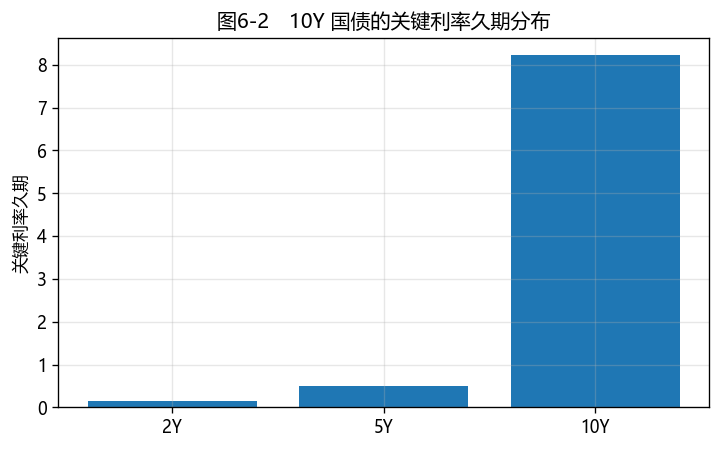
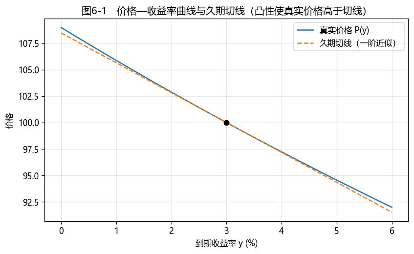

# 第6章　久期与凸性

[](https://colab.research.google.com/github/albertandking/fixed-income/blob/main/notebooks/ch06_duration_convexity.ipynb) [](https://mybinder.org/v2/gh/albertandking/fixed-income/main?labpath=notebooks/ch06_duration_convexity.ipynb)

!!! info "配套代码"
    本章所有数字都可在配套 notebook（`notebooks/ch06_duration_convexity.ipynb`）中复现，默认依赖内置数据，离线即可运行；久期、凸性、DV01 与关键利率久期均由复用包 `fi.risk` 实现。**章末 6.10 节给出全部习题的参考答案与详解，便于自学。**

## 6.1 本章导读与学习目标

**为什么久期是固定收益最重要的一个数？**

第3章我们学会了给债券定价，第4章把价格翻译成收益率。但投资者真正天天面对的问题是：**利率动一下，我手里的债券组合会亏多少、赚多少？** 一只 10 年期国债和一只 1 年期国债，同样面对央行加息，损失天差地别。**久期**就是把"对利率有多敏感"压缩成一个数字的度量；**凸性**则修正久期在大幅波动时的偏差。掌握这两个量，你就能在不重新定价的情况下，快速估算利率冲击下的损益，并据此对冲风险。

这一章是全书利率风险分析的核心：第7章的免疫、第11章的期货套保、第18章的 VaR，都建立在久期与凸性之上。建议读者亲自完成 6.2 的推导——一旦理解了"价格对收益率求导"这一核心，后续内容便顺理成章。

久期并非抽象的数学概念，其作用在真实市场中屡屡显现。2022 年 11 月，中国债券市场经历了一轮较大调整：利率快速上行，持有**长久期**债券的银行理财产品净值明显回撤，引发投资者赎回；理财产品为应对赎回而抛售债券，又进一步压低债券价格与净值，形成"价格下跌—赎回—抛售—再下跌"的负反馈过程。事后来看，回撤幅度最大的，往往是久期最长的产品。**久期越长，利率上行时的价格损失越大**——本章正是要把这一规律阐述清楚、计算准确，并说明相应的对冲方法。

久期概念已有近百年历史。1938 年，加拿大经济学家 **Frederick Macaulay** 在研究美国铁路债券时，提出以"现金流的现值加权平均回收时间"刻画债券的有效期限，这就是今天的**麦考利久期**。此后 Hicks 从价格弹性角度、Redington 从负债免疫角度（第7章）、Fisher 与 Weil 从期限结构角度不断加以拓展，久期才从朴素的"期限度量"，发展为现代固定收益的核心**利率敏感度指标**。这一看似简单的加权平均，是几代学者持续研究的成果。

!!! abstract "学习目标"
    学完本章，你应能：

    1. 从价格对收益率求导出发，推导**麦考利久期**与**修正久期**，理解久期"加权平均回收时间"与"价格弹性"的双重含义；
    2. 区分**有效久期**与**关键利率久期（KRD）**，明白为什么含权债和非平行移动需要它们；
    3. 解释**凸性**的来源，用"久期 + 凸性"做价格变动的二阶近似，并说明凸性为何对投资者有利；
    4. 计算 **DV01/PV01**，并用它确定两券或期货的**对冲比率**；
    5. 用 `fi.risk` 与 QuantLib `BondFunctions` 两条路径计算上述指标并相互验证；
    6. 对一个中国国债组合，估算 +100bp 利率冲击下的损益并做归因。

!!! note "学习路径（本章知识结构）"
    **价格对 $y$ 求导**（6.2.1）→ 一阶导数 → **麦考利/修正久期**（6.2.2）→ 度量"涨跌幅"
    　　↓ 求导不够准（曲线是弯的）
    **二阶导数** → **凸性**（6.4）→ 修正久期的误差
    　　↓ 现金流不固定 / 曲线非平行
    **有效久期 + 关键利率久期**（6.3）→ 含权债与曲线形状风险
    　　↓ 把百分比敏感度换成金额
    **DV01 + 对冲比率**（6.5）→ 风控与套保 → 第7、14、18 章

---

## 6.2 麦考利久期与修正久期

### 6.2.1 从价格—收益率曲线的斜率说起

考虑一个常见的实务问题：某机构持有市值上亿元的债券组合，需要回答"若央行加息 25 个基点，组合价值大约变动多少"。一种做法是把组合中的每只债券按新收益率逐一重新定价、加总后再与原值相减；但这种方法计算量大，且无法**事先**为风险设定限额。实务中更需要的，是一个**预先计算好的指标**，用以快速估计"利率每变动 1 个基点，组合价值变动多少"。这一指标就是久期。

要找到它，关键的数学动作只有一个：**对价格关于收益率求导**。导数衡量的正是"自变量动一点、因变量动多少"，这与我们的问题完全契合。下面我们就把这个求导做出来。一只债券的全价是收益率 $y$ 的函数（设每年付息 $k$ 次，现金流 $CF_i$ 发生在 $t_i$ 年）：

$$P(y)=\sum_{i=1}^{n}\frac{CF_i}{\left(1+\dfrac{y}{k}\right)^{k t_i}}$$

我们想知道：$y$ 变动一点点，$P$ 变多少？这正是**导数**的定义。用一阶泰勒展开，把 $P(y+\Delta y)$ 在 $y$ 处线性近似：

$$P(y+\Delta y)\approx P(y)+\frac{dP}{dy}\,\Delta y\quad\Longrightarrow\quad \Delta P\approx\frac{dP}{dy}\,\Delta y$$

所以"价格对利率有多敏感"就藏在斜率 $\dfrac{dP}{dy}$ 里。对定价公式逐项求导（用链式法则，$\dfrac{d}{dy}(1+y/k)^{-kt}=-t(1+y/k)^{-kt-1}$）：

$$\frac{dP}{dy}=\sum_{i=1}^{n}CF_i\cdot(-t_i)\left(1+\frac{y}{k}\right)^{-k t_i-1}=-\frac{1}{1+\dfrac{y}{k}}\sum_{i=1}^{n}t_i\,\frac{CF_i}{\left(1+\dfrac{y}{k}\right)^{k t_i}}$$

最后一步把公因子 $\left(1+\dfrac{y}{k}\right)^{-1}$ 提了出来。两边除以 $P$，整理成"**相对**价格变动"（更便于跨券比较）：

$$\frac{1}{P}\frac{dP}{dy}=-\frac{1}{1+\dfrac{y}{k}}\cdot\underbrace{\frac{1}{P}\sum_{i=1}^{n}t_i\,\frac{CF_i}{\left(1+\dfrac{y}{k}\right)^{k t_i}}}_{\textstyle D_{\text{mac}}}$$

### 6.2.2 两个久期的定义

上式中那个被现金流现值加权的"平均回收时间"，就是**麦考利久期（Macaulay Duration）**：

$$\boxed{\,D_{\text{mac}}=\frac{1}{P}\sum_{i=1}^{n}t_i\,\frac{CF_i}{\left(1+\dfrac{y}{k}\right)^{k t_i}}=\sum_{i=1}^{n}t_i\cdot w_i,\quad w_i=\frac{PV_i}{P}\,}\qquad\text{单位：年}$$

它就是把每笔现金流的时间 $t_i$ 用其**现值权重** $w_i=PV_i/P$ 加权平均（注意 $\sum_i w_i=1$）——回收得越晚、权重越大，久期越长。

而前面的系数定义为**修正久期（Modified Duration）**：

$$\boxed{\,D_{\text{mod}}=\frac{D_{\text{mac}}}{1+\dfrac{y}{k}}\,}\qquad\Longrightarrow\qquad \frac{\Delta P}{P}\approx -D_{\text{mod}}\,\Delta y$$

修正久期直接回答了那个核心问题：**收益率每上行 1 个百分点，债券价格大约下跌 $D_{\text{mod}}$ 个百分点**。所以它本质是价格对收益率的**弹性**。

至此，久期已呈现出**四个相互印证的侧面**，值得逐一体会——熟练的使用者往往会同时从这四个角度理解它：

- **几何视角**：久期是价格—收益率曲线在当前点的**切线斜率**（标准化后）。利率变动时，价格近似沿这条切线移动 $-D_{\text{mod}}$ 个百分点；后文的凸性，正是用以刻画"真实曲线是弯曲的、切线存在偏差"这一事实。
- **数学视角**：久期是价格对收益率的**一阶弹性**——将非线性的定价公式在当前点线性化所得到的灵敏度系数。
- **时间视角**：麦考利久期是现金流的**现值加权平均回收时间**，回答"投入的资金平均经过多久收回"。
- **经济视角**：久期是利率风险的**统一标尺**。10 年期国债久期约 8.5、1 年期约 1，因此同样加息 100bp，前者市值缩水约 8.5%、后者仅缩水约 1%——久期将"何种债券对加息更敏感"表达为一个可横向比较的数字。

这四个侧面描述的是同一对象，只是观察角度不同。初学者往往只记住公式（数学视角），但在交易与风控实务中，**几何（切线）与经济（标尺）两个视角的直觉常常更为有用**——它们使人在不依赖精确计算时也能对风险作出判断。

!!! tip "两种久期，一句话区分"
    - **麦考利久期**回答"钱平均多久回来"（时间概念，单位：年）；
    - **修正久期**回答"利率动一点，价格动多少"（敏感度概念）；
    - 二者只差一个 $(1+y/k)$ 因子；收益率越低，两者越接近。

!!! example "例6.2：零息债的久期 = 到期期限"
    零息债只有一笔现金流：在 $T$ 年到期兑付面值 $F$。代入麦考利久期定义，求和只有一项，权重 $w=1$：

    $$D_{\text{mac}}=\frac{T\cdot \dfrac{F}{(1+y)^{T}}}{\dfrac{F}{(1+y)^{T}}}=T$$

    **零息债的麦考利久期恰好等于其期限。** 例如 5 年期零息国债（$y=3\%$，年复利）：$D_{\text{mac}}=5$ 年，$D_{\text{mod}}=5/1.03=4.854$。零息债是久期的"标尺"——任何附息债都可看作一篮子零息债，其久期是各零息债久期的加权平均，因此**附息债久期必然短于其到期期限**（见下方误区框）。

### 6.2.3 影响久期的因素

| 因素 | 久期变化 | 直觉 |
|---|---|---|
| 期限 ↑ | 久期 ↑ | 现金流整体推后 |
| 票息率 ↑ | 久期 ↓ | 更多现金流提前到账，权重前移 |
| 到期收益率 ↑ | 久期 ↓ | 远期现金流被折得更狠，权重前移 |
| 付息频率 ↑ | 久期 ↓ | 现金流更早、更密 |

这张表背后是同一条直觉：**久期取决于"现金流重心距今多远"**。任何使现金流重心前移的因素，都会缩短久期。票息率是最典型的例子——高票息债券每年回流的现金更多，重心前移，因此同为 10 年期，票息 5% 的债券久期会明显短于票息 2% 的债券。这一规律有一个重要的实务推论：**在预期利率下行、希望通过拉长久期获取价格上行收益时，应选择低票息、长期限的债券**（极端情形为长期零息债，其久期等于期限、价格弹性最大）；反之，若希望在不缩短到期期限的前提下降低利率敏感度，可转向高票息债券。

收益率水平的影响则容易被忽略：**收益率越高，久期越短**。原因在于高收益率使远端现金流折现得更多，远端权重下降、重心前移。这意味着同一只债券，在 2% 的低利率环境与 6% 的高利率环境下，久期并不相同——低利率时久期更长，对利率变动也更敏感。这也部分解释了为何在近年的低利率环境下，债券组合对加息较为敏感：利率越低，久期越长，加息对价格的影响也越大。

!!! warning "误区：久期 = 到期期限？"
    麦考利久期的单位是"年"，初学者常把它和"到期期限"混为一谈。**只有零息债的久期才等于其期限**（例6.2）；附息债因为期间有票息回款，久期总是**短于**到期期限。比如一只 10 年期附息国债，久期可能只有 8 年左右。把久期当成"还有几年到期"，会严重高估利率敏感度。记住：久期是**现金流的现值加权平均回收时间**，不是"最后一笔现金流的时间"。

!!! example "例6.1：3 年期附息国债的久期与凸性"
    某国债：面值 100 元，年付息一次（$k=1$），票面利率 3%，剩余期限 3 年，当前到期收益率 $y=3\%$（平价）。

    **第一步：现金流与现值**

    | $t_i$（年） | $CF_i$ | 折现因子 $(1.03)^{-t_i}$ | 现值 $PV_i$ | 权重 $w_i$ |
    |---|---|---|---|---|
    | 1 | 3 | 0.970874 | 2.91262 | 0.02913 |
    | 2 | 3 | 0.942596 | 2.82779 | 0.02828 |
    | 3 | 103 | 0.915142 | 94.25959 | 0.94260 |
    | | | **合计 $P$** | **100.0000** | 1.00000 |

    **第二步：麦考利久期**（按现值权重加权时间）

    $$D_{\text{mac}}=1\times0.02913+2\times0.02828+3\times0.94260=2.9135\text{ 年}$$

    （注意 94% 的权重压在第 3 年，所以久期接近 3 年，但略短。）

    **第三步：修正久期**

    $$D_{\text{mod}}=\frac{2.9135}{1.03}=2.8286$$

    含义：收益率上行 100bp，价格约下跌 **2.83%**。

    **第四步：凸性**（解析式，见 6.4 节）

    $$C=\frac{1}{P}\sum_i CF_i\,t_i(t_i+1)(1.03)^{-t_i-2}=10.877$$

    **第五步：与真实重定价对照**（收益率升到 4%）

    重新折现得 $P(4\%)=97.2249$，真实变动 $\Delta P/P=-2.775\%$。

    - 仅用久期：$-2.8286\times0.01=-2.829\%$（高估了损失）；
    - 久期 + 凸性：$-2.829\%+\tfrac12\times10.877\times0.01^2=-2.829\%+0.054\%=-2.774\%$（几乎完全吻合）。

    可见凸性把一阶近似的误差从约 0.05 个百分点压到了千分位以内。

---

## 6.3 有效久期与关键利率久期

### 6.3.1 有效久期：当价格没有解析式时

修正久期有一个隐藏的前提：现金流是**固定**的。正因为现金流不随利率变，我们才能对那条光滑的定价公式求导。可现实里有一大类债券不满足这个前提——它们的现金流会**随利率自己改变**。可赎回债在利率下行时被发行人提前赎回（第9章）、MBS 的房贷借款人在利率下行时提前还款再融资（第15章）、可转债在股价上涨时被转股（第10章）。对这些债券，"价格—收益率曲线"不再光滑可导，甚至在某些利率区间会**反向弯折**（负凸性），解析的修正久期公式直接失效。

此时应回到导数最原始的定义——**差商**。即不再求解析导数，而是直接将利率变动一个小幅度、观察价格的变化：把整条收益率曲线向上、向下各平移一个小幅度 $\Delta y$，**分别重新定价**（含权部分由定价模型重新判断是否行权），再相除。这就是**有效久期**：

$$\boxed{\,D_{\text{eff}}=\frac{P_{-}-P_{+}}{2\,P_0\,\Delta y}\,}$$

其中 $P_{-},P_{+}$ 分别是收益率下行、上行 $\Delta y$ 后重新定价得到的价格；它的妙处在于**不问价格公式长什么样**——只要有一个能在任意利率下给债券定价的"黑箱"（哪怕是蒙特卡洛或二叉树），就能算出有效久期。所以有效久期是更通用的工具，前面的修正久期只是它在"现金流固定"特例下的解析形式（下方例6.3 验证二者在普通债上完全相等）。

!!! example "例6.3：普通债的有效久期 ≈ 修正久期"
    对例6.1 的 3 年期债，取 $\Delta y=1\text{bp}$ 重定价：$P_{-}=P(2.99\%)$、$P_{+}=P(3.01\%)$，代入差商得 $D_{\text{eff}}=2.8286$——与修正久期**完全一致**（到小数点后 4 位）。这验证了：对**现金流固定**的普通债，有效久期与修正久期是同一个东西，只是一个用解析公式、一个用数值差商。二者的差异只在**含权债**上才显现（第9章），那里现金流随利率变化，解析的修正久期失效，必须用有效久期。

### 6.3.2 关键利率久期：应对非平行移动

修正久期/有效久期都假设收益率曲线**平行移动**。但现实中曲线常常"陡峭化"或"平坦化"——短端和长端动得不一样。**关键利率久期（Key Rate Duration, KRD）**把曲线敏感度拆到各个关键期限节点上：只在第 $j$ 个关键期限（如 2Y、5Y、10Y）处把零息曲线抬升 $\Delta y$、其余节点不动，度量价格的相对变化：

$$\text{KRD}_j=\frac{P_{-}^{(j)}-P_{+}^{(j)}}{2\,P_0\,\Delta y}$$

**关键性质**：所有关键利率久期之和约等于平行移动下的有效久期，

$$\sum_j \text{KRD}_j\approx D_{\text{eff}}$$

直觉：把曲线"每个节点抬一点"叠加起来，就等于"整条曲线平移"。这让我们既能看到组合的"总利率敞口"，又能看到敞口**分布在哪一段曲线上**——这是只用一个久期数字看不到的。

这一点在实务中十分重要。债券基金经理常进行**曲线交易**：预期收益率曲线**变陡**（长端相对短端上行更多）时，减持长端、增持短端，或将"子弹"组合调整为"哑铃"组合；预期**变平**时则反向操作。这类策略的损益完全由曲线**形状**的变化驱动，而组合的总久期可能保持不变——一个总久期为 5 的组合，其敞口既可能集中于 10Y，也可能分散于 2Y/5Y，两者在曲线变陡时的盈亏差异很大，但总久期给出的却是同一个数字。概言之，**总久期刻画"利率整体涨跌"的风险，关键利率久期刻画"曲线形状变化"的风险**。中国债券市场中活跃的"做陡/做平"策略，本质上正是对关键利率久期分布的交易。

<figure markdown>
  { width="600" }
  <figcaption>图6-2　10Y 国债的关键利率久期分布：敞口高度集中在 10Y 节点（KRD 之和≈有效久期）</figcaption>
</figure>

!!! note "为什么基金经理盯着 KRD"
    两个久期同为 5 的组合，可能风险结构完全不同：一个把敞口集中在 10Y（看多长端），另一个分散在 2Y/5Y。当曲线陡峭化（长端上行多于短端）时，前者亏得多、后者亏得少。修正久期对二者给出同一个数字（都是 5），**完全看不出这个差别**；KRD 才能把"曲线形状风险"显式化。中国债市的"做陡/做平曲线"策略，正是基于 KRD 管理的。

---

## 6.4 凸性的概念、计算与二阶近似

### 6.4.1 凸性从哪来

久期是一阶近似，对应价格—收益率曲线的切线。但真实曲线是**向原点凸出（convex）**的：收益率大幅下行时，价格涨得比久期预测的多；大幅上行时，价格跌得比久期预测的少。要刻画这种"弯曲"，把泰勒展开**多保留一项**（二阶项）：

$$P(y+\Delta y)\approx P+\frac{dP}{dy}\Delta y+\frac12\frac{d^2P}{dy^2}(\Delta y)^2$$

两边除以 $P$，第一项就是 $-D_{\text{mod}}\Delta y$，第二项定义凸性：

$$\frac{\Delta P}{P}\approx -D_{\text{mod}}\,\Delta y+\frac12\,C\,(\Delta y)^2,\qquad C=\frac{1}{P}\frac{d^2P}{dy^2}$$

对定价公式求**二阶**导数（再求一次导，幂次再降一阶、系数多乘一个 $(t_i+1/k)$ 类项）：

$$\frac{d^2P}{dy^2}=\sum_{i=1}^{n}CF_i\,t_i\!\left(t_i+\frac1k\right)\!\left(1+\frac{y}{k}\right)^{-k t_i-2}$$

于是凸性的解析式为：

$$\boxed{\,C=\frac{1}{P}\sum_{i=1}^{n}CF_i\,t_i\!\left(t_i+\frac1k\right)\!\left(1+\frac{y}{k}\right)^{-k t_i-2}\,}$$

凸性里现金流时间是以 $t_i^2$ 量级加权的——所以**现金流越分散（哑铃型），凸性越大**；越集中（子弹型），凸性越小（第7章会用到）。

换个角度看会更直观：**久期是切线，凸性是曲线的弯曲程度**。久期假设价格沿着一条直线（切线）随利率移动，但真实的价格—收益率曲线是一条向上弯的"碗形"。凸性度量的，正是真实曲线偏离那条切线有多远。利率只动一点点时，曲线和切线几乎重合，久期就够用；利率动得越大，曲线越往切线上方"翘"，只用久期的误差就越大——而且这个误差**总是朝对投资者有利的方向**（下方 6.4.2 解释为什么）。这就是为什么小波动看久期、大波动必须补凸性。

### 6.4.2 凸性对投资者有利

注意二阶项 $\tfrac12 C(\Delta y)^2$ 永远 $\ge 0$（普通债 $C>0$）：

- 收益率**下行**（$\Delta y<0$）：久期带来上涨，凸性**再加一笔**上涨；
- 收益率**上行**（$\Delta y>0$）：久期带来下跌，凸性**减少**这笔下跌。

也就是说，**正凸性让债券"涨多跌少"**。在久期相同的两只债券里，凸性更大的那只总是更值钱——因此凸性本身有价格（投资者愿为它付溢价，表现为收益率略低）。

凸性不仅是理论概念，也是市场中可交易的对象。成熟市场的交易者会主动**买入凸性**——通过期权或现金流分散的哑铃组合构造高凸性头寸，以在利率大幅波动时获益（无论上行还是下行）；而**卖出凸性**的一方（如卖出含权债、做空利率期权）则收取权利金，其判断是利率将保持平稳。**凸性是一种可以定价、可以买卖的风险**。这也解释了一个常见现象：久期相同的两只债券，凸性较高者收益率反而略低——这正是市场为"涨多跌少"这一特性所要求的对价。

与之相对的是**负凸性**。MBS 与可赎回债的持有人被动承担了负凸性：利率大幅下行时，普通债券价格大涨，而这类债券因提前偿还或赎回被"封顶"，价格难以继续上行。买入此类资产，相当于卖出凸性、换取少量额外票息，代价是放弃了大幅波动中的上行收益——这正是第9章（可赎回债）与第15章（MBS）讨论的核心问题。理解了凸性具有价值，也就理解了含权债为何需要提供更高的收益率。

<figure markdown>
  { width="640" }
  <figcaption>图6-1　真实价格曲线始终位于久期切线之上：收益率下行涨得更多、上行跌得更少（正凸性）</figcaption>
</figure>

!!! warning "含权债的负凸性"
    可赎回债在低利率区会被发行人赎回，封住了价格上行空间，呈现**负凸性**：收益率下行时价格涨幅反而收窄。此时久期近似会**低估上行方向的风险**，必须用有效久期/有效凸性，见第9章。

!!! example "例6.4：凸性如何改善近似（承例6.1）"
    对例6.1 的 3 年期债（$D_{\text{mod}}=2.8286$，$C=10.877$，$P_0=100$），比较不同利率冲击下两种近似与真实重定价：

    | 收益率变动 $\Delta y$ | 真实 $\Delta P/P$ | 仅久期 | 久期+凸性 |
    |---|---|---|---|
    | $-100$ bp | $+2.884\%$ | $+2.829\%$ | $+2.883\%$ |
    | $-50$ bp | $+1.428\%$ | $+1.414\%$ | $+1.428\%$ |
    | $+50$ bp | $-1.401\%$ | $-1.414\%$ | $-1.400\%$ |
    | $+100$ bp | $-2.775\%$ | $-2.829\%$ | $-2.774\%$ |

    幅度越大，仅久期的误差越大（且方向上系统性高估损失/低估收益），而加入凸性后误差始终在千分位级别。**经验法则**：日常 ±25bp 内久期足够；超过 ±50bp（如政策利率调整、危机）务必加凸性。

---

## 6.5 DV01/PV01 与对冲比率

### 6.5.1 把敏感度换成"钱"

久期是百分比敏感度，交易台更关心**绝对金额**：收益率变动 1bp，持仓价值变动多少元？这就是 **DV01（Dollar Value of 1 basis point，也称 PV01、基点价值）**：

$$\boxed{\,\text{DV01}=D_{\text{mod}}\times P\times 0.0001\,}$$

对一个市值 $MV$ 的组合，$\text{DV01}_{\text{组合}}=D_{\text{mod}}\times MV\times10^{-4}$。它直接等于"利率动 1bp 的盈亏"，是风控限额与对冲计算的通用语言。

在银行或券商的交易实务中，更常用的表述往往不是"这只债久期 8.5"，而是"这个交易簿 DV01 五百万"——即利率变动 1bp，该交易簿的盈亏约为 500 万元。**DV01 是交易与风控实务中的通用语言。**风控部门以 DV01 为每位交易员、每个交易簿设定限额（如"国债簿 DV01 不超过 800 万"），既直观，又便于逐层汇总：将所有持仓的 DV01 相加，即得到机构的利率总敞口；某笔交易增加了多少风险，也可由其 DV01 直接读出。久期是百分比、不能跨券相加，而 DV01 是金额、可从单券一直汇总到全机构——这正是实务中 DV01 比久期更常用的根本原因（参见下方提示框）。

!!! tip "DV01 可直接相加，久期不能"
    组合的 DV01 = 各券 DV01 之和（金额可加）；但组合久期是**市值加权平均**，不能直接相加。做组合层风控时，DV01 比久期更方便——这也是交易台普遍用 DV01 设限额的原因。

### 6.5.2 对冲比率

要用工具债（或国债期货）对冲目标债的利率风险，令两边 DV01 相等即可。需要的对冲工具**数量/名义**为：

$$N_{\text{hedge}}=-\frac{\text{DV01}_{\text{目标}}}{\text{DV01}_{\text{工具}}}$$

负号表示方向相反（多头组合要用空头工具对冲）。这就是**久期中性 / DV01 中性**对冲，第11章会把它用到国债期货上（含 CTD 转换因子）。

这类对冲在实务中十分常见，但有三点需要注意。**第一，它只对冲一阶风险。** DV01 中性使组合对小幅平行移动的损益归零，但凸性差异依然存在——若目标券与对冲工具的凸性不同，在大幅波动下两者并不完全抵消，会留下二阶残差。**第二，它假设曲线平行移动。** 若曲线变陡或变平（短端与长端变动幅度不同），用单一工具债对冲跨期限组合仍会留有敞口，此时需按关键利率久期分段对冲（见 6.3.2）。**第三，对冲比率会随时间漂移。** 利率变动与时间推移都会改变两边的 DV01，今日的中性到次日未必成立，因此需要**动态再对冲（dynamic rehedging）**——再对冲越频繁，跟踪越紧密，但交易成本也越高，二者需要权衡。

以一个具体情形为例：某保险公司持有大量长久期国债，为防范加息风险，卖出国债期货将组合 DV01 减半，所用的正是上述公式（具体手数的计算见第11章）。但需注意，期货价格盯住的是"最便宜可交割券"，其久期会随利率变化而跳变（CTD 切换），凸性也与现券不同——因此这是一项需要持续跟踪、定期调整的对冲，而非一次性完成的安排。**现实中并不存在完美对冲，明确残余风险所在，比追求账面上的"零敞口"更为重要。**

!!! example "例6.5：DV01 对冲"
    持有市值 1 亿元的 10 年期国债，$D_{\text{mod}}=8.78$，则组合 $\text{DV01}=8.78\times10^8\times10^{-4}=8.78$ 万元/bp。
    若用 $D_{\text{mod}}=4.70$ 的 5 年期国债对冲，其单位市值 DV01 为 $4.70\times10^{-4}$，需卖出市值

    $$MV_{\text{hedge}}=\frac{8.78}{4.70}\times1\text{ 亿}\approx1.87\text{ 亿元}$$

    使组合对小幅平行移动的损益接近零。注意：DV01 对冲只中和**一阶**风险，凸性差异（与曲线非平行移动）仍是残余敞口。

---

## 6.6 Python 实现：久期、凸性与 DV01（`fi.risk`）

本书把利率风险指标统一实现在复用包 `fi.risk` 中，正文与 notebook 共用同一套代码。核心 API：

```python
from fi.cashflow import make_cashflows
from fi.pricing import price_bond
from fi.risk import (
    macaulay_duration, modified_duration, convexity, dv01,
    price_change, effective_duration, key_rate_durations,
)

# 例6.1：3 年期、年付息、票息 3%、收益率 3% 的国债
cfs, ts = make_cashflows(coupon_rate=0.03, maturity=3, freq=1, face=100)

P     = price_bond(cfs, ts, ytm=0.03, freq=1)          # 100.0
d_mac = macaulay_duration(cfs, ts, 0.03, freq=1)       # 2.9135
d_mod = modified_duration(cfs, ts, 0.03, freq=1)       # 2.8286
conv  = convexity(cfs, ts, 0.03, freq=1)               # 10.877
bpv   = dv01(cfs, ts, 0.03, freq=1)                    # 0.02829 元/百元面值

# 用久期+凸性估计 +100bp 冲击下的价格变动
approx = price_change(P, d_mod, conv, dy=0.01)         # ≈ -2.774
```

`price_change` 实现的就是二阶近似 $\Delta P\approx P_0(-D_{\text{mod}}\Delta y+\tfrac12 C\Delta y^2)$。对含权债，把 `modified_duration` 换成 `effective_duration`（内部用 $\pm\Delta y$ 重定价）即可。

!!! tip "实现要点"
    `fi.risk` 中所有解析式都用 `numpy` 向量化：现金流 `cashflows`、时间 `times` 一一对应，折现因子统一为 $(1+y/k)^{-kt}$。这样久期、凸性、DV01 共享同一份现值计算，避免口径不一致。

---

## 6.7 QuantLib 实现：`BondFunctions` 模块

QuantLib 把久期/凸性封装在 `BondFunctions` 中，可与 `fi.risk` 互为对拍（cross-check）：

```python
import QuantLib as ql

today = ql.Date(11, 6, 2026)
ql.Settings.instance().evaluationDate = today

schedule = ql.Schedule(
    today, today + ql.Period(3, ql.Years), ql.Period(ql.Annual),
    ql.China(ql.China.IB), ql.Following, ql.Following,
    ql.DateGeneration.Backward, False,
)
bond = ql.FixedRateBond(0, 100.0, schedule, [0.03], ql.ActualActual(ql.ActualActual.ISDA))
rate = ql.InterestRate(0.03, ql.ActualActual(ql.ActualActual.ISDA), ql.Compounded, ql.Annual)

ql.BondFunctions.duration(bond, rate, ql.Duration.Macaulay)   # ≈ 2.9135
ql.BondFunctions.duration(bond, rate, ql.Duration.Modified)   # ≈ 2.8286
ql.BondFunctions.convexity(bond, rate)                        # ≈ 10.88（口径见下）
```

!!! note "对拍时的口径差异"
    QuantLib 与教科书解析式在**日历、计息惯例（ActualActual）、结算天数**上可能略有差异，导致小数点后第三位起不同。教学中应让学生**显式对比并解释差异来源**，而不是只看"数值接近"。配套 notebook 给出了把二者对齐到同一口径的做法。

---

## 6.8 案例：利率冲击下的中国国债组合损益归因

我们用内置的中国国债收益率曲线样本（`fi.data.load_sample("cgb_yield_curve")`，见附录C 的真实抓取方法），构造一个等市值的三券组合，估算 **+100bp 平行上行**冲击下的损益。

设组合由 2Y、5Y、10Y 平价国债各 1000 万元市值构成（票息 = 各自收益率，半年付息）：

| 券 | 收益率 | 修正久期 $D_{\text{mod}}$ | 市值（万元） | DV01（万元/bp） | +100bp 一阶损益 | 凸性修正 | 估计损益 |
|---|---|---|---|---|---|---|---|
| 2Y CGB | 1.95% | 1.95 | 1000 | 0.195 | −19.5 | +0.2 | −19.3 |
| 5Y CGB | 2.25% | 4.70 | 1000 | 0.470 | −47.0 | +1.3 | −45.8 |
| 10Y CGB | 2.55% | 8.78 | 1000 | 0.878 | −87.8 | +4.4 | −83.4 |
| **组合** | — | **5.14** | **3000** | **1.543** | **−154.3** | **+5.9** | **−148.5** |

> 表中数字由配套 notebook 用 `fi.risk` 计算；凸性修正项 $=\tfrac12 C\,MV\,\Delta y^2$；各列独立四舍五入至 0.1 万元，故行内加总可能有 0.1 的舍入差。

**归因结论**：

1. 组合修正久期 5.14，即 +100bp 冲击下市值约缩水 5.1%（一阶）；
2. **10Y 单券贡献了过半的 DV01**（0.878 / 1.543 ≈ 57%）——利率敞口高度集中在长端，这正是 KRD 要揭示的信息；
3. 正凸性让实际损失比一阶估计**小约 5.9 万元**；
4. 若要把组合久期从 5.14 降到 3.0，可卖出 10Y 国债期货，使组合 DV01 下降约 $1.543\times(1-3.0/5.14)\approx0.64$ 万元/bp（对冲手数计算见第11章）。

这四条结论合起来，恰好构成组合经理拿到风险报告后的完整分析链条：先看**总久期**，判断"利率变动大致带来多少损益"；再看 **DV01 的分布**，判断"风险集中在曲线哪一段"；进而用**凸性**修正"一阶估计偏乐观还是偏保守"；最后据此**决定是否对冲、对冲多少**。久期并非孤立的数字，而是将"利率如何变动"转化为"组合价值如何变化"的一整套分析语言——本章此前给出的各项指标（修正久期、关键利率久期、DV01、凸性、对冲比率），至此整合为一个完整的分析框架。

尤其值得注意的是第 2 条所揭示的"敞口集中"。组合久期 5.14 看似温和，但其中 57% 的利率风险集中于 10Y 这一节点——若未来曲线呈"熊陡"形态（长端上行幅度大于短端），该组合的实际损失会大于"久期 5.14"这一平均指标所暗示的水平。这正是风控不能只看单一总久期、而需考察关键利率久期分布的原因：**平均指标可能掩盖风险的结构，分布则能将其显现。**配套 notebook 进一步绘制了该组合的**价格—收益率曲线**与**各券关键利率久期柱状图**，直观呈现"局部线性近似"与"敞口集中于长端"这两个事实。

---

## 6.9 习题与编程实验

**概念题**

1. 用一句话分别解释麦考利久期与修正久期的含义，并说明为何零息债的麦考利久期等于其期限。
2. 为什么说"正凸性对投资者有利"？举一个久期相同、凸性不同的例子说明谁更值钱。
3. 含权债为什么要用有效久期而非修正久期？负凸性会在什么利率区间出现？

**计算题**

4. 一只 5 年期、半年付息、票息 4%、面值 100、到期收益率 4% 的国债，手工计算其修正久期与 DV01；再用久期与"久期+凸性"两种方式估算 +150bp 冲击下的价格变动，与真实重定价比较误差。
5. 组合由 A（$D_{\text{mod}}=3$，市值 600 万）与 B（$D_{\text{mod}}=8$，市值 400 万）构成，求组合修正久期与 DV01；若要把组合久期降到 4，需卖出多少市值的 B？

**编程实验**

6. 用 `fi.risk` 实现并验证例6.1、例6.4 的全部数字，画出该债券的价格—收益率曲线及久期切线，直观展示凸性带来的"涨多跌少"。
7. 用 `fi.risk.key_rate_durations` 计算 6.8 案例中 10Y 国债在 2Y/5Y/10Y 三个节点的关键利率久期，画柱状图，并验证三者之和约等于其有效久期。
8. 用 akshare 取一条真实国债收益率曲线（见附录C），重做 6.8 的组合损益归因，比较"曲线平坦化 25bp + 整体上行 75bp"与"纯平行上行 100bp"两种情景下的损益差异。

---

## 6.10 习题参考答案与详解

!!! tip "完整可运行解答 notebook"
    本节编程实验的**完整可运行代码**见 [`notebooks/solutions/ch06_solutions.ipynb`](https://colab.research.google.com/github/albertandking/fixed-income/blob/main/notebooks/solutions/ch06_solutions.ipynb)（点击徽章可在 Colab 直接运行）。

!!! success "概念题 1 详解"
    - **麦考利久期**：现金流按现值加权的**平均回收时间**（单位：年），回答"我投出去的钱平均多久收回来"；
    - **修正久期**：价格对收益率的**弹性**，$\Delta P/P\approx -D_{\text{mod}}\Delta y$，回答"收益率动 1%、价格动百分之几"；二者关系 $D_{\text{mod}}=D_{\text{mac}}/(1+y/k)$。
    - **零息债**只有一笔在 $T$ 年的现金流，其现值权重 $w=1$，加权平均时间就是 $T$ 本身，故 $D_{\text{mac}}=T$（见例6.2）。附息债因期间有票息回款分担权重，久期必短于期限。

!!! success "概念题 2 详解"
    **正凸性 = 价格—收益率曲线下凸。** 二阶项 $\tfrac12 C(\Delta y)^2\ge 0$，无论收益率上行还是下行，都使真实价格**高于**久期切线的预测——即"下行涨更多、上行跌更少"（涨多跌少），对持有人单向有利。
    **久期相同、凸性不同的例子**：久期都为 7 的**哑铃组合**（2 年 + 10 年）与**子弹组合**（单只 ~7 年债）。哑铃现金流更分散，凸性更高（第7章实测：哑铃凸性 ≈ 65.9 > 子弹 ≈ 59.2）。在大幅利率波动下，哑铃"涨多跌少"更明显，因此**哑铃更值钱**；市场会让它的收益率略低，作为对凸性的"付费"。

!!! success "概念题 3 详解"
    - **修正久期**由"现金流固定"假设下对价格公式求导得到。含权债（可赎回/可转/MBS）的现金流**随利率变化**（如利率下行触发赎回），价格不再是固定现金流的解析函数，修正久期失效。
    - **有效久期**用 $\pm\Delta y$ 重定价的数值差商，重新定价时**重估了期权行权**，因此能正确捕捉含权债的敏感度。
    - **负凸性**出现在嵌入期权"**价内附近**"——可赎回债当市场利率接近票面、债券价格接近赎回价时（第9章扫描显示约在 $r_0=4\%\sim6\%$ 区间），赎回概率随利率下行迅速上升，价格被赎回价"封顶"，曲线呈上凸（负凸性）。

!!! success "计算题 4 详解"
    5 年期、半年付息（$k=2$，$N=10$ 期）、票息 4%、收益率 4% → **平价，$P=100$**。用 `fi.risk` 或解析式：

    - **修正久期** $D_{\text{mod}}=4.4913$；**凸性** $C=23.4989$；
    - **DV01** $=D_{\text{mod}}\times P\times10^{-4}=4.4913\times100\times10^{-4}=\mathbf{0.04491}$ 元/百元面值（即每百元面值、每 1bp 价格变动约 0.045 元）。

    **+150bp（$\Delta y=0.015$）的估算与真实对照**：

    | 方法 | $\Delta P/P$ | 误差 |
    |---|---|---|
    | 真实重定价（$y=5.5\%$） | **−6.4801%** | — |
    | 仅久期 $-D_{\text{mod}}\Delta y$ | −6.7369% | +0.257%（高估损失） |
    | 久期+凸性 $-D_{\text{mod}}\Delta y+\tfrac12 C\Delta y^2$ | −6.4726% | −0.008% |

    凸性修正项 $=\tfrac12\times23.4989\times0.015^2=+0.264\%$，把误差从 0.26% 压到 0.008%——大幅波动下凸性不可省略。

!!! success "计算题 5 详解"
    **组合修正久期**（市值加权）：

    $$D_{\text{mod}}^{P}=\frac{3\times600+8\times400}{600+400}=\frac{1800+3200}{1000}=\mathbf{5.0}$$

    **组合 DV01** $=5.0\times1000\text{万}\times10^{-4}=\mathbf{5000}$ 元/bp（市值 1000 万元）。

    **降到久期 4**：设卖出 $x$（万元）的 B、换成现金（久期 0）。新久期

    $$\frac{3\times600+8\times(400-x)}{1000}=4\;\Rightarrow\;5000-8x=4000\;\Rightarrow\;x=\mathbf{125\text{ 万元}}$$

    即卖出 125 万元的 B（持仓 B 降到 275 万元）。验证：$(3\times600+8\times275)/1000=(1800+2200)/1000=4.0$ ✓。

!!! success "编程实验 6 参考代码与结果"
    ```python
    import numpy as np
    from fi.cashflow import make_cashflows
    from fi.pricing import price_bond
    from fi import risk, plotting
    cfs, ts = make_cashflows(0.03, 3, freq=1, face=100); y = 0.03
    P = price_bond(cfs, ts, y, 1)
    d_mod = risk.modified_duration(cfs, ts, y, 1)   # 2.8286
    conv  = risk.convexity(cfs, ts, y, 1)           # 10.877
    # 价格-收益率曲线 + 久期切线
    ys = np.linspace(0, 0.06, 121)
    prices  = [price_bond(cfs, ts, yi, 1) for yi in ys]
    tangent = [P * (1 - d_mod * (yi - y)) for yi in ys]
    ```
    **要点**：真实价格曲线（`prices`）始终位于切线（`tangent`）**之上**，即图6-1——这就是正凸性的图形证据。例6.4 表格的四个数字可用 `price_bond` 重定价与 `risk.price_change` 近似逐一复现，误差与正文一致。

!!! success "编程实验 7 参考结果"
    ```python
    from fi import data, risk
    from fi.cashflow import make_cashflows
    curve = data.load_sample("cgb_yield_curve").set_index("tenor")["yield_pct"] / 100
    key_tenors = [2.0, 5.0, 10.0]; zeros = curve[[2, 5, 10]].to_numpy()
    cf10, t10 = make_cashflows(float(curve[10]), 10, freq=2, face=100)
    krd = risk.key_rate_durations(cf10, t10, key_tenors, zeros)
    ```
    结果（与正文图6-2 一致）：KRD(2Y) ≈ **0.156**、KRD(5Y) ≈ **0.501**、KRD(10Y) ≈ **8.222**，**之和 ≈ 8.88**，与该 10Y 债的有效久期（≈8.78）相近——印证 $\sum_j\text{KRD}_j\approx D_{\text{eff}}$。敞口压倒性地集中在 10Y 节点，因为这只债的现金流几乎都在 10 年附近。

!!! success "编程实验 8 思路与对照"
    **思路**：用 `akshare`（附录C）取真实国债收益率曲线后，对 6.8 的三券组合分两种情景估算损益：

    - **情景 A（纯平行 +100bp）**：每只债 $\Delta y=+100$bp，组合损益 ≈ −组合DV01×100 ≈ **−154 万元**（一阶，见 6.8）。
    - **情景 B（平坦化：长端少升、短端多升，整体上行 75bp + 平坦化 25bp）**：用**关键利率久期**分别施加各节点的收益率变动——例如 2Y 升 +112.5bp、10Y 升 +62.5bp（短端多升、长端少升即"平坦化"），用 $\Delta P=-\sum_j \text{KRD}_j\cdot MV\cdot\Delta y_j$ 计算。

    **对照结论**：组合 DV01 集中在 10Y（占比 ~57%），所以"长端少升"的平坦化情景会让组合损失**小于**纯平行 +100bp 的情景——尽管平均升幅相近。这说明**只看组合久期会误判曲线情景下的损益，必须用 KRD**。这正是 6.3.2 与图6-2 的现实意义。

---

## 6.11 本章小结

回到本章开头那个问题——"利率动一下，组合亏多少？"我们用一条主线给出了越来越精细的答案：先对价格求**一阶导数**，得到**久期**，回答"涨跌幅大约多少"；发现曲线是弯的，便补上**二阶导数**——**凸性**，把大波动下的误差抹平，并意外发现它对投资者有利、还能交易；意识到现金流可能不固定、曲线可能不平行移动，于是引入**有效久期**与**关键利率久期**；最后把百分比敏感度换算成金额——**DV01**，让风险可限额、可对冲、可汇总到全行。一阶到二阶、单点到全曲线、百分比到金额，这就是利率风险度量的完整阶梯。把这套工具握在手里，第7章的免疫、第11章的期货套保、第18章的 VaR 都只是它的延伸。要点回顾：

- **修正久期**把利率敏感度压缩成一个数：$\Delta P/P\approx -D_{\text{mod}}\Delta y$；**麦考利久期**是现金流现值加权的平均回收时间，二者只差 $(1+y/k)$；零息债久期=期限，附息债久期短于期限。
- **久期是一阶近似**，大幅波动时需要**凸性**做二阶修正：$\Delta P/P\approx -D_{\text{mod}}\Delta y+\tfrac12 C(\Delta y)^2$。正凸性让债券"涨多跌少"，本身具有价值。
- 含权债与非平行移动需要**有效久期**与**关键利率久期**：前者用重定价差商（普通债与修正久期相等），后者把敞口拆到曲线各节点，且 $\sum_j\text{KRD}_j\approx D_{\text{eff}}$。
- **DV01** 把敏感度换算成金额，可直接相加，是风控限额与**对冲比率**（DV01 中性）的通用语言。
- 实现上，`fi.risk` 提供解析与数值两套指标，可与 QuantLib `BondFunctions` 对拍；务必关注计息惯例与结算天数带来的口径差异。

!!! note "关键公式速查"
    | 指标 | 公式 |
    |---|---|
    | 麦考利久期 | $D_{\text{mac}}=\frac1P\sum_i t_i\,CF_i(1+y/k)^{-kt_i}$ |
    | 修正久期 | $D_{\text{mod}}=D_{\text{mac}}/(1+y/k)$ |
    | 有效久期 | $D_{\text{eff}}=(P_--P_+)/(2P_0\Delta y)$ |
    | 凸性 | $C=\frac1P\sum_i CF_i\,t_i(t_i+1/k)(1+y/k)^{-kt_i-2}$ |
    | 二阶近似 | $\Delta P/P\approx -D_{\text{mod}}\Delta y+\tfrac12 C(\Delta y)^2$ |
    | DV01 | $\text{DV01}=D_{\text{mod}}\times P\times10^{-4}$ |
    | 对冲手数 | $N=-\text{DV01}_{\text{目标}}/\text{DV01}_{\text{工具}}$ |

下一章（第7章）将把久期从"度量"推进到"管理"——用久期匹配与现金流匹配构建**免疫组合**，让资产对利率冲击免疫于既定的负债。

!!! quote "延伸阅读"
    - Fabozzi, *Bond Markets, Analysis, and Strategies*，"Measuring Interest-Rate Risk"（久期、凸性、PVBP）一章；
    - Tuckman & Serrat, *Fixed Income Securities*，"One-Factor Measures of Price Sensitivity" 与 "Key Rate '01s'"；
    - 关于久期的局限与有效久期，可对照阅读含权债定价文献（本书第9章）。
