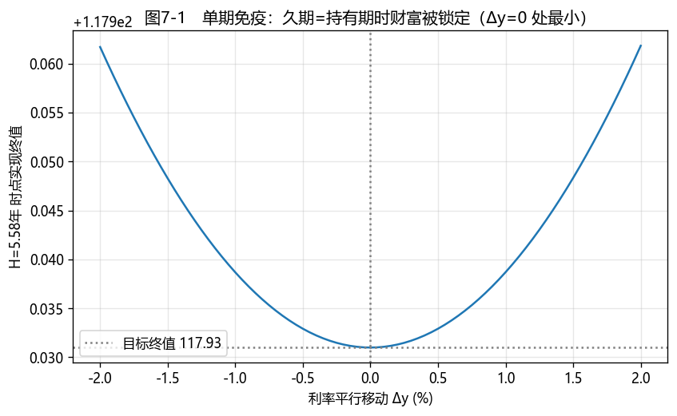

# 第7章　债券组合管理

[](https://colab.research.google.com/github/albertandking/fixed-income/blob/main/notebooks/ch07_portfolio.ipynb) [](https://mybinder.org/v2/gh/albertandking/fixed-income/main?labpath=notebooks/ch07_portfolio.ipynb)

!!! info "配套代码"
    本章免疫演示、久期匹配与现金流匹配（线性规划）由 `fi.portfolio` 实现；案例构建一个负债驱动的中国债券组合，离线即可运行。

## 7.1 本章导读与学习目标

第6章我们学会了**度量**一只债券的利率风险（久期与凸性），本章要把它升级为**管理**：当你不是孤立地持有一只债，而是要让**一整个资产组合**去对冲**一组未来负债**时，该如何配置？这正是保险公司、养老金、银行资产负债管理（ALM）每天面对的核心问题——**负债驱动投资（Liability-Driven Investing, LDI）**。

本章的主线是一个深刻而优美的洞察：第4章我们见过，利率下行时**再投资收益**下降（坏）但**债券价格**上升（好），两种风险方向相反。如果能让它们**恰好抵消**，就能把未来某个时点的财富**锁定**下来，不受利率波动影响——这就是**免疫（immunization）**。本章把这个洞察从直觉做成可计算、可求解的策略。

!!! abstract "学习目标"
    学完本章，你应能：

    1. 解释**负债驱动投资**与**免疫**的核心思想——价格风险与再投资风险的对冲；
    2. 陈述 **Redington 免疫**的三个条件（现值匹配、久期匹配、凸性占优），并用数值演示单期免疫；
    3. 用**久期匹配**（哑铃/子弹）构建免疫组合，理解其需要**动态再平衡**的原因；
    4. 用**现金流匹配（专用组合）**以线性规划求最小成本组合，并比较它与免疫的取舍；
    5. 用 `fi.portfolio` 求解久期匹配与现金流匹配，汇总组合层风险。

---

## 7.2 负债驱动投资与免疫思想

### 7.2.1 从"追求收益"到"对冲负债"

主动投资追求超额收益，但很多机构的首要目标不是"赚得多"，而是"**到期一定付得出**"：保险公司要在未来若干年兑付保单，养老金要按月发放退休金。对它们而言，风险的定义不是收益波动，而是**资产不足以覆盖负债**。负债驱动投资（LDI）因此把负债当作"基准"，让资产去**匹配**它的现值与利率敏感度。

### 7.2.2 免疫：让两种风险相互抵消

回忆第4章的再投资风险：持有一只债到某个时点 $H$，最终财富由两块构成——

- **价格部分**：到 $H$ 时债券的市价。利率上行 → 价格下跌（**价格风险**）；
- **再投资部分**：此前收到的票息再投资的累积值。利率上行 → 再投资收益上升（**再投资风险**）。

二者对利率的反应**方向相反**。免疫的精髓是：**选择合适的久期，让这两个相反的效应在目标时点恰好抵消**。可以证明，当组合的**麦考利久期等于投资期限 $H$** 时，一阶上二者完全对冲，目标时点的财富被"免疫"于（小幅平行）利率变动。

!!! tip "一个机械的类比"
    把价格部分和再投资部分想象成跷跷板的两端：利率一动，一端升、一端降。久期就是支点的位置——把支点放在 $H$ 处（久期=持有期），跷跷板就在 $H$ 这一点保持水平，无论利率怎么晃，那一点的高度（财富）几乎不变。

### 7.2.3 Redington 免疫的三个条件

对一般的"资产组合对冲负债组合"，**Redington（1952）**给出免疫盈余（资产现值 − 负债现值）对小幅平行利率变动免疫的三个条件：

$$\boxed{
\begin{aligned}
&\text{(1) 现值匹配：}\quad PV_{\text{资产}}=PV_{\text{负债}}\\
&\text{(2) 久期匹配：}\quad D_{\text{资产}}=D_{\text{负债}}\quad(\text{等价于美元久期相等})\\
&\text{(3) 凸性占优：}\quad C_{\text{资产}}\ge C_{\text{负债}}
\end{aligned}}$$

前两条保证盈余对利率的一阶导数为零；第三条保证二阶导数非负——于是利率**无论往哪个方向**小幅移动，盈余都**不减**。这解释了一个常被忽略的要点：**免疫不只要匹配久期，还要让资产凸性不低于负债凸性**（习题会让你说清"为什么"）。

---

## 7.3 久期匹配与单期免疫

### 7.3.1 单期免疫：久期 = 持有期

最简单的情形是**单笔负债**在未来 $H$ 时点到期。免疫做法：用现值等于负债现值的资金，买入**麦考利久期恰好等于 $H$** 的债券（组合）。

!!! example "例7.1：单期免疫的数值演示"
    某机构需在未来某时点兑付一笔负债。它买入一只 6 年期、年付息、票息 3% 的平价国债（价格 100，麦考利久期 $D=5.5797$ 年），并把**持有期设为 $H=D=5.5797$ 年**。目标终值为 $100\times(1.03)^{5.5797}=117.9310$。

    现在让利率**瞬时平行移动** $\Delta y$，把所有现金流按新利率再投资/折现到 $H$，计算实现终值：

    | $\Delta y$ | $H$ 时点实现终值 |
    |---|---|
    | −1.0% | 117.9387 |
    | −0.5% | 117.9329 |
    | **0.0%** | **117.9310** |
    | +0.5% | 117.9329 |
    | +1.0% | 117.9387 |

    **结论**：实现终值在 $\Delta y=0$ 处取得**最小值**，任何方向的利率冲击都让终值**略高于**目标——盈余被免疫且因正凸性而"涨多跌少"。这就是免疫：把 $H$ 时点的财富**锁定**在目标之上。

<figure markdown>
  { width="640" }
  <figcaption>图7-1　久期=持有期时，实现终值在 Δy=0 处最小、两侧上翘：财富被免疫于利率波动（正凸性带来"涨多跌少"）</figcaption>
</figure>

### 7.3.2 哑铃 vs 子弹：凸性的作用

要把组合久期配到目标 $H$，有无数种组合。两种典型：

- **子弹型（bullet）**：集中持有久期≈$H$ 的单一期限债；
- **哑铃型（barbell）**：用短久期 + 长久期两端债，加权久期=$H$。

二者久期相同，但**哑铃的凸性更高**（现金流更分散）。由 Redington 第三条，凸性越高，免疫对大幅利率变动越稳健——这是哑铃的优势；代价是哑铃通常**收益率略低**（为凸性付费），且对**曲线非平行移动**更敏感。

!!! example "例7.2：哑铃久期匹配"
    负债的久期为 7 年。用 2 年期债（$D=1.95$）与 10 年期债（$D=8.78$）构哑铃，解 $w_s\cdot1.95+w_l\cdot8.78=7$、$w_s+w_l=1$：

    $$w_l=\frac{7-1.95}{8.78-1.95}=0.7394,\qquad w_s=0.2606$$

    即把 26.06% 市值配 2 年期、73.94% 配 10 年期，组合久期恰为 7 年。

### 7.3.3 免疫不是"买完就不管"

久期会**随时间流逝和利率变动而漂移**：时间过一年，负债久期下降约 1，但资产久期通常下降不足 1；利率变了，久期也变。因此免疫组合必须**定期再平衡（rebalance）**以重新对齐久期——这是免疫的隐性成本（交易费用、跟踪误差），也是它与下面"现金流匹配"的关键区别。

---

## 7.4 现金流匹配（专用组合）

### 7.4.1 思想：精确对齐，一劳永逸

**现金流匹配（cash flow matching / dedication）**走另一条路：不玩久期近似，而是**让资产在每个时点产生的现金流，恰好覆盖该时点的负债**。如果每一期都现金流匹配，那么无论利率怎么变，到期都有钱可付——**完全不需要再平衡，也没有再投资风险**。

### 7.4.2 线性规划求最小成本

实务中希望用**最小成本**搭出这样的专用组合。设有 $n$ 只可选债券，单价 $p_i$，债券 $i$ 在第 $t$ 期的现金流为 $C_{it}$；第 $t$ 期负债为 $\ell_t$；买入份数 $x_i\ge0$。则：

$$\min_{x\ge0}\;\sum_i p_i x_i\quad\text{s.t.}\quad \sum_i C_{it}\,x_i\ge \ell_t\;\;(\forall t)$$

这是一个标准**线性规划（LP）**，`fi.portfolio.cash_flow_match` 用 `scipy.optimize.linprog` 求解。

!!! example "例7.3：现金流匹配 LP"
    未来 3 年每年末需兑付负债各 100。可选三只年付息债（每百元面值现金流）：

    | 债券 | 第1年 | 第2年 | 第3年 | 单价 |
    |---|---|---|---|---|
    | 1 年期 | 102 | 0 | 0 | 100.0 |
    | 2 年期(5%) | 5 | 105 | 0 | 101.0 |
    | 3 年期(4%) | 4 | 4 | 104 | 100.5 |

    线性规划求解得**最小成本 278.905**，买入份数约 $(0.8978,\,0.9158,\,0.9615)$，各期资产现金流精确为 $(100,100,100)$，恰好覆盖负债。

### 7.4.3 免疫 vs 现金流匹配

!!! note "两条路线的取舍"
    | 维度 | 久期免疫 | 现金流匹配 |
    |---|---|---|
    | 利率风险 | 一阶对冲（需凸性条件） | 完全消除 |
    | 再平衡 | **需要**定期再平衡 | **不需要** |
    | 成本 | 通常更低、更灵活 | 通常更高（约束更强） |
    | 适用 | 负债不确定、强调灵活 | 负债确定、强调确定性 |

    实务常用**折中**：对近端负债做现金流匹配（确定性高），对远端负债做久期免疫（灵活、成本低），即"**水平/组合免疫**"。

---

## 7.5 Python 实现：`fi.portfolio`

```python
from fi import portfolio as pf

# 组合久期 = 市值加权
pf.portfolio_duration(market_values=[1000, 1000, 1000], durations=[1.95, 4.70, 8.78])   # 5.143

# 久期匹配（哑铃）：目标久期 7，用 D=1.95 与 D=8.78 两只债
pf.two_asset_immunization(d_short=1.95, d_long=8.78, d_target=7.0)   # (0.2606, 0.7394)

# 现金流匹配（线性规划）
import numpy as np
liab = [100, 100, 100]
bond_cf = np.array([[102, 0, 0], [5, 105, 0], [4, 4, 104]], dtype=float)
prices = [100.0, 101.0, 100.5]
res = pf.cash_flow_match(liab, bond_cf, prices)
res["cost"], res["units"]      # 278.905, [0.8978, 0.9158, 0.9615]
```

`cash_flow_match` 把"各期资产现金流 ≥ 负债"写成 $-C^\top x\le-\ell$ 的不等式约束，交给 `linprog`（HiGHS 求解器）求最小成本解。

---

## 7.6 QuantLib 实现：组合层风险汇总

组合的利率风险是各券风险的**市值加权汇总**。最常用的两个组合层指标：

- **组合久期** $=\sum_i w_i D_i$（$w_i$ 为市值权重）；
- **组合 DV01** $=\sum_i \text{DV01}_i$（金额可直接相加，是风控限额的通用口径，见第6章）。

```python
import QuantLib as ql
# 对每只债用 ql.BondFunctions.duration / 自带定价引擎取 DV01，再按市值加权/求和
# 组合 DV01 = Σ 各券 DV01（金额可加），组合久期 = Σ w_i · D_i
```

!!! tip "组合久期的局限"
    组合久期只刻画**平行移动**风险。两个久期相同的组合，对**曲线变陡/变平**的暴露可能完全不同——这要用**关键利率久期**（第6章）来分解。负债驱动组合尤其要关注：负债集中在长端，若只匹配总久期、不匹配各关键期限久期，曲线非平行移动会打开缺口。

---

## 7.7 案例：负债驱动的中国债券组合

设某保险机构有一笔**久期约 7 年**的负债，用中国国债构建免疫组合。配套 notebook 演示：

1. **久期匹配**：用 2 年期与 10 年期国债构哑铃，使组合久期=7（例7.2），并计算其凸性；
2. **再平衡演示**：让时间前进一年、利率移动，观察组合久期如何漂移、需要怎样再平衡；
3. **现金流匹配对照**：对同一组负债现金流，用一组国债做现金流匹配 LP，比较两种方案的成本与稳健性；
4. **组合风险汇总**：计算组合久期、DV01 与关键利率久期，讨论曲线非平行移动下的残余风险。

**结论要点**：哑铃免疫成本低但需再平衡、且有曲线风险；现金流匹配确定性最高但成本更高。中国实务中，保险与养老资金正是超长期国债（如 30 年、50 年）的主要配置者——这与第5章"市场分割/优先聚集地理论"对超长端收益率被压低的解释相互印证。

---

## 7.8 习题与编程实验

**概念题**

1. 用"价格风险与再投资风险相互抵消"解释为什么单期免疫要令久期等于持有期。
2. Redington 免疫为什么除了久期匹配，还要求**资产凸性不低于负债凸性**？若资产凸性更低会怎样？
3. 哑铃与子弹久期相同，为什么免疫稳健性不同？哑铃的代价是什么？
4. 免疫为什么需要再平衡？现金流匹配为什么不需要？

**计算题**

5. 负债久期为 6 年，用 $D=2$ 与 $D=9$ 两只债构哑铃，求权重；若改用 $D=4$ 与 $D=7$，权重如何变化？哪种组合凸性更高？
6. 未来 2 年每年末付负债 50、150，可选 1 年期零息（价 0.98/元面值）与 2 年期 6% 付息债（价 1.00），手算能否现金流匹配，成本多少？

**编程实验**

7. 用 `fi.portfolio` 复现例7.1 的免疫演示，画出"实现终值关于 Δy"的曲线（图7-1），验证 Δy=0 处为最小。
8. 用 `fi.portfolio.cash_flow_match` 复现例7.3，再增加/删除一只可选债，观察最小成本与组合构成的变化。
9. 构建一个久期=7 的哑铃组合，模拟"时间前进一年 + 利率上行 50bp"，计算组合久期漂移量，并求出恢复久期匹配所需的再平衡调整。

---

## 7.9 本章小结

- **负债驱动投资**以负债为基准让资产去匹配；**免疫**的核心是让**价格风险与再投资风险相互抵消**。
- **Redington 免疫**三条件：现值匹配、久期匹配、**凸性占优**；满足后盈余对小幅平行利率变动免疫且"涨多跌少"。
- **单期免疫**令久期=持有期；**哑铃**比子弹凸性高、更稳健但收益略低且有曲线风险；免疫组合需**定期再平衡**。
- **现金流匹配**精确对齐各期现金流，完全消除利率风险、无需再平衡，但成本更高；可用线性规划求最小成本组合。
- `fi.portfolio` 提供组合久期、久期匹配与现金流匹配；组合 DV01 可直接相加，但只刻画平行移动，曲线风险需用关键利率久期。

下一部分（第8章已完成的货币市场与回购之后，第9章起）进入含权与高级债券品种；其中含权债的负凸性会让本章的"凸性占优"条件变得更微妙。

!!! quote "延伸阅读"
    - Fabozzi, *Bond Markets, Analysis, and Strategies*，"Liability-Driven Strategies / Bond Portfolio Management" 相关章节；
    - Redington, F. M. (1952). *Review of the Principles of Life-Office Valuations*. （免疫理论原始文献）
    - Tuckman & Serrat, *Fixed Income Securities*，关于对冲与组合风险的章节。
