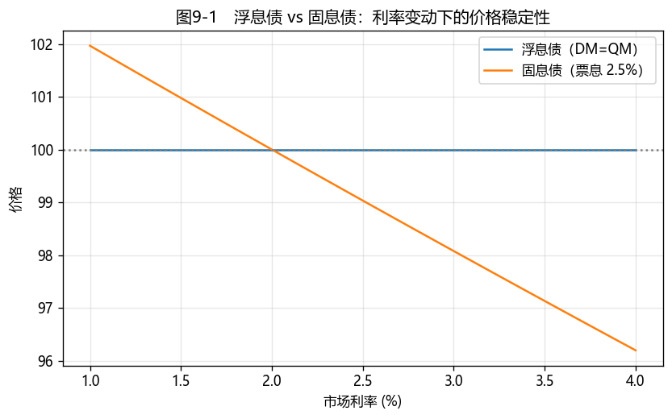

# 第8章　浮动利率债券

[](https://colab.research.google.com/github/albertandking/fixed-income/blob/main/notebooks/ch08_floating_rate.ipynb) [](https://mybinder.org/v2/gh/albertandking/fixed-income/main?labpath=notebooks/ch08_floating_rate.ipynb)

!!! info "配套代码"
    本章浮息债定价、折现利差与"浮息 vs 固息"对比由 `fi.frn` 实现，并与 QuantLib `FloatingRateBond` 对拍；案例基于中国 LPR/SHIBOR 浮息债，离线即可运行。

## 9.1 本章导读与学习目标

此前各章讨论的债券，票息都是**固定**的——发行时定好，到期不变。但利率会变：若投资者持有一只固定票息 3% 的债券，而市场利率升至 5%，该债券便显得"票息偏低"、价格下跌（第6章的利率风险）。**浮动利率债券（Floating Rate Note, FRN）**给出了另一种思路：**让票息随市场利率一起浮动**——市场利率涨，下一期票息也涨。如此一来，债券价格几乎不随基准利率波动，利率风险被大幅削弱。

但"几乎不随利率波动"不等于"没有风险"。浮息债把利率风险换成了另一类风险——**利差风险**：当市场要求的信用/流动性利差变化时，浮息债的价格依然会动。本章讲清浮息债的**重定价机制**、两个关键利差（**票面利差 QM** 与**折现利差 DM**），以及它在中国市场（LPR/SHIBOR 基准）的应用。

!!! abstract "学习目标"
    学完本章，你应能：

    1. 描述浮息债的**现金流结构与重定价机制**，解释它为何对基准利率的久期很低；
    2. 区分**票面利差（quoted margin, QM）**与**折现利差（discount margin, DM）**，理解 DM 是浮息债的"收益率"；
    3. 说明 **DM = QM 时浮息债在重定价日恰好平价**，以及 DM 偏离 QM 时价格如何变动；
    4. 辨析浮息债的**利率风险（低）与利差风险（存在）**，破除"浮息债无风险"的误区；
    5. 用 `fi.frn` 与 QuantLib `FloatingRateBond` 定价并求折现利差，分析中国 LPR/SHIBOR 浮息债。

!!! note "本章知识结构"
    **重定价机制**（9.2，票息 = 基准 + QM，每期重置）
    　↓ 为何利率久期低
    价格在每个重定价日被拉回面值 → **对基准利率的久期 ≈ 到下次重定价的时间**
    　↓ 两个利差别混淆
    **票面利差 QM vs 折现利差 DM**（9.3，DM=QM ⇒ 平价）
    　↓ 不是没风险
    **利率久期低、利差久期高**（9.4）：利差风险 / 重定价间隙 / 基准下行三类风险 → LPR/SHIBOR 案例（9.7）

---

## 9.2 浮息债的现金流与重定价机制

### 9.2.1 票息 = 基准 + 利差

浮息债的每期票息不是固定的，而是在**重定价日（reset date）**重置为：

$$\text{票息率}_t=\underbrace{\text{基准利率}_t}_{\text{随市场浮动}}+\underbrace{\text{票面利差（QM）}}_{\text{发行时定死}}$$

- **基准利率**：随市场变动的参考利率。中国浮息债常用的基准有 **LPR**（贷款市场报价利率）、**SHIBOR**（同业拆放利率）、**DR**（存款类机构回购利率），历史上还有以一年期定期存款利率为基准的老券；
- **票面利差 QM**：发行时确定、写进条款、永不改变的固定加点（如 +50bp），反映发行人的信用与发行时的市场状况。

每到重定价日，票息就"跟上"当前市场利率——这是浮息债的核心机制。

浮息债并非凭空设计出来的金融工具，其出现有特定的历史背景。20 世纪 70 年代欧美经历持续高通胀，市场利率大幅上行，早年买入固定低票息长债的投资者，其持仓在通胀中实际价值下降、价格显著回撤，固定票息在此环境下成为劣势。正是在这一背景下，浮息债被引入市场：它取消了"票息固定"这一在通胀时期最为不利的特征，代之以"票息随市场利率重置"，从而降低投资者对加息的暴露。理解这一由来，便把握了浮息债的设计主旨——**其全部机制都指向将利率风险从投资者一方转移出去**。

### 9.2.2 为什么浮息债的利率久期很低

固定票息债的价格风险，来自"票息固定、而折现率变动"的错配。浮息债把这个错配**消除**了：利率涨，下一期票息也涨，二者方向一致。直觉上，**在每个重定价日，浮息债的价格都会被"拉回"面值附近**——因为此后的票息会按新的市场利率重置，债券相当于"重新平价发行"。

因此，浮息债对**基准利率**的久期，约等于"到下一个重定价日的时间"（通常只有几个月），而不是到期期限。一只 5 年期、季度重定价的浮息债，利率久期可能只有 0.1–0.25 年——这正是浮息债"抗加息"的来源。

!!! tip "把浮息债想成"短债的滚动""
    持有一只浮息债，近似等于"不断滚动持有一只到下次重定价的短债"。因此其利率敏感度接近短债（很低），而信用暴露接近长债（持有至到期）。这种"利率短、信用长"的二重性，是理解浮息债风险的关键。

---

## 9.3 票面利差 QM 与折现利差 DM

### 9.3.1 两个利差，别混淆

| 利差 | 英文 | 含义 | 会变吗 |
|---|---|---|---|
| **票面利差** | quoted margin, QM | 写在条款里、加在基准之上算票息的固定加点 | 不变 |
| **折现利差** | discount margin, DM | 使浮息债现金流现值=市价的、基准之上的利差，即浮息债的"收益率" | 随市场变 |

**QM 是合同**，**DM 是市场对它的当前定价**。二者的关系完全平行于固定债里"票面利率 vs 到期收益率"（第3章）：

$$\boxed{\;DM=QM\Rightarrow P=\text{面值}\;(\text{重定价日});\quad DM>QM\Rightarrow P<\text{面值};\quad DM<QM\Rightarrow P>\text{面值}\;}$$

直觉：若市场当前要求的利差（DM）高于该债券支付的利差（QM）——例如发行人信用恶化——投资者仅愿以**折价**买入，以价格折让弥补利差不足的部分。

值得进一步分析 QM 与 DM 逐渐分离的过程，因为它正是浮息债"利率风险低、信用风险不低"的根本原因。在发行日，市场认为该发行人对应 +50bp 的补偿，遂将 QM 确定为 50bp、债券平价发行，此时 DM=QM。一年后，发行人经营恶化、评级下调，市场要求 +120bp 方愿持有——但 QM 写入合同、无法变更，债券仍只支付 +50bp。其间 70bp 的缺口只能由**价格下跌**来弥补：债券折价至某一水平，使"少支付的利差"由"买入价更低"加以补偿，所实现的实际利差（DM）重新等于市场要求的 120bp。由此可见，浮息债的价格波动几乎全部来自 **DM 的变动，即市场对该发行人信用判断的变化**——基准利率的涨跌已被重定价机制吸收。这也说明，分析一只信用浮息债时，关注的重点不应是其票息或 YTM，而应是**DM 相对 QM 是走阔还是收窄**：该指标反映了市场信用判断的变化。

### 9.3.2 浮息债定价

在重定价日，把未来各期票息（用基准的远期投影 + QM）按"基准远期 + DM"折现求和。一个透明的教学模型是假设**基准利率在剩余期限内恒定**为当前值 $L$：每期票息率 $=L+QM$、每期折现率 $=L+DM$，于是

$$P=\frac{(L+QM)}{k}\cdot\frac{1-\left(1+\frac{L+DM}{k}\right)^{-N}}{\frac{L+DM}{k}}\cdot F+F\left(1+\frac{L+DM}{k}\right)^{-N}$$

当 $DM=QM$ 时，无论 $L$ 取何值，上式都**精确等于面值** $F$——这就是 9.3.1 那条性质的代数证明（习题）。

!!! example "例9.1：DM = QM 时浮息债平价（与基准水平无关）"
    一只 2 年期、季度重定价（$k=4$，$N=8$）浮息债，QM = 50bp。取 DM = QM = 50bp，则无论基准 $L=1\%,2\%,3\%,4\%$，价格都精确等于 **100.000000**。

    这印证了浮息债的核心特性：**只要市场要求的利差没变，基准利率怎么动，重定价日的价格都钉在面值**——利率风险被重定价机制吸收了。

!!! example "例9.2：信用恶化推高 DM、压低价格"
    同一只债（基准 $L=2\%$，QM = 50bp）。若发行人信用恶化，市场要求的折现利差升至：

    | 折现利差 DM | 价格 |
    |---|---|
    | 50bp（= QM） | 100.0000 |
    | 80bp | 99.4185 |
    | 120bp | 98.6491 |

    反过来，若已知市价 99.50，可**反求折现利差** DM ≈ **75.78bp**——这就是浮息债的"收益率指标"，是信用债浮息券相对价值分析的核心。

### 9.3.3 简单利差（simple margin）

实务中还有一种粗略近似——**简单利差（simple margin）**，它在折现利差基础上做线性简化，计算更快但精度较低。本书以更准确的折现利差为主，简单利差留作了解（习题）。

---

## 9.4 价格、久期与风险辨析

浮息债把"利率风险"换成了"利差风险"，但并非毫无风险。此外还有一类常被忽略、却可能影响整个市场的风险——**基准本身的风险**。浮息债的票息取决于某一基准利率，而这一基准由谁报出、如何形成、是否可靠，本身即构成一个问题。2012 年揭露的 **LIBOR 操纵丑闻**即为典型案例：作为全球数百万亿美元浮息合约所锚定的基准，LIBOR 由少数大型银行每日报价产生，而非源于真实成交，多家银行被查实串通操纵报价。这一事件削弱了市场对 LIBOR 的信任，最终导致其被逐步废弃；2021—2023 年间，全球将基准切换至基于真实回购成交的 **SOFR**，大量存量浮息债与互换合约因此重新锚定。中国市场亦有自身的基准演进过程：浮息债的基准由早年的一年期定存利率，逐步转向 **SHIBOR**，2019 年 LPR 改革后则越来越多地挂钩 **LPR**——每一次基准变更，都改变了浮息债票息的来源。由此可见，**基准的选择并非单纯的技术细节，而决定了票息所依据的基础是否稳固。**

回到久期，浮息债有两类：

- **利率久期（到基准）**：很低，约等于到下次重定价的时间——这是它抗利率波动的来源；
- **利差久期（spread duration）**：与到期期限相当——DM 每变动 1bp，价格变动 ≈ 利差久期 × 1bp。信用利差走阔时，长期限浮息债照样大跌。

!!! warning "误区：浮息债"无风险""
    "浮息债不怕加息，所以没风险"——这一说法只对了一半，应予澄清。浮息债确实**利率风险低**，但：
    1. **利差风险仍在**：信用恶化或流动性收紧推高 DM，价格下跌（例9.2）；
    2. **重定价间隙风险**：两个重定价日之间，基准已变但票息未重置，存在小幅价格波动；
    3. **基准本身的风险**：若基准利率（如 LPR）下行，票息随之下降，**再投资/收益缩水**——抗加息的另一面是"怕降息"。

    一句话：浮息债是"用利率风险换利差风险与基准下行风险"，不是消灭风险。

<figure markdown>
  { width="640" }
  <figcaption>图8-1　市场利率变动时，浮息债（DM=QM）价格钉在面值，而同期限固息债价格大幅波动——浮息债利率风险低的直观体现</figcaption>
</figure>

---

## 9.5 Python 实现：`fi.frn`

```python
from fi import frn

# 例9.1：DM=QM -> 平价（与基准水平无关）
frn.price_frn(reference=0.02, quoted_margin=0.005, disc_margin=0.005, n_periods=8, freq=4)   # 100.0

# 例9.2：DM 高于 QM -> 折价
frn.price_frn(0.02, 0.005, disc_margin=0.008, n_periods=8, freq=4)    # 99.4185

# 由价格反求折现利差 DM（浮息债的"收益率"）
frn.discount_margin(price=99.50, reference=0.02, quoted_margin=0.005, n_periods=8, freq=4)   # 0.007578

# 用逐期基准（远期）曲线定价，更贴近实务
fwds = [0.018, 0.019, 0.020, 0.021, 0.022, 0.023, 0.024, 0.025]
frn.price_frn_curve(fwds, quoted_margin=0.005, disc_margin=0.005, freq=4)   # ≈ 100
```

`price_frn` 用"基准恒定"模型透明展示 DM=QM→平价；`price_frn_curve` 则用远期曲线逐期投影票息，是实务定价的雏形；`discount_margin` 用 Brent 法由价格反解 DM。

---

## 9.6 QuantLib 实现：`FloatingRateBond` 类

QuantLib 用 `IborIndex`（基准指数）+ 预测曲线 + 折现曲线给浮息债定价：

```python
import QuantLib as ql

today = ql.Date(15, 6, 2026)
ql.Settings.instance().evaluationDate = today
fwd_h = ql.YieldTermStructureHandle(ql.FlatForward(today, 0.02, ql.Actual365Fixed()))  # 基准曲线 2%
idx = ql.IborIndex("MyIbor", ql.Period(3, ql.Months), 0, ql.CNYCurrency(),
                   ql.NullCalendar(), ql.Unadjusted, False, ql.Actual365Fixed(), fwd_h)
sched = ql.Schedule(today, today + ql.Period(2, ql.Years), ql.Period(3, ql.Months),
                    ql.NullCalendar(), ql.Unadjusted, ql.Unadjusted, ql.DateGeneration.Backward, False)
bond = ql.FloatingRateBond(0, 100.0, sched, idx, ql.Actual365Fixed(), ql.Unadjusted, 0,
                           [1.0], [0.005], [], [], False, 100.0, today)   # spread = QM = 50bp
disc = ql.FlatForward(today, 0.025, ql.Actual365Fixed())   # 折现曲线 = 基准 + DM = 2% + 0.5%
bond.setPricingEngine(ql.DiscountingBondEngine(ql.YieldTermStructureHandle(disc)))
bond.cleanPrice()   # ≈ 99.99，DM=QM 时接近面值
```

!!! tip "对拍要点：基准曲线 vs 折现曲线"
    浮息债定价的关键是**两条曲线**：用**基准（预测）曲线**投影未来票息，用**折现曲线**折现。当折现曲线 = 基准曲线 + (DM=QM) 时价格≈面值。`fi.frn` 的"基准恒定"模型是这套双曲线机制的简化版；理解了 fi 的透明实现，再看 QuantLib 的工程化封装就不再是黑箱。

---

## 9.7 案例：中国 LPR / SHIBOR 浮息债分析

中国市场的浮息债以 **LPR** 与 **SHIBOR** 为主要基准（早期亦有定存基准老券）。配套 notebook 演示：

1. **浮息 vs 固息的利率风险对比**（图8-1）：让市场利率从 1% 变到 4%，浮息债（DM=QM）价格钉在面值，固息债价格大幅波动；
2. **折现利差分析**：给定一只 SHIBOR 浮息债的市价，反求 DM，与票面利差 QM 比较，判断其相对贵贱；
3. **远期曲线定价**：用第5章构建的基准远期曲线投影票息，给浮息债定价，与"基准恒定"近似对比；
4. **利差久期**：数值估计该浮息债对 DM 变动的敏感度，量化其"利差风险"。

**结论要点**：浮息债以低利率久期抵御加息，但承担利差风险与基准下行风险；其相对价值分析的核心不是 YTM，而是**折现利差 DM**。在中国，LPR 浮息债还把债券票息与贷款定价锚（LPR）联系起来，是利率市场化进程的一个缩影（第1章）。

---

## 9.8 习题与编程实验

**概念题**

1. 用重定价机制解释：为什么浮息债对基准利率的久期约等于"到下次重定价的时间"，而不是到期期限？
2. 票面利差 QM 与折现利差 DM 有何区别？它们与固定债里的"票面利率 vs 到期收益率"如何类比？
3. "浮息债不怕加息所以无风险"错在哪里？列举浮息债仍承担的三类风险。

**计算题**

4. 代数证明：在"基准恒定"模型下，当 $DM=QM$ 时浮息债价格精确等于面值（提示：令折现率 = 票息率，套用年金恒等式）。
5. 一只 3 年期、季度重定价浮息债，基准 2.5%、QM = 40bp。若 DM = 70bp，估算其价格（可用近似）。

**编程实验**

6. 用 `fi.frn.price_frn` 复现例9.1，验证 DM=QM 时价格与基准水平无关；再画出"价格关于 DM"的曲线，标出 DM=QM 处为面值。
7. 复现图8-1：让市场利率从 1% 到 4%，对比浮息债（DM=QM）与同期限固息债的价格曲线。
8. 用 `fi.frn.discount_margin` 对一只给定市价的浮息债反求 DM；再用 `fi.frn.price_frn` 数值估计其**利差久期**（DM ±1bp 重定价），与固息债的修正久期对比。

---

## 9.9 习题参考答案与详解

!!! tip "完整可运行解答 notebook"
    本节编程实验的**完整可运行代码**见 [`notebooks/solutions/ch08_solutions.ipynb`](https://colab.research.google.com/github/albertandking/fixed-income/blob/main/notebooks/solutions/ch08_solutions.ipynb)（点击徽章可在 Colab 直接运行）。

!!! success "概念题 1"
    在每个**重定价日**，浮息债的票息重置为"当前基准 + QM"，相当于"重新平价发行"，价格被拉回面值附近。所以利率风险只在"两个重定价日之间"积累，对基准利率的久期 ≈ **到下次重定价的时间**（通常几个月），而非到期期限。可把浮息债近似看作"不断滚动持有一只到下次重定价的短债"。

!!! success "概念题 2"
    **QM（票面利差）**写在条款里、固定不变，是发行时定的加点；**DM（折现利差）**是市场当前要求的利差、随市场变动，是浮息债的"收益率指标"。二者类比固定债的"**票面利率 vs 到期收益率**"：QM↔票面利率（合同固定），DM↔YTM（市场定价）；DM=QM ⇔ 平价，DM>QM ⇔ 折价。

!!! success "概念题 3"
    错在"无风险"。浮息债**利率风险低**（重定价吸收），但仍承担：① **利差风险**（信用恶化/流动性收紧推高 DM，价格下跌，利差久期≈到期期限）；② **重定价间隙风险**（两个重定价日之间基准已变、票息未重置的小幅波动）；③ **基准下行风险**（基准如 LPR 下行→票息下降→收益缩水）。抗加息的另一面是怕降息。

!!! success "计算题 4（代数证明）"
    "基准恒定"模型下，每期折现率 $i=(L+DM)/k$、每期票息率 $(L+QM)/k$。令 $DM=QM$，则票息率 = 折现率 $=i$。价格（面值归一）：

    $$P=i\cdot\frac{1-(1+i)^{-N}}{i}+(1+i)^{-N}=\big[1-(1+i)^{-N}\big]+(1+i)^{-N}=1$$

    即**精确等于面值**，且与基准水平 $L$ 无关。∎

!!! success "计算题 5"
    3 年期、季度重定价（$k=4$，$N=12$），基准 2.5%、QM=40bp、DM=70bp。因 **DM > QM**，价格**低于面值**。用 `fi.frn.price_frn(0.025, 0.004, 0.007, n_periods=12, freq=4)` 得 **≈ 99.145**。直觉：市场要求的利差（70bp）高于债券支付的（40bp），用约 0.85 元的价格折让补足差额。

!!! success "编程实验 6–8（要点）"
    - **实验 6**：`price_frn` 在 DM=QM 时对任意基准都返回 100；画"价格 vs DM"曲线，在 DM=QM 处穿过面值、DM 越大价格越低。
    - **实验 7**：图8-1——市场利率从 1% 到 4%，浮息债（DM=QM）价格钉在 100，固息债大幅波动，直观显示浮息债利率风险低。
    - **实验 8**：`discount_margin` 由市价反求 DM；用 DM±1bp 重定价的差商估"利差久期"，会发现它与**同期限固息债的修正久期相当**（≈到期期限），而浮息债的利率久期却很低——印证"利率短、信用长"的二重性。

---

## 9.10 本章小结

- **浮息债**的票息在每个重定价日重置为"**基准 + 票面利差 QM**"，使其对基准利率的**久期很低**——价格在每个重定价日被拉回面值附近。
- **票面利差 QM**（合同固定）与**折现利差 DM**（市场定价、浮息债的"收益率"）要分清；**DM=QM⇒重定价日平价**，DM>QM⇒折价。
- 浮息债不是无风险：它把利率风险换成了**利差风险（spread duration）+ 重定价间隙风险 + 基准下行风险**。
- `fi.frn`（基准恒定模型 + 远期曲线模型 + DM 求解）与 QuantLib `FloatingRateBond`（双曲线机制）一致。
- 中国浮息债以 **LPR/SHIBOR** 为主要基准，相对价值分析看 **DM** 而非 YTM。

下一章（第9章）进入**含权债券**：可赎回/可回售债券的现金流会随利率变化，带来**负凸性**，让第6章的久期凸性分析变得更微妙，也需要新的定价工具（利率树）。

!!! note "关键公式速查"
    | 概念 | 公式 |
    |---|---|
    | 票息率 | 基准利率 + 票面利差 QM |
    | 定价（基准恒定） | $P=\dfrac{L+QM}{k}\cdot\text{年金因子}\cdot F+F(1+\tfrac{L+DM}{k})^{-N}$ |
    | 平价条件 | $DM=QM\Rightarrow P=$ 面值（与基准水平无关） |
    | 价格判据 | $DM>QM$ 折价，$DM<QM$ 溢价 |
    | 利率久期 | ≈ 到下次重定价的时间（很低）；利差久期 ≈ 到期期限 |

!!! quote "延伸阅读"
    - Fabozzi, *Bond Markets, Analysis, and Strategies*，"Floating-Rate Securities" 与 "Valuation of Floating-Rate Bonds" 章节；
    - Tuckman & Serrat, *Fixed Income Securities*，关于浮息债与利差的讨论；
    - 中国人民银行关于 LPR 形成机制改革的公告；全国银行间同业拆借中心 SHIBOR 相关规则——理解中国浮息债基准的制度背景。
