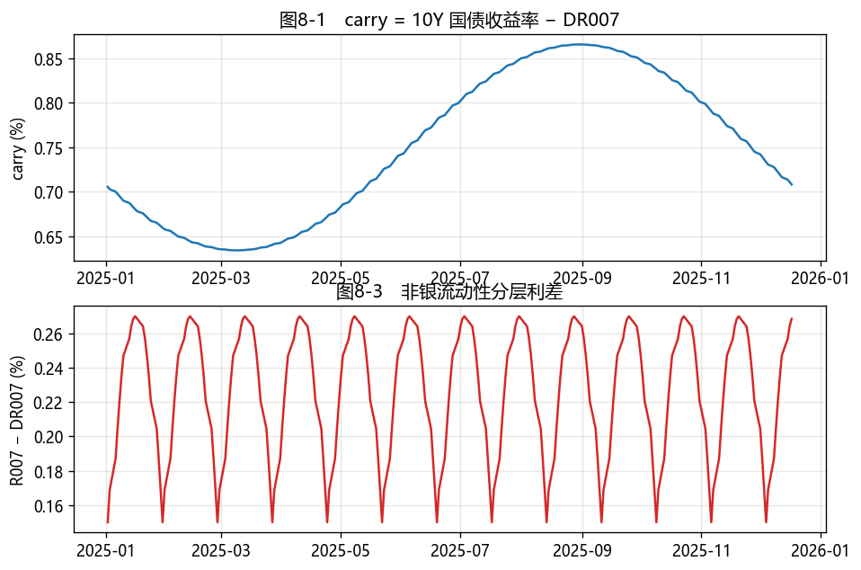
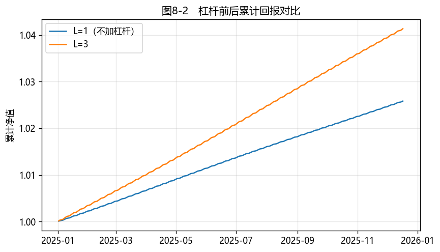

# 第8章　货币市场工具与回购市场

[](https://colab.research.google.com/github/albertandking/fixed-income/blob/main/notebooks/ch08_money_market_repo.ipynb) [](https://mybinder.org/v2/gh/albertandking/fixed-income/main?labpath=notebooks/ch08_money_market_repo.ipynb)

!!! info "配套代码"
    本章回购现金流、资金成本与杠杆套息均由复用包 `fi.repo` 实现；案例使用内置货币市场利率样本（`fi.data.load_sample("money_market")`），离线即可运行。

## 8.1 本章导读与学习目标

**前几章把债券当成一个孤立的现金流去定价——但真实的债券投资者从不孤立地持有债券。** 他们用回购把手里的债券质押出去借钱，再买更多债券；他们盯着 DR007 判断"资金面"松紧；他们靠"持有收益高于融资成本"这一点点利差，用杠杆把它放大成可观的回报。这套围绕**货币市场**与**回购**运转的机制，是中国债券市场流动性的心脏，也是 2013 年"钱荒"、2016 年债灾的导火索。本章不推导复杂模型，而是讲清楚**制度如何运转、现金流如何计算、杠杆如何放大收益与风险**。

!!! abstract "学习目标"
    学完本章，你应能：

    1. 列举中国货币市场的主要工具（同业存单 NCD、短融/超短融、央票），说明各自的发行人、期限与市场；
    2. 描述**质押式回购**与**买断式回购**的机制差异，并计算回购两端的现金流与利息（ACT/365）；
    3. 解读中国回购利率体系（**DR / R / GC**），理解 DR007 作为政策利率锚与"资金面"指标的含义；
    4. 推导**杠杆套息**的权益回报恒等式 $\text{ROE}=y+(L-1)(y-r)$，并说明 carry、roll-down 与杠杆的关系；
    5. 用 `fi.repo` 测算回购资金成本与杠杆收益，对一段真实/样本数据做套息策略复盘；
    6. 辨析杠杆套息的三类风险：利率风险放大、滚动续作风险、负 carry 反噬。

---

!!! note "本章知识结构"
    **货币市场工具**（8.2，NCD / 短融超短融 / 央票）
    　↓ 抵押融资
    **回购机制**（8.3，质押式 vs 买断式、ACT/365 单利）
    　↓ 资金价格
    **DR / R / GC 利率体系**（8.4，DR007 政策锚、R−DR 流动性分层）
    　↓ 借短买长
    **杠杆套息**（8.5，$\text{ROE}=y+(L-1)(y-r)$、三类风险）→ 套息策略复盘（8.7）

## 8.2 货币市场工具概览

**货币市场**指期限在 1 年以内、高流动性、低信用风险的短期资金融通市场。它是机构管理流动性、央行传导货币政策的主战场。中国货币市场的主要工具：

| 工具 | 发行人 | 典型期限 | 市场 | 说明 |
|---|---|---|---|---|
| 同业存单（NCD） | 存款类金融机构（银行） | 1M–1Y | 银行间 | 银行最重要的**主动负债**工具，发行利率紧盯资金面 |
| 短期融资券（CP） | 非金融企业 | ≤1Y | 银行间（交易商协会注册） | 企业短期直接融资 |
| 超短期融资券（SCP） | 非金融企业（高评级） | ≤270 天 | 银行间 | 滚动发行，成本低 |
| 央行票据（央票） | 中国人民银行 | 3M–3Y | 银行间 | 回笼流动性的工具；近年境内少用，有离岸央票 |
| 同业拆借 | 银行间机构 | 隔夜–1Y | 银行间 | 信用拆借，无抵押 |

!!! note "为什么 NCD 利率是观察资金面的窗口"
    同业存单是银行"主动借钱"的标准化凭证。当资金面收紧、银行缺钱时，1 年期 NCD 发行利率会迅速抬升——它比贷款利率灵敏得多，常被用作中短端资金价格的风向标。

---

## 8.3 回购市场机制：质押式 vs 买断式

**回购（Repo）= 抵押融资。** 一方把债券作抵押借入资金（**正回购方 / 融资方**），到期还本付息、赎回债券；另一方融出资金、赚取利息（**逆回购方 / 资金融出方**）。这是债市加杠杆的基础设施。

理解回购，最直观的类比是**当铺**。你手头有一块值钱的金表（债券），急需用钱但又不想卖掉它，于是拿去当铺：当铺给你一笔现金（略低于金表市值，留出"折扣"防跌价），约定几天后你拿本金加一点利息把金表赎回。回购几乎是同一回事——只不过"金表"换成了国债、"当铺"换成了资金融出方、"当期"短到隔夜或七天，而且交易量是天文数字。这个朴素机制之所以是债券市场的命脉，是因为它同时满足了两类人的迫切需求：**手握债券但缺现金的人**（用券融到低成本资金），和**手握现金想安全增值的人**（把钱借出去、有债券作抵押、几乎无风险地赚利息）。整个银行间市场每天数万亿元的资金，就是通过这套"以券换钱、到期赎回"的管道循环流动的——它是金融体系名副其实的**水管**，平日无声无息，一旦堵塞（如 2013 年钱荒），整栋大楼立刻断水。

### 8.3.1 两种回购的本质区别

| 维度 | 质押式回购（Pledged Repo） | 买断式回购（Outright Repo） |
|---|---|---|
| 债券所有权 | **不转移**，仅质押冻结 | **转移**给逆回购方 |
| 逆回购方能否再处置 | 否（券被冻结） | 能（可再卖出/再质押） |
| 主要用途 | 日常融资（绝对主流） | 解决重复质押、支持做空 |
| 违约处置 | 处置质押券 | 已持有券，处置更直接 |

绝大多数成交是**质押式回购**。买断式因为所有权转移，能让逆回购方拿到券去做空或再融资，但占比小。

### 8.3.2 回购现金流与利息

中国银行间回购利息按**实际天数 / 365 单利**计算：

$$I=\text{本金}\times r\times\frac{\text{天数}}{365}$$

从**融资方（正回购）**视角的现金流：

- 第 0 天：交付质押券，**收到资金**（本金 $C$）；
- 第 $N$ 天：**偿还** $C+I$，赎回质押券。

逆回购方现金流方向相反：第 0 天融出 $C$，到期收回 $C+I$。

!!! example "例8.1：7 天质押式回购的现金流"
    某基金以面值 1 亿元的国债质押，做 7 天质押式回购融资，回购利率 1.85%。

    **利息**：

    $$I=100{,}000{,}000\times1.85\%\times\frac{7}{365}=35{,}479.45\text{ 元}$$

    **现金流**：第 0 天收到 1 亿元；第 7 天偿还 $100{,}035{,}479.45$ 元，赎回质押的国债。

    若融资方把这 1 亿元又买入国债、再质押、再融资……就形成了**杠杆**（见 8.5）。

---

## 8.4 回购利率体系（DR / R / GC）与资金面

中国有多套并行的回购利率，区别在于**参与机构**和**质押品**：

| 利率 | 全称含义 | 参与方 | 质押品 | 角色 |
|---|---|---|---|---|
| **DR** | 存款类机构间利率债质押回购 | 仅存款类机构（银行） | 仅利率债 | **政策利率锚**，剔除信用与流动性分层 |
| **R** | 银行间全市场质押回购 | 全市场（含非银） | 各类债券 | 反映全市场资金价格 |
| **GC** | 交易所质押式回购 | 交易所参与者（含个人） | 标准券 | 交易所资金价格（如 GC001） |

其中 **DR007（7 天期 DR）是央行重点培育的基准利率**：它围绕 7 天逆回购操作利率（OMO，即政策利率）波动，是**利率走廊的中枢**，也是判断"资金面"松紧最常看的指标。

!!! tip "R − DR 利差：流动性分层的温度计"
    - **DR** 只含银行、只收利率债质押，几乎无信用与流动性溢价；
    - **R** 含非银机构（基金、券商、理财），它们融资要付更高价格。
    - 因此 **R007 − DR007 利差**衡量"非银相对银行的融资溢价"。利差骤然走阔，往往意味着流动性分层加剧、非银被"挤出"——这是 2013 年钱荒、2016 年末等流动性冲击的典型特征。

---

## 8.5 债市杠杆与套息（carry & roll-down）

### 8.5.1 carry：持有收益减融资成本

**套息（carry）交易**的逻辑朴素到极致：**借短买长**——用低成本的短期回购资金，买入收益率更高的债券，赚取利差。每单位时间的 carry 就是

$$\text{carry}=y-r$$

其中 $y$ 是持有债券的收益率，$r$ 是回购融资利率。只要收益率曲线**向上倾斜**（长端高于短端、高于资金成本），carry 通常为正。

除了 carry，持有期还有 **roll-down（骑乘下滑）收益**：当曲线向上倾斜，债券随时间临近到期，会沿曲线"下滚"到更低的收益率点，收益率下降意味着价格上升，带来额外资本利得（详见第17章骑乘策略）。

### 8.5.2 杠杆：把利差放大

回购融资有**折扣率（haircut）**：质押 100 元市值的债券，只能借到 $100\times(1-\text{haircut})$ 元。利率债资质好、折扣率低（质押率常达 95%+），信用债折扣率高。把借到的钱再买债、再质押，反复进行，理论最大杠杆为

$$L_{\max}=\frac{1}{\text{haircut}}$$

设实际杠杆为 $L=$ 总资产 / 自有权益。在纯 carry 视角（暂不计债券价格变动）下，自有资金的权益回报率为：

$$\boxed{\;\text{ROE}=y+(L-1)(y-r)\;}$$

**推导**：自有权益 $E$，买入债券总市值 $V=L\cdot E$，其中借入 $V-E=(L-1)E$。一年内债券赚 $yV$，融资付 $r(V-E)$，故

$$\text{ROE}=\frac{yV-r(V-E)}{E}=yL-r(L-1)=y+(L-1)(y-r).$$

含义一目了然：**权益回报 = 不加杠杆的票息 + (杠杆−1) × carry 利差**。

这个公式漂亮，但它藏着一个不写在纸面上的结构性脆弱：**期限错配**。注意杠杆套息的标准玩法是"用 7 天回购的钱，买 10 年的债"——融资端是短到不能再短的隔夜或七天，资产端却是长达十年的长债。这意味着持有这笔头寸的人，每隔几天就必须到回购市场上**重新借一次钱**来续上前一笔，如此往复几百次，才能撑到长债到期。平日里这没问题，资金充裕、利率平稳，借新还旧如行云流水。可一旦某天资金面骤紧、借不到钱或借钱成本暴涨，这个"短借长投"的结构就会瞬间绷断：要么被迫亏本抛掉长债去还短钱（踩踏），要么咬牙以高得离谱的利率续作（负 carry 反噬）。**杠杆放大的从来不只是那 0.7% 的利差，更是这种"靠不断续命维系的期限错配"本身的脆弱性。** 上式里那个看似中性的 $L$，乘上的不仅是收益，还有 8.5.3 即将展开的全部风险——这正是 2013 年钱荒里无数机构血的教训。

!!! example "例8.2：杠杆套息的收益与反噬"
    持有 10 年期国债（$y=2.55\%$），用 7 天回购滚动融资（$r=1.85\%$），carry 利差 $y-r=0.70\%$。

    | 杠杆 $L$ | ROE $=y+(L-1)(y-r)$ |
    |---|---|
    | 1（不加杠杆） | $2.55\%$ |
    | 3 | $2.55\%+2\times0.70\%=\mathbf{3.95\%}$ |

    **杠杆把 0.70% 的利差放大成 1.40% 的超额回报。** 但反过来——若资金面收紧、回购利率飙到 $r=2.80\%$：

    $$\text{carry}=2.55\%-2.80\%=-0.25\%,\qquad \text{ROE}=2.55\%+2\times(-0.25\%)=\mathbf{2.05\%}$$

    回报反而**低于不加杠杆**。这就是**负 carry 反噬**：杠杆是双刃剑，融资成本一旦超过持有收益，杠杆越高亏得越多。

### 8.5.3 三类风险

!!! warning "杠杆套息的风险"
    1. **利率风险被放大**：组合的久期/DV01 被乘以杠杆 $L$（见第6章）。利率上行时，杠杆头寸的市值损失是无杠杆的 $L$ 倍。
    2. **滚动续作（rollover）风险**：用隔夜或 7 天回购为长债融资，需不断"借新还旧"。一旦资金面骤紧，要么续不上钱被迫抛券（踩踏），要么续作成本飙升——这正是 **2013 年"钱荒"**的剧本。
    3. **负 carry 反噬**：如例8.2，融资成本超过持有收益时，杠杆放大亏损。

    监管对各类产品的杠杆率设有上限（如开放式债基总资产/净资产不超过 140%），正是为约束上述风险。

!!! note "历史镜鉴：2013 年"钱荒"与 2022 年"理财赎回潮""
    **2013 年 6 月"钱荒"**：彼时大量机构用短期回购为长久期资产融资、加杠杆套息。当资金面骤然收紧（季末考核、外汇占款下降、央行未及时投放叠加），隔夜回购利率一度飙至两位数，被迫去杠杆的机构集中抛券，利率与资金价格螺旋上行——这是"滚动续作风险"最经典的一次集中爆发。

    **2022 年 11 月"理财赎回潮"**：利率快速上行使债券型理财净值回撤，触发投资者赎回，理财被迫抛债，债券下跌又进一步压低净值、引发更多赎回，形成"下跌→赎回→抛售→再下跌"的**负反馈螺旋**。它提醒我们：杠杆与期限错配放大的不只是收益，还有**流动性踩踏的系统性风险**。

    读这两段历史，是为了让"三类风险"从抽象条款变成有血有肉的教训。

---

## 8.6 Python 实现：回购现金流与资金成本（`fi.repo`）

```python
from fi import repo

# 例8.1：1 亿元国债质押，7 天，回购利率 1.85%
cf = repo.repo_cashflows(principal=1e8, rate=0.0185, days=7)
cf["interest"]    # 35479.45 元
cf["dayN_out"]    # 100035479.45 元

# 例8.2：10Y 国债 2.55%，回购融资 1.85%，杠杆 3 倍
repo.leveraged_carry(bond_yield=0.0255, repo_rate=0.0185, leverage=3)["roe_annual"]   # 0.0395
# 资金面收紧：回购利率升到 2.80%
repo.leveraged_carry(0.0255, 0.0280, leverage=3)["roe_annual"]                        # 0.0205

# 由折扣率得到理论最大杠杆
repo.max_leverage(haircut=0.05)   # 20.0
```

`leveraged_carry` 实现的就是 $\text{ROE}=y+(L-1)(y-r)$，返回 `carry_spread`、`roe_annual` 与按持有期折算的 `roe_period`。

---

## 8.7 案例：用回购加杠杆的套息策略复盘

我们用内置的货币市场利率样本（`fi.data.load_sample("money_market")`，含 DR007、R007、1Y NCD、10Y 国债收益率；真实抓取见附录C），复盘一个**"持有 10Y 国债 + 7 天回购滚动融资"**的杠杆套息策略：

1. **carry 时间序列**：$\text{carry}_t=y^{\text{10Y}}_t-\text{DR007}_t$，反映每日"借短买长"的利差；
2. **杠杆 ROE**：在 $L=3$ 下，按 $\text{ROE}_t=y_t+(L-1)(y_t-\text{DR007}_t)$ 逐日测算权益回报；
3. **资金面与分层**：叠加 $\text{R007}-\text{DR007}$ 利差，观察非银融资溢价的波动。

配套 notebook 画出三张图并给出统计：

- **图8-1** carry 随时间的波动——资金中枢 DR007 抬升时，carry 被显著压缩；
- **图8-2** $L=1$ 与 $L=3$ 的累计回报对比——杠杆放大了平均收益，也放大了每日回报的波动幅度；
- **图8-3** R007 − DR007 利差——利差走阔的时段对应非银资金紧张。

<figure markdown>
  { width="720" }
  <figcaption>图8-1（上）carry = 10Y 国债收益率 − DR007；图8-3（下）R007 − DR007 流动性分层利差</figcaption>
</figure>

<figure markdown>
  { width="640" }
  <figcaption>图8-2　L=1 与 L=3 的累计净值对比：杠杆放大了平均回报（样本期 carry 恒正，故无回撤）</figcaption>
</figure>

**复盘结论（样本数据）**：

1. 样本期内 carry 多数时间为正，但**在 DR007 上行阶段被压缩到极薄**，此时 $L=3$ 的超额回报几乎消失；
2. 杠杆把累计回报从约 2.6% 抬高到约 4.1%（$L=3$）。注意：本案例**只算 carry 且样本期 carry 始终为正**，故净值单调上行、回撤为零；但这并不意味着杠杆无风险——一旦计入债券价格变动，杠杆会**按 $L$ 倍同比例放大久期损失与回撤**（见下方 note 与例8.2 的负 carry 反噬）；
3. R007 − DR007 利差在资金紧张时段明显走阔，提示**非银机构正是滚动续作风险的高暴露方**。

!!! note "从 carry 到真实损益"
    本案例只算 carry（持有收益 − 融资成本），未计入债券价格变动。真实策略损益还要叠加久期带来的资本利得/损失（第6章）与 roll-down 收益（第17章）。把这三块合起来，才是杠杆债券组合的完整回报。

---

## 8.8 习题与编程实验

**概念题**

1. 质押式回购与买断式回购在**债券所有权**与**逆回购方能否再处置质押券**上有何区别？为什么买断式回购能支持做空？
2. 用一句话解释 DR007 与 R007 的区别，并说明为什么央行把 DR007 培育为政策利率锚。
3. 在什么情形下"加杠杆套息"反而亏钱？结合 carry 与融资成本说明。

**计算题**

4. 某机构以面值 5000 万元的国开债质押做 14 天质押式回购，回购利率 2.10%，计算利息与到期偿还金额。
5. 自有资金 2 亿元，买入收益率 2.60% 的信用债，回购融资成本 1.90%。分别计算 $L=2$ 与 $L=4$ 下的权益回报；若融资成本升至 2.70%，两种杠杆下的 ROE 各是多少？

**编程实验**

6. 用 `fi.repo` 复现例8.1、例8.2 的全部数字，并画出 ROE 关于杠杆 $L$（1→5）的曲线，标出在 $r=1.85\%$ 与 $r=2.80\%$ 两种融资成本下曲线的交叉点（负 carry 临界杠杆）。
7. 用内置 `money_market` 样本复盘 8.7 案例：画出 carry 时间序列与 $L=1$ vs $L=3$ 的累计回报，计算两者的年化收益与最大回撤之比。
8. 用 akshare 取真实的 DR007、R007 与 10Y 国债收益率（见附录C），重做上述复盘，并标注 R007 − DR007 利差最大的若干交易日，结合当时的市场新闻讨论流动性事件。

---

## 8.9 习题参考答案与详解

!!! tip "完整可运行解答 notebook"
    本节编程实验的**完整可运行代码**见 [`notebooks/solutions/ch08_solutions.ipynb`](https://colab.research.google.com/github/albertandking/fixed-income/blob/main/notebooks/solutions/ch08_solutions.ipynb)（点击徽章可在 Colab 直接运行）。

!!! success "概念题 1"
    **质押式回购**：债券所有权不转移、仅质押冻结，逆回购方**不能**再处置质押券；是日常融资的绝对主流。**买断式回购**：债券所有权**转移**给逆回购方，到期再买回，逆回购方**能**再卖出/再质押。正因所有权转移、逆回购方真正持有了券，买断式回购才能让其在市场上**卖出该券做空**——质押式做不到（券被冻结）。

!!! success "概念题 2"
    **DR007** 仅含存款类机构、只收**利率债**质押，几乎无信用与流动性溢价；**R007** 含全市场（含非银），质押品更杂，含更高溢价。央行把 DR007 培育为**政策利率锚**，正因它"干净"——剔除了信用与流动性分层，最能反映银行体系真实资金成本，便于作为政策传导的基准（DR007 围绕 7 天逆回购利率波动）。

!!! success "概念题 3"
    当**融资成本 $r$ 超过持有收益 $y$**（即 carry $=y-r<0$）时，加杠杆套息反而亏钱。由 $\text{ROE}=y+(L-1)(y-r)$：carry 为负时，杠杆 $L$ 越大、ROE 越低（负 carry 反噬）。这通常发生在**资金面骤紧**（DR007 飙升）时，例如计算题 5 中融资成本升到 2.70%（> 收益 2.60%），杠杆越高 ROE 越低。

!!! success "计算题 4"
    回购利息按 ACT/365 单利：

    $$I=5000\text{万}\times2.10\%\times\frac{14}{365}=\mathbf{40{,}273.97}\text{ 元}$$

    到期偿还 = 本金 + 利息 = $50{,}000{,}000+40{,}273.97=\mathbf{50{,}040{,}273.97}$ 元。

!!! success "计算题 5"
    用 $\text{ROE}=y+(L-1)(y-r)$，$y=2.60\%$：

    | 融资成本 $r$ | carry | $L=2$ | $L=4$ |
    |---|---|---|---|
    | 1.90% | +0.70% | **3.30%** | **4.70%** |
    | 2.70% | −0.10% | **2.50%** | **2.30%** |

    正 carry（r=1.9%）时杠杆放大收益；**负 carry（r=2.7%）时杠杆放大亏损**——$L=4$ 的 ROE（2.30%）反而低于 $L=2$（2.50%），印证负 carry 反噬。

!!! success "编程实验 6–8（要点）"
    - **实验 6**：`fi.repo` 复现例8.1（利息 35,479.45）、例8.2（L=3 ROE 3.95%）；画 ROE-杠杆曲线，正 carry（r=1.85%）斜率向上、负 carry（r=2.80%）斜率向下，二者在 $y=r$（carry=0）处交于不加杠杆的票息水平。
    - **实验 7**：用 `money_market` 样本画 carry 时序与 L=1 vs L=3 累计回报——杠杆放大平均收益（约 2.6%→4.1%）；注意样本 carry 恒正故无回撤（真实数据会有）。
    - **实验 8**：akshare 取真实 DR007/R007/10Y，标注 R007−DR007 利差最大的交易日（往往对应季末、钱荒等流动性事件），结合新闻理解流动性分层。

---

## 8.10 本章小结

- **货币市场**是 1 年以内的短期资金市场，NCD、短融/超短融、央票是主要工具；NCD 发行利率是观察资金面的灵敏窗口。
- **回购 = 抵押融资**：质押式回购（券不过户、主流）与买断式回购（券过户、可做空）；利息按 **ACT/365 单利**计算。
- 中国回购利率分 **DR / R / GC** 三套；**DR007 是政策利率锚与资金面指标**，**R007 − DR007 利差**度量非银的流动性分层。
- **杠杆套息**的核心恒等式 $\text{ROE}=y+(L-1)(y-r)$：权益回报 = 票息 + (杠杆−1) × carry 利差；杠杆同时放大收益与风险。
- 三类风险——**利率风险放大、滚动续作风险、负 carry 反噬**——共同决定了杠杆策略的脆弱性，也是监管设杠杆上限的原因。

!!! note "知识点自测清单"
    - [ ] 区分**质押式 vs 买断式回购**，解释为何买断式支持做空
    - [ ] 按 **ACT/365 单利**计算回购利息与到期偿还
    - [ ] 说清 **DR007 vs R007**、为何 DR007 是政策利率锚
    - [ ] 解释 **R007−DR007 利差**（非银流动性分层）的含义
    - [ ] 用 $\text{ROE}=y+(L-1)(y-r)$ 计算杠杆套息回报
    - [ ] 解释**负 carry 反噬**与三类风险（利率放大/滚动续作/负carry）
    - [ ] 复述 2013 钱荒 / 2022 理财赎回潮的风险传导

!!! quote "延伸阅读"
    - Fabozzi, *Bond Markets, Analysis, and Strategies*，关于货币市场工具与回购市场的章节；
    - 中国人民银行《货币政策执行报告》中关于公开市场操作、DR 利率培育与流动性管理的专栏；
    - 全国银行间同业拆借中心关于质押式/买断式回购的交易规则；复盘 2013 年"钱荒"与 2022 年理财赎回潮的研究报告，理解杠杆与流动性风险的传导。

下一部分（第9章起）将进入含权与高级债券品种；其中浮息债的定价正好要用到本章的基准利率（LPR/SHIBOR/DR）体系。
