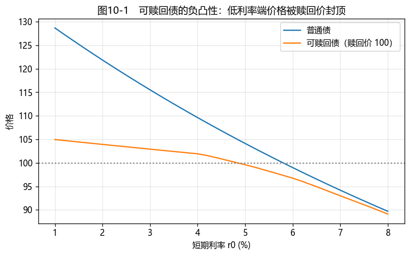

# 第10章　可赎回债券与可回售债券

[](https://colab.research.google.com/github/albertandking/fixed-income/blob/main/notebooks/ch10_callable_putable.ipynb) [](https://mybinder.org/v2/gh/albertandking/fixed-income/main?labpath=notebooks/ch10_callable_putable.ipynb)

!!! info "配套代码"
    本章利率二叉树、含权债定价、有效久期/凸性由 `fi.tree` 实现，并与 QuantLib `CallableFixedRateBond`（Hull-White 树引擎）对拍。

## 10.1 本章导读与学习目标

到目前为止，我们的债券现金流都是"铁板钉钉"的。但现实中大量债券**带有嵌入期权**：发行人可以提前赎回（**可赎回债**），或投资者可以提前回售（**可回售债**）。这些期权让现金流**随利率变化**——利率下行时发行人会赎回低成本再融资，利率上行时投资者会回售拿回本金。一旦现金流不再确定，前面"逐笔折现"的定价方法就**失效**了，必须引入能描述"利率走不同路径、期权相机行权"的新工具：**利率树**。

更重要的是，嵌入期权会带来一个第6章没出现过的现象——**负凸性**：可赎回债在低利率区价格被"封顶"，涨不动了。这让久期、凸性的分析变得微妙，也催生了一个专门的利差指标——**期权调整利差（OAS）**。本章是全书技术上较硬的一章，但它把"期权 + 债券"这两条主线第一次拧在一起。

!!! abstract "学习目标"
    学完本章，你应能：

    1. 说明可赎回债与可回售债的**期权归属**，并用"债券 = 普通债 ± 期权"分解其价值；
    2. 解释嵌入期权如何导致**负凸性**与**久期压缩**；
    3. 用**利率二叉树 + 反向归纳**为含权债定价，理解 ``min/max`` 行权决策；
    4. 定义**期权调整利差（OAS）**，理解它为何依赖波动率假设；
    5. 用 `fi.tree` 与 QuantLib `CallableFixedRateBond` 定价并计算有效久期、有效凸性。

---

## 10.2 嵌入期权的债券：谁持有期权？

理解含权债的钥匙，是看清**期权属于谁**。

### 10.2.1 可赎回债（callable）：发行人持有看涨期权

可赎回债允许**发行人**在约定日期以约定价格（赎回价）提前赎回债券。发行人会在**利率下行**时行权——用更低成本重新发债，把高息旧债赎回（"借新还旧"）。这相当于投资者**卖给了发行人一个期权**，于是：

$$\boxed{\;V_{\text{可赎回}}=V_{\text{普通债}}-V_{\text{赎回期权}}\;}$$

可赎回债更便宜（收益率更高）——这个更高的收益率，正是投资者卖出期权收到的"权利金"。

### 10.2.2 可回售债（putable）：投资者持有看跌期权

可回售债允许**投资者**在约定日期以约定价格（回售价）把债券卖回给发行人。投资者会在**利率上行**（债券贬值）时行权，拿回本金去买更高息的新债。期权归投资者，于是：

$$\boxed{\;V_{\text{可回售}}=V_{\text{普通债}}+V_{\text{回售期权}}\;}$$

可回售债更贵（收益率更低）——投资者为这份"保护"付费。

!!! note "中国市场的含权债：无处不在的""X+Y""结构"
    中国信用债大量采用 **"X+Y"含权结构**（如"3+2"年）：在第 X 年末，发行人有**调整票面利率选择权**、投资者有**回售选择权**——发行人若调高票息则投资者倾向继续持有，若维持低票息则投资者回售。这本质是一组嵌入期权的组合。此外，**永续债**含发行人赎回权（不赎回则票息跳升），**银行二级资本债 / 永续债**的赎回权更与监管资本工具的减记条款交织。理解含权债定价，是读懂中国信用债估值的必修课。

---

## 10.3 嵌入期权对价格与久期的影响：负凸性

### 10.3.1 价格被"封顶"与"托底"

把可赎回债与普通债的**价格—利率曲线**画在一起（图10-1）：

- **利率高时**：赎回期权几乎一文不值（没人会赎回一只低于面值的债），可赎回债 ≈ 普通债；
- **利率低时**：普通债价格本应大涨，但发行人会以赎回价赎回，价格被**封顶**在赎回价附近——可赎回债涨不上去了。

这条"低利率端被压平"的曲线，就是**负凸性**：与普通债"涨多跌少"的正凸性相反，可赎回债在低利率端**涨少跌多**，对投资者不利。可回售债则相反——回售价给价格**托底**，凸性更强（正向保护）。

<figure markdown>
  { width="640" }
  <figcaption>图10-1　利率下行时，普通债价格持续上升，而可赎回债被赎回价"封顶"——低利率端的负凸性</figcaption>
</figure>

### 10.3.2 久期压缩

封顶效应也**压缩了久期**：可赎回债在低利率区对利率几乎不敏感（反正会被赎回），有效久期远低于同期限普通债。本章例10.1 中，一只普通债有效久期约 5.3 年，加上赎回权后骤降到约 1.0 年。

!!! warning "误区：含权债不能用修正久期"
    第6章的修正久期建立在"现金流固定"上，对含权债**不成立**——现金流会随利率变化。必须改用**有效久期**（$\pm\Delta y$ 重定价的数值差商，第6章 6.3.1）。直接套用修正久期会严重高估可赎回债在低利率区的利率敏感度，是含权债风控的典型错误。

---

## 10.4 利率二叉树与含权债定价

### 10.4.1 为什么需要树

含权债的现金流取决于"未来利率走到哪、期权是否行权"，这要求一个能描述**利率随机演化**的模型。最直观的是**利率二叉树**：从今天的短期利率出发，每期向上或向下分叉（风险中性概率各 0.5），形成一棵重组的利率树（如 BDT、Hull-White 模型的离散化）。

### 10.4.2 反向归纳与行权决策

有了利率树，从**到期日往回**逐节点折现（backward induction）：

$$V(i,j)=\frac{\text{票息}+0.5\,V_{\text{上}}+0.5\,V_{\text{下}}}{1+r(i,j)}$$

在每个可行权节点，叠加**相机决策**：

- **可赎回**：发行人在"续作价值 > 赎回价"时赎回 → $V=\min(\text{续作},\ \text{赎回价})$；
- **可回售**：投资者在"续作价值 < 回售价"时回售 → $V=\max(\text{续作},\ \text{回售价})$。

普通债与含权债的根节点价值之差，就是**嵌入期权的价值**。

!!! example "例10.1：可赎回债定价与久期压缩"
    一只 6 年期、年付息、票息 6% 的债，短期利率树以 $r_0=3\%$、波动率 $\sigma=20\%$ 构建（低利率、高票息环境），赎回价 100、第 1 年起可赎回。在树上反向归纳：

    | 指标 | 普通债 | 可赎回债 |
    |---|---|---|
    | 价格 | **115.5203**（溢价） | **102.9126** |
    | 有效久期 | 5.29 | **0.97** |

    **赎回期权价值** $=115.5203-102.9126=\mathbf{12.6076}$。可赎回债便宜了 12.6 元——这是投资者卖出赎回权的代价；它的久期被压缩到约 1 年，因为低利率下赎回几乎必然发生。

!!! example "例10.2：可回售债定价与价格托底"
    一只 6 年期、年付息、票息 2% 的债，$r_0=5\%$（高利率、低票息，普通债深度折价），回售价 100、第 1 年起可回售：

    | 指标 | 普通债 | 可回售债 |
    |---|---|---|
    | 价格 | **83.9059**（折价） | **97.1429** |
    | 有效久期 | 5.55 | **0.95** |

    **回售期权价值** $=97.1429-83.9059=\mathbf{13.2370}$。回售权给深度折价的债**托了底**（价格被拉到接近回售价），久期也大幅缩短——投资者随时可以回售离场，不必承担长久期风险。

---

## 10.5 期权调整利差（OAS）

### 10.5.1 普通利差的问题

对普通信用债，我们用"利差"（相对无风险曲线的额外收益）衡量信用补偿。但含权债的收益率里**混入了期权价值**——直接比较收益率会把"期权的影响"误当成"信用利差"。

### 10.5.2 OAS 的定义

**期权调整利差（Option-Adjusted Spread, OAS）**：在利率树的**每个短期利率上加一个常数利差 $s$**，使得模型定出的含权债价格**恰好等于市场价格**。这个 $s$ 就是 OAS——它**剥离了期权价值**，反映的是"纯粹的信用/流动性补偿"，因此可在含权与不含权债之间做**苹果对苹果**的比较。

$$\text{求 } s:\quad V_{\text{树}}(\text{利率}+s,\ \text{期权行权})=P_{\text{市价}}$$

### 10.5.3 OAS 依赖波动率

关键的一点：**OAS 的大小依赖于假设的利率波动率 $\sigma$**。波动率越高，嵌入期权越值钱：

- 对**可赎回债**：更高的 $\sigma$ → 赎回期权对投资者更不利、价值更大 → 在给定市价下，期权"解释"了更多的收益率，留给 OAS 的就更少 → **OAS 随 $\sigma$ 上升而下降**。

因此谈 OAS 必须说清波动率假设；不同机构因波动率模型不同，算出的 OAS 会有差异。这也是编程实验要你验证的。

---

## 10.6 Python 实现：`fi.tree`

```python
from fi import tree

# 构建短期利率树：r0=3%、波动率 20%、6 步
t = tree.short_rate_tree(r0=0.03, sigma=0.20, n_steps=6)

# 例10.1：普通债 vs 可赎回债（赎回价 100，第 1 步起可赎回）
straight = tree.value_bond(t, coupon=6.0, face=100)                         # 115.5203
callable_ = tree.value_bond(t, 6.0, 100, call_price=100, call_from=1)       # 102.9126
call_value = straight - callable_                                           # 12.6076

# 有效久期 / 有效凸性（含权债必须用"有效"版）
tree.effective_duration_tree(0.03, 0.20, 6, 6.0, call_price=100, call_from=1)    # ≈ 0.97
tree.effective_convexity_tree(0.05, 0.20, 6, 6.0, call_price=100, call_from=1)   # 期权在价内时为负
```

`value_bond` 在每个可行权节点对续作价值取 `min`（赎回）或 `max`（回售）；`effective_duration_tree`/`effective_convexity_tree` 整体平移利率树重定价求差商——这正是含权债唯一正确的久期/凸性口径。

---

## 10.7 QuantLib 实现：`CallableFixedRateBond`

QuantLib 用 **Hull-White 模型 + 树引擎**为可赎回债定价，并能直接求 OAS：

```python
import QuantLib as ql

today = ql.Date(15, 6, 2026); ql.Settings.instance().evaluationDate = today
dc = ql.ActualActual(ql.ActualActual.ISDA)
ts = ql.YieldTermStructureHandle(ql.FlatForward(today, 0.03, dc))
sched = ql.Schedule(today, today + ql.Period(6, ql.Years), ql.Period(ql.Annual),
                    ql.NullCalendar(), ql.Unadjusted, ql.Unadjusted, ql.DateGeneration.Backward, False)
calls = ql.CallabilitySchedule()
for y in range(1, 6):
    calls.append(ql.Callability(ql.BondPrice(100.0, ql.BondPrice.Clean),
                                ql.Callability.Call, today + ql.Period(y, ql.Years)))
bond = ql.CallableFixedRateBond(0, 100.0, sched, [0.06], dc, ql.Unadjusted, 100.0, today, calls)
bond.setPricingEngine(ql.TreeCallableFixedRateBondEngine(ql.HullWhite(ts, 0.03, 0.015), 100))
bond.cleanPrice()   # ≈ 102.69（与 fi.tree 的 102.91 同量级，模型不同故有差异）
```

!!! tip "两套模型，结论一致"
    `fi.tree` 用对数正态二叉树、QuantLib 用 Hull-White 三叉树，绝对价格会有差异（模型与校准不同），但**定性结论一致**：可赎回债价格被赎回价压低、久期被压缩、低利率端呈负凸性。教学上，先用 `fi.tree` 把"反向归纳 + 相机行权"的机制看透，再用 QuantLib 的工业级模型做实务定价与 OAS。

---

## 10.8 案例：中国含权债券分析

中国信用债大量带含权结构（"X+Y"、永续债赎回权等）。配套 notebook 演示：

1. **负凸性可视化**（图10-1）：画出可赎回债与普通债的价格—利率曲线，定位负凸性区间；
2. **期权价值分解**：对同一只债，分别计算普通债价值、可赎回/可回售价值与嵌入期权价值；
3. **久期压缩**：比较普通债的修正久期与含权债的有效久期，量化"用错久期"的误差；
4. **OAS 对波动率的敏感性**：用 QuantLib 在不同波动率假设下计算 OAS，验证"波动率越高、可赎回债 OAS 越低"。

**结论要点**：含权债不能用修正久期，必须用有效久期/有效凸性与 OAS；中国"X+Y"债与永续债的估值，本质是给一组嵌入期权定价——这把第14–16章的利率期权工具提前用到了债券上。

---

## 10.9 习题与编程实验

**概念题**

1. 用"债券 = 普通债 ± 期权"分别分解可赎回债与可回售债，说明期权归谁、投资者是收权利金还是付权利金。
2. 为什么可赎回债在低利率区呈**负凸性**？它对投资者有利还是不利？可回售债呢？
3. 为什么含权债不能用修正久期？有效久期如何计算？
4. OAS 与普通利差有何区别？为什么 OAS 依赖波动率假设？

**计算题**

5. 在给定的 2 步利率二叉树上（自拟短期利率），手工对一只可赎回债做反向归纳定价，并与同条款普通债比较。
6. 一只可赎回债市价 102，普通债（同现金流）模型价 115，估计赎回期权价值；若波动率假设提高，期权价值与 OAS 各如何变化（定性）？

**编程实验**

7. 用 `fi.tree` 复现例10.1、例10.2，并复现图10-1（可赎回 vs 普通的价格—利率曲线），标出负凸性区间。
8. 用 `fi.tree.effective_convexity_tree` 扫描 $r_0$，找出可赎回债有效凸性由正转负的利率区间，解释为何发生在"期权价内附近"。
9. 用 QuantLib `CallableFixedRateBond` 在波动率 0.5%、1.5%、3% 三种假设下计算同一只可赎回债的 OAS，验证 OAS 随波动率上升而下降。

---

## 10.10 习题参考答案与详解

!!! success "概念题 1"
    **可赎回债 = 普通债 − 赎回期权**：期权归**发行人**（利率下行时赎回再融资），投资者**卖出**了期权、**收权利金**（表现为更高收益率）。**可回售债 = 普通债 + 回售期权**：期权归**投资者**（利率上行时回售），投资者**买入**期权、**付权利金**（表现为更低收益率）。

!!! success "概念题 2"
    可赎回债在低利率区，发行人会以赎回价赎回，价格被**封顶**，无法跟随普通债上涨——价格-利率曲线在低利率端被压平、上凸，即**负凸性**。对投资者**不利**（涨少跌多）。可回售债相反：回售价给价格**托底**，凸性更强（正向保护），对投资者有利。

!!! success "概念题 3"
    修正久期由"现金流固定"假设求导得到；含权债现金流随利率变化（赎回/回售改变现金流），修正久期失效。**有效久期**用 $\pm\Delta y$ 整体平移曲线、**重新定价（重估期权行权）**的数值差商 $D_{\text{eff}}=(P_--P_+)/(2P_0\Delta y)$，对含权债才正确。

!!! success "概念题 4"
    **普通利差**直接由收益率算，但含权债收益率里混入了期权价值，会把"期权影响"误当"信用利差"。**OAS** 在利率树每个节点的利率上加一个常数利差，使含权债模型价 = 市价——它**剥离了期权价值**，反映纯信用/流动性补偿，可在含权与不含权债间公平比较。OAS **依赖波动率**，因为波动率决定嵌入期权的价值，进而决定"多少利差归期权、多少归 OAS"。

!!! success "计算题 5（思路）"
    自拟 2 步短期利率树（如 $r_0=4\%$，上 5\%/下 3\%，再分叉），从到期日 $V=$ 面值往回：每节点 $V=(\text{票息}+0.5V_上+0.5V_下)/(1+r)$；在可赎回节点取 $V=\min(\text{续作}, \text{赎回价})$。把同条款普通债（不取 min）的根节点价与可赎回债比，差额即赎回期权价值。可赎回债价 < 普通债价、久期更短。

!!! success "计算题 6"
    赎回期权价值 ≈ 普通债模型价 − 可赎回债市价 $=115-102=\mathbf{13}$。**若波动率假设提高**：嵌入期权更值钱（期权价值↑）；在给定市价下，期权"解释"了更多收益率，留给 **OAS 的更少 → OAS 下降**（与编程实验 9 一致：vol 0.5%/1.5%/3% → OAS 约 17/0/−105 bp）。

!!! success "编程实验 7–9（要点）"
    - **实验 7**：`fi.tree` 复现例10.1（普通 115.52 / 可赎回 102.91 / 期权值 12.61）、例10.2（可回售托底）；图10-1 中可赎回曲线在低利率端被赎回价封顶（负凸性区）。
    - **实验 8**：`effective_convexity_tree` 扫描 $r_0$，凸性在 $r_0\approx4\%\sim6\%$（期权"价内附近"、债价接近赎回价）由正转负——此处赎回概率随利率下行迅速上升，价格被封顶。
    - **实验 9**：QuantLib `CallableFixedRateBond` 在 vol 0.5%/1.5%/3% 下算 OAS，得约 +17bp / 0 / −105bp，验证 **OAS 随波动率上升而下降**。

---

## 10.11 本章小结

- **可赎回债 = 普通债 − 赎回期权**（期权归发行人，投资者收权利金、收益率更高）；**可回售债 = 普通债 + 回售期权**（期权归投资者，付费、收益率更低）。
- 嵌入期权使现金流随利率变化，带来**负凸性**（可赎回债低利率端被封顶）与**久期压缩**；含权债必须用**有效久期/有效凸性**，不能用修正久期。
- 含权债用**利率树 + 反向归纳**定价，在可行权节点对续作价值取 `min`（赎回）或 `max`（回售）。
- **OAS** 剥离期权价值、反映纯信用补偿，可在含权与不含权债间公平比较，但**依赖波动率假设**。
- `fi.tree` 与 QuantLib `CallableFixedRateBond` 定性一致；中国"X+Y"含权债与永续债是这套方法的主战场。

下一章（第11章）将走向最复杂的含权品种——**可转换债券**：它同时嵌入了股票看涨期权与债券，价值在"股性"与"债性"之间切换。

!!! quote "延伸阅读"
    - Fabozzi, *Bond Markets, Analysis, and Strategies*，"Analysis of Bonds with Embedded Options" 与 "Valuing Bonds with Embedded Options / OAS" 章节；
    - Tuckman & Serrat, *Fixed Income Securities*，关于二叉树模型与含权债的章节；
    - 中国市场可参考交易商协会、交易所关于含权债（含永续债、二级资本债）估值与信息披露的规则。
