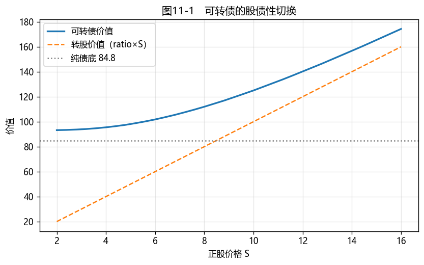

# 第11章　可转换债券

[](https://colab.research.google.com/github/albertandking/fixed-income/blob/main/notebooks/ch11_convertible.ipynb) [](https://mybinder.org/v2/gh/albertandking/fixed-income/main?labpath=notebooks/ch11_convertible.ipynb)

!!! info "配套代码"
    本章可转债定价（股票二叉树 + 反向归纳）、纯债价值与溢价率由 `fi.convertible` 实现，并与 QuantLib `ConvertibleFixedCouponBond` 对拍。

## 11.1 本章导读与学习目标

可转债是固定收益里最迷人的品种：它是一只债券，又内嵌一份**把债券转换成股票的权利**。涨的时候它像股票（跟着正股上涨），跌的时候它像债券（有纯债价值托底）——"下有保底、上不封顶"，这种**非对称收益**让它成为攻守兼备的资产。

但这份美妙背后是定价的复杂：它的价值同时取决于**利率**（债的一面）和**股价、股票波动率**（股的一面），还叠加了赎回、回售、下修等多重条款博弈。第10章我们用利率树为含权债定价；本章把舞台换成**股票二叉树**，并把"债性"与"股性"的切换讲清楚。可转债是 Part 5 的收尾，也是连接固定收益与权益的桥梁。

!!! abstract "学习目标"
    学完本章，你应能：

    1. 拆解可转债的四个关键条款——**转股、赎回（强赎）、回售、下修**——并说明各自的触发与博弈；
    2. 区分**转股价值、纯债价值、可转债价值**，计算**转股溢价率**与**纯债溢价率**；
    3. 解释可转债的**股性/债性切换**，及其无套利下限 $V\ge\max(\text{纯债价值},\ \text{转股价值})$；
    4. 用**股票二叉树 + 反向归纳**为可转债定价（了解 LSM 蒙特卡洛的适用场景）；
    5. 用 `fi.convertible` 与 QuantLib 定价，理解中国可转债的"双低""下修博弈"等策略。

---

!!! note "本章知识结构"
    **四个条款**（11.2，转股 / 强赎 / 回售 / 下修；发行人促转股动机）
    　↓ 三个价值
    **转股价值 / 纯债价值 / 可转债价值**（11.3，$V\ge\max$，两个溢价率、股债性切换）
    　↓ 怎么定价
    **股票二叉树 + 反向归纳 / LSM**（11.4，信用折现 Tsiveriotis–Fernandes）
    　↓
    QuantLib `ConvertibleBond`（11.6）→ 双低 / 下修博弈（11.7）

## 11.2 可转债的条款：四个关键选择权

可转债是一组选择权的集合，理解条款是定价与投资的前提。

### 11.2.1 转股权（投资者的看涨期权）

核心条款。投资者可在转股期内，按**转股价（conversion price）** $P_c$ 把每张债券转换成股票。**转股比例（conversion ratio）**为

$$\text{转股比例}=\frac{\text{面值}}{\text{转股价}\ P_c}$$

转股权本质是投资者持有的一份**股票看涨期权**——这是可转债"股性"的来源。

### 11.2.2 赎回权 / 强赎（发行人）

当正股大涨（如连续 15/30 个交易日收盘价 ≥ 转股价的 **130%**），发行人有权按略高于面值的价格**赎回**。理性投资者此时会选择转股（转股价值远高于赎回价）——所以强赎实为**强制转股**，目的是把债务转成股本、免去还本压力。

### 11.2.3 回售权（投资者）

当正股长期低迷（如连续 30 个交易日收盘价 ≤ 转股价的 **70%**），投资者有权按约定价（通常 ≈ 面值 + 补偿利息）把债券**回售**给发行人。这是"债性"的下方保护。

### 11.2.4 下修权（发行人）

当正股低迷触发条件，发行人有权**下调转股价**（向下修正），从而抬高转股价值、促成转股、规避回售。下修需股东大会通过，是发行人与投资者之间的重要**博弈**。

要真正读懂中国可转债，必须先看穿发行人的"小心思"：**绝大多数发行人压根不想还钱，他们想让债变成股。** 还钱要动用真金白银，而转股只是多印些股票、债务凭空消失。所以从发行那一刻起，发行人就在盘算如何"促成转股"——这正是理解全部条款博弈的总钥匙。下修条款就是这盘棋里最精彩的一手：当正股跌得太惨、转股价值远低于面值、投资者眼看就要触发回售来要钱时，发行人往往会主动**下调转股价**，相当于把"换股的门槛"降低，让转股重新变得诱人，从而既避免了掏钱回售、又推动了转股。但这一手并非发行人单方面说了算——下修要稀释老股东权益，需股东大会通过，于是形成一场**猫鼠博弈**：投资者赌发行人"为了不还钱一定会下修"，发行人则掂量"下修稀释股权 vs 回售掏现金"哪个更划算。市场上无数"抢权博下修"的交易，赌的就是发行人这份"宁可送股、不愿还钱"的强烈动机。

!!! note "中国可转债的标准条款"
    中国可转债高度标准化：转股期通常自发行 6 个月后开始；**强赎线 130%、回售线 70%、15/30 个交易日**是典型阈值；几乎都含**下修条款**。正因条款统一，中国可转债成了研究嵌入期权博弈的绝佳样本——投资者博弈的不是利率，而是**发行人"促转股"的强烈动机**（多数发行人并不想还钱，而想让债转成股）。

---

## 11.3 三个价值：转股价值、纯债价值与溢价率

可转债的价值被两条"底线"夹住。

- **转股价值（parity / conversion value）**：立即转股能拿到的股票市值，

$$\text{转股价值}=\text{转股比例}\times S$$

- **纯债价值（bond floor）**：剥离转股权，把它当普通信用债，按含信用利差的折现率给现金流定价（第3章）；

- **无套利下限**：可转债价值不可能低于这两者中的较高者，否则存在套利：

$$\boxed{\;V_{\text{可转债}}\ \ge\ \max(\text{纯债价值},\ \text{转股价值})\;}$$

实际价格还会**高出**这条下限——高出的部分就是**时间价值/期权价值**（未来正股可能上涨的期权）。

这两条底线夹出的，是可转债最迷人的特质——**一个资产、两副面孔**。把它的价值曲线画出来（图11-1），你会看到一条始终趴在"纯债底"（一条水平线）和"转股价值"（一条 45°斜线）这两条下限之上的平滑曲线。正股很低时，转股权一文不值，曲线紧贴水平的纯债底——此刻它就是一只普普通通的债，跌无可跌（只要发行人不违约）；正股很高时，债性退居幕后，曲线紧贴 45°的转股价值线，几乎一比一地跟着股票涨——此刻它就是一只股票。而在中间地带，它两副面孔同时若隐若现，既有债底的保护又有股票的弹性。这就是那句广告词般的"**下有保底、上不封顶**"的几何来历：**下跌有纯债底接着、上涨有转股权跟着**，一种天然的非对称——亏损被债底截断，盈利却向股价敞开。当然，世上没有免费的午餐，这份非对称是用"平日里更低的票息"换来的，而且那条保底的"地板"究竟有多结实，完全取决于发行人的信用资质——一旦信用恶化，纯债底本身就会塌陷，所谓的"保底"也就成了空话。

### 11.3.1 两个溢价率

| 溢价率 | 公式 | 衡量 |
|---|---|---|
| **转股溢价率** | $(V-\text{转股价值})/\text{转股价值}$ | 相对"立即转股"贵多少——衡量股性强弱 |
| **纯债溢价率** | $(V-\text{纯债价值})/\text{纯债价值}$ | 相对"纯债底"贵多少——衡量债性保护的厚薄 |

!!! example "例11.1：三个价值与股性/债性"
    一只 5 年期、年付息 1.5%、面值 100、转股价 10（转股比例 10）的可转债；股票波动率 30%、无风险 3%；纯债价值（按 5% 信用折现率）= **84.85**。在不同股价下：

    | 股价 $S$ | 可转债价值 | 转股价值 | 转股溢价率 | 纯债溢价率 | 形态 |
    |---|---|---|---|---|---|
    | 5 | 98.10 | 50 | 96.2% | 15.6% | **债性**（近纯债底，高转股溢价） |
    | 8 | 111.98 | 80 | 40.0% | 32.0% | 平衡型 |
    | 12 | 140.17 | 120 | 16.8% | 65.2% | **股性**（近转股价值，低转股溢价） |

    **规律**：正股越低，可转债越像债（趴在纯债底上，转股溢价率高）；正股越高，越像股（贴着转股价值走，转股溢价率低）。这种"切换"正是可转债的灵魂。

---

## 11.4 定价模型：二叉树与 LSM 蒙特卡洛

### 11.4.1 股票二叉树 + 反向归纳

可转债的价值依赖正股路径与相机转股，自然用**股票二叉树**（CRR）+ 反向归纳：

- 构建股价二叉树：每步上涨 $u=e^{\sigma\sqrt{\Delta t}}$ 或下跌 $d=1/u$，风险中性概率 $p=\dfrac{e^{r\Delta t}-d}{u-d}$；
- 到期日：$V=\max(\text{面值}+\text{票息},\ \text{转股比例}\times S_T)$；
- 每个中间节点：$V=\max(\underbrace{\text{转股价值}}_{\text{ratio}\times S},\ \underbrace{\text{持有价值}}_{\text{折现期望}+\text{票息}})$；
- 叠加条款：可赎回节点对持有价值取上限（强赎促转股）、可回售节点取下限。

### 11.4.2 LSM 蒙特卡洛

当条款**路径依赖**（如"连续 N 日满足条件"的强赎/回售/下修），二叉树难以精确刻画"连续 N 日"的历史路径。此时用 **最小二乘蒙特卡洛（Longstaff-Schwartz, LSM）**：模拟大量正股路径，用回归估计每条路径上的"继续持有价值"，再与转股价值比较决策。LSM 是处理复杂路径依赖条款的实务工具，本书作为进阶了解（习题给出思路）。

!!! example "例11.2：二叉树定价与无套利下限"
    对例11.1 的可转债，用 200 步股票二叉树定价。在各股价下，可转债价值始终**高于** $\max(\text{纯债底},\ \text{转股价值})$：

    | 股价 $S$ | 可转债价值 | $\max(\text{底 }84.85,\ \text{转股 }10S)$ |
    |---|---|---|
    | 3 | 93.88 | 84.85 |
    | 8 | 111.98 | 84.85 |
    | 12 | 140.17 | 120.0 |
    | 15 | 165.42 | 150.0 |

    高出下限的部分即期权时间价值；股价越极端（很低或很高），时间价值越薄，可转债越贴近某条底线。

---

## 11.5 Python 实现：`fi.convertible`

```python
from fi import convertible as cb

# 纯债价值（按含信用利差的折现率）
cb.bond_floor(face=100, coupon_rate=0.015, maturity=5, discount_rate=0.05)   # 84.85

# 股票二叉树为可转债定价（转股比例 10，股价 8，σ=30%，r=3%，5 年）
res = cb.price_convertible(s0=8, sigma=0.30, r=0.03, maturity=5,
                           face=100, coupon_rate=0.015, conv_ratio=10, n_steps=200)
res["price"]              # 111.98
res["conversion_value"]   # 80.0（= 10 × 8）

# 带强赎条款
cb.price_convertible(8, 0.30, 0.03, 5, 100, 0.015, 10, n_steps=200, call_price=105)["price"]
```

!!! tip "实现的简化：信用折现"
    `fi.convertible` 为教学清晰，全树用**无风险利率**折现，再单独算含信用利差的纯债底。严格的实务模型（**Tsiveriotis–Fernandes**）会把可转债拆成"债的部分"（按含信用利差折现）与"股的部分"（按无风险折现）分别处理——这也是 QuantLib 引擎传入 `creditSpread` 的原因。理解了简化模型，再看 QuantLib 的差异就清楚了（下节）。

---

## 11.6 QuantLib 实现：`ConvertibleFixedCouponBond`

```python
import QuantLib as ql

today = ql.Date(15, 6, 2026); ql.Settings.instance().evaluationDate = today
dc, cal = ql.Actual365Fixed(), ql.NullCalendar()
spot = ql.QuoteHandle(ql.SimpleQuote(8.0))
rTS = ql.YieldTermStructureHandle(ql.FlatForward(today, 0.03, dc))
qTS = ql.YieldTermStructureHandle(ql.FlatForward(today, 0.0, dc))
volTS = ql.BlackVolTermStructureHandle(ql.BlackConstantVol(today, cal, 0.30, dc))
process = ql.BlackScholesMertonProcess(spot, qTS, rTS, volTS)
exercise = ql.AmericanExercise(today, today + ql.Period(5, ql.Years))
sched = ql.Schedule(today, today + ql.Period(5, ql.Years), ql.Period(ql.Annual), cal,
                    ql.Unadjusted, ql.Unadjusted, ql.DateGeneration.Backward, False)
bond = ql.ConvertibleFixedCouponBond(exercise, 10.0, ql.CallabilitySchedule(),
                                     today, 0, [0.015], dc, sched, 100.0)
bond.setPricingEngine(ql.BinomialConvertibleEngine(
    process, "crr", 200, ql.QuoteHandle(ql.SimpleQuote(0.02)), ql.DividendSchedule()))
bond.NPV()   # ≈ 104.9（含 2% 信用利差，低于 fi 的 112）
```

!!! note "为什么 QuantLib 更低"
    QuantLib 对债券部分施加了 2% 的**信用利差**（Tsiveriotis–Fernandes 法），使纯债底降低，可转债价值随之下降（≈104.9 vs `fi` 的 ≈112）。这正说明：**信用折现对可转债估值很重要**——尤其当正股低迷、可转债贴近纯债底时，信用利差直接决定"地板"的高度。

---

## 11.7 案例：中国可转债投资策略

中国可转债条款标准、发行人促转股动机强，催生了几类经典策略。配套 notebook 演示：

1. **价值分解与股债性图**（图11-1）：画出可转债价值、纯债底、转股价值随正股的三条线，定位股性/债性区间；
2. **"双低"策略**：筛选**价格低 + 转股溢价率低**的可转债——既贴近债底（跌幅有限），又保留向上弹性（期权便宜），是中国市场广受欢迎的攻守兼备策略；
3. **下修与强赎博弈**：模拟正股低迷触发**下修**（转股价下调→转股价值抬升）、正股大涨触发**强赎**（强制转股）对可转债价值的影响；
4. **fi vs QuantLib**：对比简化模型与含信用利差模型的定价差异，量化信用折现的作用。

**结论要点**：可转债的"下有保底、上不封顶"使其在震荡市尤具吸引力；但保底的厚度取决于**纯债价值与信用资质**，向上的弹性取决于**正股与波动率**。"双低"是把这两点量化成可筛选指标的朴素而有效的策略——但要警惕信用瑕疵券的"伪债底"。

<figure markdown>
  { width="660" }
  <figcaption>图11-1　可转债价值（曲线）始终在纯债底（水平线）与转股价值（45°线）之上：低股价像债、高股价像股，平滑切换</figcaption>
</figure>

---

## 11.8 习题与编程实验

**概念题**

1. 解释可转债的四个条款（转股、赎回/强赎、回售、下修）各属于谁的权利、何时触发，以及发行人为什么有强烈的"促转股"动机。
2. 转股价值、纯债价值、可转债价值三者的无套利关系是什么？转股溢价率与纯债溢价率分别衡量什么？
3. 为什么正股越高可转债越"像股"、越低越"像债"？用转股溢价率的变化说明。

**计算题**

4. 面值 100、转股价 12.5 的可转债，转股比例是多少？当正股为 15 时转股价值是多少？若可转债市价 130，转股溢价率是多少？
5. 一只可转债纯债价值 90、转股价值 70，若市价为 85，存在套利吗？为什么？市价为 65 呢？

**编程实验**

6. 用 `fi.convertible` 复现例11.1、例11.2，并复现图11-1（可转债/纯债底/转股价值三条线），标出股性区与债性区。
7. 给可转债加入**强赎**条款（`call_price`），比较有无强赎对高股价区可转债价值的影响，解释强赎为何"封顶"股性收益。
8. 用 `fi.convertible` 与 QuantLib `ConvertibleFixedCouponBond` 对同一只可转债定价，改变信用利差（0%/2%/4%），观察纯债底与可转债价值如何随信用利差变化。

---

## 11.9 习题参考答案与详解

!!! tip "完整可运行解答 notebook"
    本节编程实验的**完整可运行代码**见 [`notebooks/solutions/ch11_solutions.ipynb`](https://colab.research.google.com/github/albertandking/fixed-income/blob/main/notebooks/solutions/ch11_solutions.ipynb)（点击徽章可在 Colab 直接运行）。

!!! success "概念题 1"
    - **转股权**（投资者）：转股期内按转股价把债转成股；
    - **赎回/强赎**（发行人）：正股大涨（如 15/30 日 ≥ 转股价 130%）时强制赎回 → 逼投资者转股；
    - **回售**（投资者）：正股长期低迷（如 ≤ 转股价 70%）时把债卖回发行人；
    - **下修**（发行人）：正股低迷时下调转股价，抬高转股价值、促转股、避回售。
    发行人**促转股动机强**：转股后债务变成股本，免去还本付息压力——这是中国可转债博弈的核心。

!!! success "概念题 2"
    **无套利关系**：可转债价值 $\ge\max(\text{纯债价值},\ \text{转股价值})$，高出部分是期权时间价值。**转股溢价率** $=(V-\text{转股价值})/\text{转股价值}$，衡量相对"立即转股"贵多少（股性强弱）；**纯债溢价率** $=(V-\text{纯债价值})/\text{纯债价值}$，衡量相对纯债底贵多少（债性保护厚薄）。

!!! success "概念题 3"
    正股**越高**，转股价值越大、可转债越贴着转股价值走（转股溢价率→低），**像股**；正股**越低**，转股价值远低于纯债底，可转债趴在纯债底上（转股溢价率→高），**像债**。转股溢价率从高到低的变化，正是"债性→股性"的切换刻度（见例11.1）。

!!! success "计算题 4"
    转股比例 $=$ 面值 / 转股价 $=100/12.5=\mathbf{8}$（每张可转 8 股）。正股 15 时**转股价值** $=8\times15=\mathbf{120}$。市价 130 时**转股溢价率** $=(130-120)/120=\mathbf{8.33\%}$——即比"立即转股"贵 8.33%，反映尚存的期权时间价值。

!!! success "计算题 5"
    无套利下限 $V\ge\max(\text{纯债 }90,\ \text{转股 }70)=90$。
    - **市价 85 < 90**：**存在套利**——买入可转债（其价值至少等于纯债底 90），不转股也能当债持有获得 ≥90 的价值，低价买入即套利。
    - **市价 65 < 90**：同样存在套利，且更明显（远低于纯债底）。
    结论：只要市价低于 $\max(\text{两底})$ 就有套利；85 与 65 都触发（65 更甚）。

!!! success "编程实验 6–8（要点）"
    - **实验 6**：`fi.convertible` 复现例11.1（S=5/8/12 → 价 98/112/140）、例11.2；图11-1 三条线（可转债曲线在纯债底与转股价值之上），低股价为债性区、高股价为股性区。
    - **实验 7**：加 `call_price` 后，高股价区可转债价值被强赎**封顶**（接近赎回价/转股价值），股性收益受限——这正是发行人强赎"促转股"的代价对投资者的影响。
    - **实验 8**：信用利差 0%/2%/4% 时，QuantLib NPV 约 111/105/99——信用利差越高、纯债底越低、可转债越便宜（尤其正股低迷、贴近债底时影响最大）。

---

## 11.10 本章小结

- 可转债 = **纯债 + 转股权（股票看涨期权）**，叠加**赎回（强赎）、回售、下修**条款；中国可转债条款标准、发行人促转股动机强。
- 三个价值：**转股价值**（ratio×S）、**纯债价值**（信用折现的债底）、**可转债价值**；无套利下限 $V\ge\max(\text{两底})$，高出部分为期权时间价值。
- **转股溢价率/纯债溢价率**刻画股性/债性；正股越高越像股、越低越像债，平滑切换。
- 用**股票二叉树 + 反向归纳**定价（路径依赖条款用 **LSM 蒙特卡洛**）；信用折现（Tsiveriotis–Fernandes）对债底高度很重要。
- `fi.convertible`（简化、无风险折现）与 QuantLib（含信用利差）定性一致；"双低"是把"债底保护 + 期权弹性"量化的经典策略。

下一部分（第12章起）进入**信用风险与结构化**：可转债的纯债底依赖发行人信用，而信用风险的度量与定价正是下一章的主题。

!!! note "知识点自测清单"
    - [ ] 说出转股 / 强赎 / 回售 / 下修四条款各归谁、何时触发，及发行人促转股动机
    - [ ] 计算**转股比例、转股价值、转股溢价率、纯债溢价率**
    - [ ] 解释无套利下限 $V\ge\max(\text{纯债价值},\text{转股价值})$
    - [ ] 解释正股越高越"像股"、越低越"像债"（股债性切换）
    - [ ] 用股票二叉树 + 反向归纳给可转债定价
    - [ ] 理解信用利差（Tsiveriotis–Fernandes）对纯债底的影响
    - [ ] 解释"双低"策略与下修博弈

!!! quote "延伸阅读"
    - Fabozzi, *Bond Markets, Analysis, and Strategies*，"Convertible Securities" 章节；
    - Tsiveriotis, K. & Fernandes, C. (1998). *Valuing Convertible Bonds with Credit Risk*. （含信用风险的可转债定价经典文献）
    - Longstaff & Schwartz (2001). *Valuing American Options by Simulation: A Simple Least-Squares Approach*.（LSM 方法原始文献）
    - 中国可转债市场可参考交易所可转债发行与交易规则、各券募集说明书中的条款设计。
