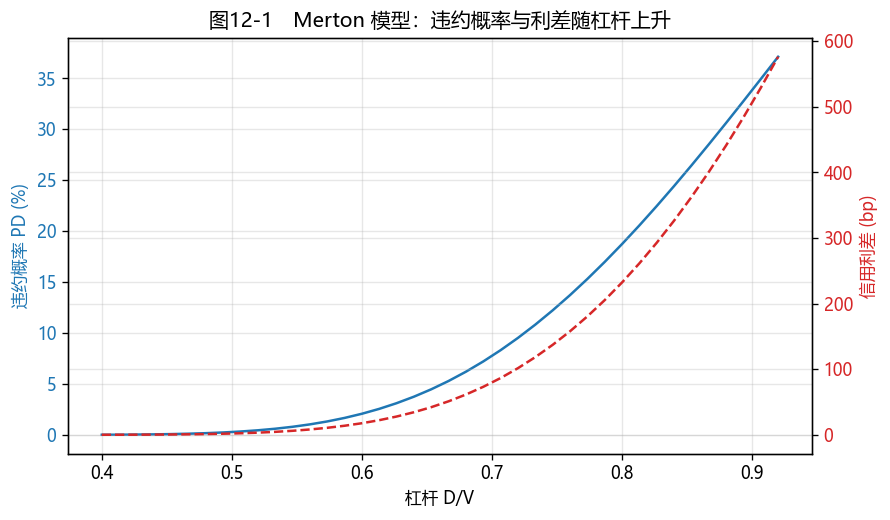

# 第12章　信用风险与定价模型

[](https://colab.research.google.com/github/albertandking/fixed-income/blob/main/notebooks/ch12_credit_risk.ipynb) [](https://mybinder.org/v2/gh/albertandking/fixed-income/main?labpath=notebooks/ch12_credit_risk.ipynb)

!!! info "配套代码"
    本章 Merton 结构化模型、约化模型与隐含违约率曲线由 `fi.credit` 实现，并与 QuantLib 违约期限结构对拍。

## 12.1 本章导读与学习目标

前面的章节，违约几乎是个被回避的词——我们默认现金流"一定收得到"。但现实里，债是会**违约**的：发行人还不出钱，投资者血本无归或只能拿回一部分。**信用风险**就是"借钱的人还不上"的风险，它是利率债与信用债的分水岭，也是信用利差的根源。

2014 年"11 超日债"打破中国债市的刚性兑付以来，违约不再是新闻——城投、地产、煤炭、银行……信用利差开始真正反映风险。本章要回答两个核心问题：**违约概率怎么估？**（结构化模型 Merton/KMV vs 约化模型），以及**信用利差里藏着多少违约预期？**（由利差反推违约率）。这是把"信用"从定性评级变成定量定价的关键一章。

!!! abstract "学习目标"
    学完本章，你应能：

    1. 解释**违约风险、信用利差、回收率**，用 $\text{预期损失}=PD\times LGD\times EAD$ 拆解信用风险；
    2. 用 **Merton 结构化模型**由公司资产/负债估计**违约距离**与**违约概率**，理解 KMV 的扩展；
    3. 用**约化模型（强度模型）**由违约强度计算生存概率，理解它与结构化模型的分工；
    4. 由**信用利差反推隐含违约率**，区分风险中性与真实世界违约概率；
    5. 用 `fi.credit` 与 QuantLib 违约期限结构建模，分析中国信用债。

---

!!! note "本章知识结构"
    **预期损失 EL = PD×LGD×EAD + 评级**（12.2，信用利差三层补偿、中债隐含评级）
    　↓ 两类模型估 PD
    **结构化（Merton/KMV）**（12.3，股权=看涨期权、违约距离）｜ **约化（强度模型）**（12.4，$S(t)=e^{-\lambda t}$）
    　↓ 由市场反推
    **利差反推违约率**（12.5，风险中性 ≠ 真实，信用利差之谜）
    　↓
    QuantLib 违约期限结构（12.7）→ 中国信用债案例（12.8）

## 12.2 违约风险、信用利差与评级

### 12.2.1 拆解信用风险：PD × LGD × EAD

一笔信用暴露的**预期损失（Expected Loss, EL）**可拆成三块：

$$\boxed{\;EL = PD \times LGD \times EAD\;}$$

- **违约概率（PD, Probability of Default）**：借款人在一定期限内违约的概率；
- **违约损失率（LGD, Loss Given Default）**：违约后损失的比例，$LGD = 1 - \text{回收率}(R)$；
- **违约风险暴露（EAD, Exposure at Default）**：违约时的敞口金额。

这是巴塞尔资本框架与一切信用定价的基石。本章重点是**估 PD**，并把它与**回收率**一起，翻译成信用利差。

### 12.2.2 信用利差

**信用利差**是信用债收益率高出同期限无风险利率的部分。它补偿三类东西：**预期违约损失**、**风险溢价**（投资者对不确定性要额外回报）、**流动性溢价**（信用债不如国债好卖）。后面会看到，由利差直接反推的违约率（风险中性）通常**高于**真实违约率——差额正是风险与流动性溢价。

很多人误以为信用利差就是"违约的赔率"——市场觉得这债有多大概率违约、就要多少利差补偿。这只对了三分之一。真实的信用利差是三笔账叠在一起：**第一笔**才是预期违约损失，即"违约概率 × 违约损失率"的精算期望，这是利差里唯一能用历史违约数据解释的部分。**第二笔**是风险溢价——违约不是一台稳定运转的概率机器，它会在经济衰退时扎堆爆发，恰恰是投资者最缺钱、最痛的时候，所以投资者要为承担"这种最坏时点的不确定性"额外索取补偿，哪怕长期平均违约损失并不高。**第三笔**是流动性溢价——信用债远不如国债好脱手，急用钱时可能砸价才卖得掉，这份"卖不动的风险"也要计价。耐人寻味的是，对高评级债而言，真正的预期违约损失往往只占利差的**一小部分**，大头是后两笔——这就埋下了 12.5 节"信用利差之谜"的伏笔。看懂这三层结构，你才不会把"利差走阔"一律解读成"市场认为要违约了"：很多时候，走阔的是风险厌恶和流动性恐慌，而非违约预期本身。

### 12.2.3 评级体系

- **外部评级**：由评级机构（中诚信、联合、大公等）给出 AAA/AA/A… 等级；
- **中债隐含评级**：中债登根据市场价格反推的"市场认可的信用等级"，往往比外部评级更灵敏——当一只 AAA 债的中债隐含评级被下调，常是风险的早期信号。

!!! note "中国信用债：从刚兑信仰到风险分化"
    2014 年"11 超日债"打破公募刚兑前，中国信用债几乎"零违约"，利差主要反映流动性而非信用。此后，**2016 年东北特钢、2018 年民企违约潮、2020 年永煤（永城煤电）超预期违约、2021 年地产信用风险**接连冲击市场，信用利差开始真正分化——尤其永煤事件动摇了"国企信仰"，引发利差重定价。理解信用风险定价，正是为了读懂这种分化。

---

## 12.3 结构化模型：Merton 与 KMV

### 12.3.1 Merton 的洞见：股权是一份看涨期权

Merton（1974）的天才之处，是把公司**资本结构**和**期权**联系起来。设公司资产价值 $V$ 服从几何布朗运动，负债是一笔到期 $T$、面值 $D$ 的零息债。到期时：

- 若 $V_T \ge D$：还清债务，股东拿走剩余 $V_T - D$；
- 若 $V_T < D$：违约，债权人拿走全部资产 $V_T$，股东一无所有。

于是**股权 = 以公司资产为标的、行权价为负债 $D$ 的看涨期权**：股东价值 $=\max(V_T - D, 0)$。违约就是"期权到期作废"。

这个洞见的精妙，在于它把会计课上"资产 = 负债 + 所有者权益"这个静态恒等式，翻译成了期权定价的动态语言，而钥匙正是**股东的有限责任**。想想看：公司经营得好、资产远超负债，股东能拿走全部剩余、上不封顶；可一旦资产跌破负债、资不抵债，股东最多就是"把公司钥匙扔给债权人、一走了之"，亏损被锁死在已投入的股本上、绝不会倒贴。**赚则无限、亏则有底**——这种损益结构，和买入一份看涨期权一模一样：行权价是负债 $D$，标的是公司资产 $V$。Merton 顺着这条线把整个公司资本结构都看穿了：股东持有看涨期权，那么**债权人就相当于卖出了一份看跌期权**——平时安心收着固定利息（权利金），可一旦公司垮台（资产跌破负债），就得被迫"接下"那些缩水的资产、承担损失。于是"公司会不会违约"这个看似要靠基本面研究、访谈管理层才能判断的定性问题，被 Merton 一举转化成了"这份看涨期权会不会到期作废"的**可计算**问题——只要知道资产价值、资产波动率和负债水平，违约概率就能用 Black-Scholes 的同一套公式算出来。这正是结构化模型最令人拍案叫绝之处：**它让违约第一次拥有了价格公式。**

### 12.3.2 违约距离与违约概率

由 Black-Scholes 框架，**违约概率（风险中性）**为：

$$PD = N(-d_2),\qquad d_2=\frac{\ln(V/D)+(r-\tfrac12\sigma_V^2)T}{\sigma_V\sqrt T}$$

其中 $d_2$ 就是**违约距离（Distance to Default, DD）**——衡量"资产价值离违约点有几个标准差"。DD 越大、PD 越小。

!!! example "例12.1：Merton 模型估违约概率"
    负债 $D=100$、资产波动率 $\sigma_V=25\%$、$r=3\%$、$T=1$ 年。不同资产价值（即不同杠杆）下：

    | 资产 $V$ | 杠杆 $D/V$ | 违约距离 DD | 违约概率 PD | Merton 利差 |
    |---|---|---|---|---|
    | 120 | 0.83 | 0.72 | **23.44%** | 309 bp |
    | 150 | 0.67 | 1.62 | **5.30%** | 51 bp |
    | 200 | 0.50 | 2.77 | **0.28%** | 2 bp |

    **规律**：杠杆越高（资产越接近负债），违约距离越短、违约概率越高、信用利差越宽。这把"信用风险"和可观测的**资产负债结构、股价波动率**直接挂钩——这是结构化模型最大的魅力。

<figure markdown>
  { width="640" }
  <figcaption>图12-1　杠杆越高，违约概率与 Merton 信用利差越大——结构化模型把信用风险与资本结构挂钩</figcaption>
</figure>

### 12.3.3 KMV 的工程化扩展

穆迪 **KMV** 模型把 Merton 落地为可用工具：用**违约点（default point）= 短期负债 + 0.5 × 长期负债**（经验值，因为公司在资产跌破全部负债前就会违约），算出违约距离后，再用**历史违约数据库**把 DD 经验地映射成**预期违约频率（EDF, Expected Default Frequency）**，而非依赖正态分布假设。这让结构化模型在实务中更稳健。

---

## 12.4 约化模型：强度模型

### 12.4.1 把违约看作"随机到达"

结构化模型从公司基本面出发，但需要资产价值/波动率（不可直接观测）。**约化模型（reduced-form）**换个视角：不问"为什么违约"，只把违约看作一个由**违约强度（hazard rate）$\lambda$** 驱动的随机事件（如同放射性衰变的泊松到达）。

在常数强度下，企业活过 $t$ 年的**生存概率**与到 $t$ 的**累计违约概率**为：

$$S(t)=e^{-\lambda t},\qquad PD(t)=1-e^{-\lambda t}$$

### 12.4.2 利差与强度

约化模型的好处是直接连接市场价格：在风险中性下，信用利差近似等于"强度 × 违约损失率"：

$$\boxed{\;s \approx \lambda\,(1-R)\;}\quad\Longrightarrow\quad \lambda \approx \frac{s}{1-R}$$

这让我们能**直接从市场利差反推违约强度**（Jarrow-Turnbull 模型的核心）。

!!! example "例12.2：约化模型由利差求违约概率"
    信用利差 $s=200$ bp、回收率 $R=40\%$。违约强度 $\lambda=\dfrac{0.02}{1-0.4}=3.333\%$。则：

    | 期限 | 生存概率 | 累计违约概率 |
    |---|---|---|
    | 1 年 | 96.72% | 3.28% |
    | 3 年 | 90.48% | 9.52% |
    | 5 年 | 84.65% | 15.35% |

### 12.4.3 两类模型的分工

!!! tip "结构化 vs 约化：用哪个？"
    | | 结构化（Merton/KMV） | 约化（强度模型） |
    |---|---|---|
    | 违约来自 | 资产跌破负债（有经济解释） | 随机强度（无需解释机理） |
    | 输入 | 资产价值、波动率、负债 | 市场利差、回收率 |
    | 擅长 | 单个企业的信用分析、EDF | 给信用衍生品（CDS）定价、校准市场 |
    | 短板 | 资产价值难观测、短期 PD 偏低 | "黑箱"，缺乏经济机理 |

    实务中二者互补：**结构化**用于基本面信用分析与评分，**约化**用于市场定价与衍生品校准。

---

## 12.5 由信用利差反推违约概率

### 12.5.1 隐含违约率曲线

给定一条**信用利差期限结构**（各期限的利差），用 $\lambda = s/(1-R)$ 可逐期推出**隐含累计违约概率曲线**——市场对未来各期限违约的定价。

!!! example "例12.3：由利差曲线 bootstrap 隐含违约率"
    某 AA 信用债的利差曲线与反推的累计违约概率（回收率 40%）：

    | 期限 | 利差 | 累计违约概率 |
    |---|---|---|
    | 1 年 | 50 bp | 0.83% |
    | 3 年 | 110 bp | 5.35% |
    | 5 年 | 150 bp | 11.75% |
    | 10 年 | 220 bp | 30.70% |

### 12.5.2 风险中性 ≠ 真实违约概率

!!! warning "误区：把利差反推的违约率当成"真实"违约率"
    由利差反推的是**风险中性违约概率**，它通常**远高于历史真实违约率**——因为利差里还含**风险溢价**和**流动性溢价**。这就是著名的**"信用利差之谜（credit spread puzzle）"**：高评级债的实际违约损失只能解释利差的一小部分，其余是投资者为承担不确定性与流动性而要的补偿。做信用分析时，务必分清"市场定价的违约率"与"你预期的真实违约率"——二者之差，正是相对价值的来源。

---

## 12.6 Python 实现：`fi.credit`

```python
from fi import credit as cr

# Merton 结构化模型（例12.1）
cr.merton_pd(asset_value=150, debt=100, asset_vol=0.25, r=0.03, t=1)
# -> {'distance_to_default': 1.617, 'pd': 0.0530}
cr.merton_credit_spread(150, 100, 0.25, 0.03, 1)            # ≈ 0.0051（51bp）

# 约化模型（例12.2）
lam = cr.hazard_from_spread(spread=0.02, recovery=0.4)      # 0.0333
cr.survival_probability(lam, t=5)                          # 0.8465
cr.default_probability(lam, t=5)                           # 0.1535

# 由利差曲线反推隐含违约率曲线（例12.3）
cr.implied_default_curve([1, 3, 5, 10], [0.005, 0.011, 0.015, 0.022], recovery=0.4)
```

`merton_pd` 返回违约距离与风险中性 PD；`hazard_from_spread` + `survival_probability` 实现约化模型；`implied_default_curve` 由利差期限结构 bootstrap 累计违约概率。

---

## 12.7 QuantLib 实现：违约期限结构

QuantLib 用 `DefaultProbabilityTermStructure`（如 `FlatHazardRate`）表示违约强度，并能查询生存/违约概率，用于给风险债与 CDS 定价：

```python
import QuantLib as ql

today = ql.Date(15, 6, 2026); ql.Settings.instance().evaluationDate = today
dpts = ql.FlatHazardRate(today, ql.QuoteHandle(ql.SimpleQuote(0.0333)), ql.Actual365Fixed())
d5 = today + ql.Period(5, ql.Years)
dpts.survivalProbability(d5)   # 0.8465，与 fi.credit 一致
dpts.defaultProbability(d5)    # 0.1535
```

!!! tip "约化模型天然适合校准市场"
    QuantLib 的违约期限结构可由一组 **CDS 报价** bootstrap 出分段强度曲线（`PiecewiseFlatHazardRate` + `SpreadCdsHelper`），与第5章 bootstrap 利率曲线如出一辙。这正是约化模型的工程优势：**直接吃市场报价、吐违约概率**。

---

## 12.8 案例：中国信用债违约事件的风险建模

配套 notebook 以中国信用债为背景演示：

1. **Merton 评分**（图12-1）：用公司资产/负债/股价波动率，画出违约概率、信用利差随杠杆的变化，给企业做结构化信用评分；
2. **利差反推违约率**：取不同评级（AAA/AA+/AA）信用债的利差曲线，反推隐含违约率曲线，比较评级间的违约预期差异；
3. **风险中性 vs 真实**：对比利差反推的违约率与历史违约率，量化"信用利差之谜"中的风险/流动性溢价；
4. **事件冲击**：模拟"永煤式"信用事件——利差骤然走阔时，隐含违约率与风险债价格如何重定价。

**结论要点**：结构化模型适合做基本面信用评分（与股价、杠杆挂钩），约化模型适合从市场利差快速反推违约定价；中国信用债的核心是读懂"评级 + 隐含评级 + 利差"三者的背离，尤其在国企信仰、城投信仰被反复检验的背景下。

---

## 12.9 习题与编程实验

**概念题**

1. 用 $EL=PD\times LGD\times EAD$ 解释预期损失；回收率与 LGD 是什么关系？
2. Merton 模型为什么说"股权是一份看涨期权"？违约距离的经济含义是什么？
3. 结构化模型与约化模型各自的输入、擅长场景与短板是什么？
4. 为什么由利差反推的违约率通常高于历史真实违约率？这对信用债相对价值分析有何启示？

**计算题**

5. 某公司资产 180、负债 100、资产波动率 30%、$r=3\%$、$T=1$，用 Merton 模型计算违约距离与违约概率。
6. 信用利差 300bp、回收率 30%，求违约强度与 5 年累计违约概率。

**编程实验**

7. 用 `fi.credit` 复现例12.1，并复现图12-1（违约概率/利差随杠杆 $D/V$ 的曲线）。
8. 用 `fi.credit.implied_default_curve` 由一条利差曲线 bootstrap 隐含违约率曲线，并比较回收率 30%/40%/50% 对结果的影响。
9. 用 QuantLib `FlatHazardRate` 验证例12.2，并尝试用 `PiecewiseFlatHazardRate` + CDS helper 由多个期限利差 bootstrap 分段强度曲线。

---

## 12.10 习题参考答案与详解

!!! tip "完整可运行解答 notebook"
    本节编程实验的**完整可运行代码**见 [`notebooks/solutions/ch12_solutions.ipynb`](https://colab.research.google.com/github/albertandking/fixed-income/blob/main/notebooks/solutions/ch12_solutions.ipynb)（点击徽章可在 Colab 直接运行）。

!!! success "概念题 1"
    **预期损失 $EL=PD\times LGD\times EAD$**：违约概率 × 违约损失率 × 违约时敞口。**回收率 $R$ 与 LGD 的关系**：$LGD=1-R$（违约后没收回的比例）。例如 PD=3%、回收率 40%（LGD=60%）、敞口 1 亿，则 $EL=3\%\times60\%\times1\text{亿}=180$ 万元。

!!! success "概念题 2"
    到期时若资产 $V_T\ge$ 负债 $D$，股东还债后拿走 $V_T-D$；若 $V_T<D$ 则违约、股东一无所有——股东收益 $=\max(V_T-D,0)$，正是**以资产为标的、行权价为 $D$ 的看涨期权**。**违约距离 DD** $=d_2$，衡量"资产价值距违约点（负债）还有几个标准差"，DD 越大、违约越远、PD=N(−DD) 越小。

!!! success "概念题 3"
    | | 结构化（Merton/KMV） | 约化（强度） |
    |---|---|---|
    | 输入 | 资产价值、波动率、负债 | 市场利差、回收率 |
    | 擅长 | 单企业基本面信用分析、EDF | 给 CDS 等信用衍生品定价、校准市场 |
    | 短板 | 资产价值难观测、短期 PD 偏低 | "黑箱"、缺经济机理 |
    实务互补：结构化做评分，约化做市场定价。

!!! success "概念题 4"
    由利差反推的是**风险中性违约率**，含**预期损失 + 风险溢价 + 流动性溢价**，故通常**高于历史真实违约率**（信用利差之谜）。**启示**：信用债相对价值分析要分清"市场定价的违约率（利差隐含）"与"你预期的真实违约率"——二者之差就是承担风险/流动性所获的补偿，也是 alpha 的来源；不能把利差全当成违约预期。

!!! success "计算题 5"
    Merton：$d_2=\frac{\ln(180/100)+(0.03-\tfrac12\times0.30^2)\times1}{0.30\sqrt1}$。用 `fi.credit.merton_pd(180,100,0.30,0.03,1)` 得 **违约距离 DD ≈ 1.909，违约概率 PD ≈ 2.81%**。资产对负债覆盖充分（1.8 倍）、PD 较低。

!!! success "计算题 6"
    违约强度 $\lambda=\dfrac{s}{1-R}=\dfrac{0.03}{1-0.30}=\mathbf{4.286\%}$。5 年累计违约概率 $=1-e^{-\lambda\times5}=1-e^{-0.2143}=\mathbf{19.29\%}$。（回收率越低、LGD 越大，同样利差反推出的强度越低——因为更高的 LGD 用更少的违约就能解释利差。）

!!! success "编程实验 7–9（要点）"
    - **实验 7**：`fi.credit` 复现例12.1（V=120/150/200 → PD 23.4/5.3/0.28%）；图12-1 中 PD 与利差随杠杆 D/V 凸性上升。
    - **实验 8**：`implied_default_curve` 由利差曲线反推累计违约率；回收率越高（LGD 越小），同一利差反推的违约率越高（$\lambda=s/(1-R)$，分母越小、强度越大）。
    - **实验 9**：QuantLib `FlatHazardRate` 验证例12.2（生存 96.72/90.48/84.65%）；`PiecewiseFlatHazardRate`+CDS helper 由多期限利差 bootstrap 分段强度曲线，与第5章利率曲线 bootstrap 同理。

---

## 12.11 本章小结

- 信用风险用 $EL=PD\times LGD\times EAD$ 拆解；**信用利差**补偿预期损失 + 风险溢价 + 流动性溢价。
- **结构化模型（Merton/KMV）**：股权是公司资产的看涨期权，由资产/负债/波动率推**违约距离**与 **PD=N(−d₂)**；杠杆越高、PD 越大。
- **约化模型（强度模型）**：违约由强度 $\lambda$ 驱动，$S(t)=e^{-\lambda t}$，利差 $s\approx\lambda(1-R)$，便于由市场利差反推违约概率。
- 由利差反推的是**风险中性违约率**，通常高于真实违约率（信用利差之谜）；做信用分析要分清二者。
- `fi.credit` 与 QuantLib 违约期限结构一致；中国信用债的关键是读懂评级、隐含评级与利差的背离。

下一章（第13章）进入**结构化产品与 ABS**：把一组资产的现金流打包、分层、再分配，信用风险在不同档级之间被重新切割——本章的违约/回收概念将用于给各档定价。

!!! note "知识点自测清单"
    - [ ] 用 **EL = PD × LGD × EAD** 拆解预期损失，说清回收率与 LGD 的关系
    - [ ] 解释 Merton 模型"股权是看涨期权"，计算**违约距离**与 PD=N(−d₂)
    - [ ] 用约化模型由强度 λ 算生存概率、由利差反推 λ（$\lambda\approx s/(1-R)$）
    - [ ] 说清**结构化 vs 约化模型**的输入、擅长场景与短板
    - [ ] 解释"**信用利差之谜**"（风险中性违约率 ≠ 真实违约率）
    - [ ] 认识中债隐含评级、刚兑打破与永煤事件的意义

!!! quote "延伸阅读"
    - Merton, R. C. (1974). *On the Pricing of Corporate Debt: The Risk Structure of Interest Rates*.（结构化模型原始文献）
    - Jarrow, R. & Turnbull, S. (1995). *Pricing Derivatives on Financial Securities Subject to Credit Risk*.（约化模型经典）
    - Fabozzi, *Bond Markets, Analysis, and Strategies*，"Credit Risk" 与 "Credit Risk Modeling" 章节；
    - 中央结算公司中债隐含评级方法说明；穆迪 KMV 模型白皮书。
