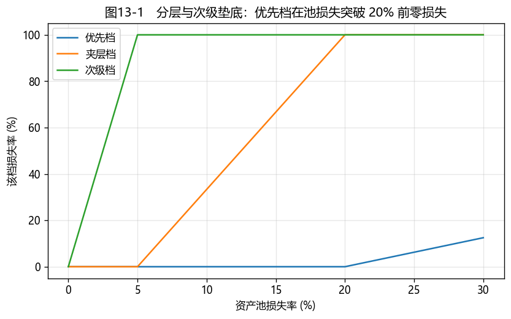

# 第13章　结构化产品与 ABS

[](https://colab.research.google.com/github/albertandking/fixed-income/blob/main/notebooks/ch13_structured.ipynb) [](https://mybinder.org/v2/gh/albertandking/fixed-income/main?labpath=notebooks/ch13_structured.ipynb)

!!! info "配套代码"
    本章分层损失分配、附着/脱离点与现金流瀑布由 `fi.securitization` 实现；案例模拟不同违约率下各档回收，离线即可运行。

## 13.1 本章导读与学习目标

前面我们给单只债券定价。本章换一种思路：把**一大堆资产**（房贷、车贷、应收账款……）的现金流**打包、切割、再分配**，造出新的证券——这就是**资产证券化（securitization）**。它的核心魔法是**分层（tranching）**：同一个资产池，切成"优先—夹层—次级"几档，损失自下而上由次级先吸收，于是优先档获得了远高于资产池本身的信用质量。

这套技术既是金融工程的精华，也是 2008 年全球金融危机的导火索——当底层资产（次级房贷）的违约相关性被低估，"安全"的优先档同样崩塌。理解结构化产品，既要懂它如何**创造**信用质量，也要警惕它如何**隐藏**风险。本章把第12章的违约/回收概念用到**分档定价**上。

!!! abstract "学习目标"
    学完本章，你应能：

    1. 说明 ABS 的交易结构——**SPV、真实出售、破产隔离**——及其经济目的；
    2. 理解**分层与次级垫底**，计算各档的**附着/脱离点**与损失分配；
    3. 描述**现金流瀑布**（利息瀑布 + 顺序还本）与**触发机制**；
    4. 列举**内部/外部信用增级**方式；理解 MBS 的**提前偿还风险**；
    5. 用 `fi.securitization` 模拟瀑布，分析不同违约率下各档回收。

---

## 13.2 资产证券化原理与交易结构

### 13.2.1 把"资产"变成"证券"

证券化的基本流程：**发起人（originator）**把一组能产生稳定现金流的资产（如房贷）"卖"给一个**特殊目的载体（SPV）**，SPV 以这些资产为支持发行证券（ABS）卖给投资者，募集资金支付给发起人。投资者的回报来自资产池的现金流，而非发起人的整体信用。

### 13.2.2 两个关键法律安排

- **真实出售（true sale）**：资产从发起人**真正转让**给 SPV，不是抵押借款；
- **破产隔离（bankruptcy remoteness）**：即使发起人破产，SPV 持有的资产**不被纳入**发起人的破产财产——投资者的现金流来源被"隔离"保护。

这两点让 ABS 的信用**脱离发起人**，仅取决于资产池本身的表现——这是证券化的法律基石。

!!! note "中国资产证券化的三套体系"
    中国 ABS 按监管分三类：**信贷 ABS**（银行信贷资产，央行/金融监管总局，银行间市场）、**企业 ABS**（企业应收/收益权，证监会，交易所）、**资产支持票据 ABN**（交易商协会，银行间）。底层资产涵盖个人房贷（RMBS）、汽车贷款、消费金融、应收账款、租赁、REITs 等。理解"谁监管、什么底层、在哪交易"，是读懂中国 ABS 谱系的起点。

---

## 13.3 分层结构：用次级垫底创造信用

### 13.3.1 优先—夹层—次级

同一个资产池，发行多档优先级不同的证券：

- **优先档（senior）**：最先获得现金、最后承担损失，评级最高、收益率最低；
- **夹层档（mezzanine）**：居中；
- **次级档（equity/residual）**：最后获得现金、**最先承担损失**，无评级或最低评级、收益率最高（博取剩余收益）。

损失自下而上分配——**次级先被打穿，优先档才会受损**。这种**次级垫底（subordination）**就是对优先档的信用增级：只要资产池损失不超过次级 + 夹层的厚度，优先档**毫发无损**。

### 13.3.2 附着点与脱离点

每档可用一对**附着点（attachment）/脱离点（detachment）**刻画——它承担的是资产池损失在 [attach, detach] 区间内的部分（占比）。

!!! example "例13.1：分层与损失分配"
    资产池 100，分三档：**优先档 80、夹层档 15、次级档 5**。附着/脱离点（自下而上累积）：

    | 档级 | 附着点 | 脱离点 | 含义 |
    |---|---|---|---|
    | 次级档 | 0% | 5% | 先吸收前 5% 损失 |
    | 夹层档 | 5% | 20% | 吸收 5%–20% 的损失 |
    | 优先档 | 20% | 100% | 损失超过 20% 才受损 |

    不同资产池损失下的分配：

    | 池损失 | 次级档 | 夹层档 | 优先档 |
    |---|---|---|---|
    | 3% | 3（**60%**） | 0 | 0 |
    | 10% | 5（全损） | 5（33%） | 0 |
    | 25% | 5（全损） | 15（全损） | 5（**6.25%**） |

    **结论**：只要池损失 ≤ 20%（次级 5 + 夹层 15 的厚度），**优先档零损失**——这就是分层"凭空造出 AAA"的机制。

<figure markdown>
  { width="640" }
  <figcaption>图13-1　各档损失率随资产池损失率变化：优先档在池损失突破 20%（其附着点）前零损失，次级/夹层先行垫底</figcaption>
</figure>

---

## 13.4 现金流瀑布与触发机制

### 13.4.1 瀑布：现金按优先级层层下流

资产池每期产生的现金，按严格优先级**像瀑布一样**自上而下分配：

- **利息瀑布**：先付优先档利息，再付夹层、次级；
- **还本瀑布**：通常**顺序偿还（sequential）**——优先档本金全部还清后，才轮到夹层、次级；也有**按比例（pro-rata）**结构。

现金不足时，下层（次级）先得不到钱，损失自下而上累积——这正是 13.3 损失分配的现金流版本。

!!! example "例13.2：现金流瀑布下的损失吸收"
    两档结构（优先档 80@4%、次级档 20@10%），资产池四期现金流因违约而不足（总现金 98 < 100 本金 + 利息）。瀑布分配后：

    | 档级 | 累计利息 | 累计还本 | 期末未偿（损失） |
    |---|---|---|---|
    | 优先档 | 11.42 | 79.23 | **0.77** |
    | 次级档 | 7.35 | 0.00 | **20.00** |

    资产池现金不足时，**优先档先足额受偿**（几乎全额收回），**次级档承担几乎全部损失**——次级用更高票息（10%）换取了垫底风险。

### 13.4.2 触发机制

为进一步保护优先档，结构里常设**触发器（triggers）**：当资产池表现恶化（如累计违约超阈值），**超额抵押测试（OC）**或**利息覆盖测试（IC）**失败，现金流会被**重新导向**——优先偿还优先档本金（加速去杠杆），切断对次级的分配。触发机制让结构在压力下自动"收紧"，是动态的信用保护。

---

## 13.5 信用增级

把优先档"垫"到 AAA，靠的是**信用增级（credit enhancement）**：

- **内部增级**：
    - **次级垫底（subordination）**：下层吸收损失（13.3）；
    - **超额抵押（overcollateralization）**：资产池价值 > 发行证券面值；
    - **超额利差（excess spread）**：资产池利息 > 证券利息 + 费用，差额做缓冲；
    - **储备账户（reserve account）**：预留现金。
- **外部增级**：第三方**担保**、**保险**、**信用证（L/C）**——但引入了担保方的信用风险（2008 年单线保险商 monoline 的崩塌即源于此）。

!!! warning "2008 的教训：分层不能消灭风险，只能转移与重组"
    分层能把损失重新分配，但**不能减少资产池的总损失**。2008 危机中，次级房贷 ABS 被再打包成 CDO、CDO 又被打包成 CDO²，层层分层制造出大量"AAA"。当房价普跌、违约**高度相关**地集中爆发，损失远超次级与夹层的厚度，"安全"的优先档同样巨亏。核心教训：**分层的保护取决于损失的规模与相关性假设**——低估相关性，再厚的次级也会被击穿。

---

## 13.6 提前偿还与 MBS

住房抵押贷款支持证券（**MBS**）有一个独特风险：借款人会**提前还款（prepayment）**——利率下行时再融资、或卖房提前结清。这让 MBS 的现金流不确定：

- **收缩风险（contraction）**：利率下行→提前还款加速→本金提前回笼，再投资于更低利率（类似可赎回债的**负凸性**）；
- **延展风险（extension）**：利率上行→提前还款放缓→久期被动拉长，正好在利率上行时受损更多。

提前还款常用 **PSA 模型**（提前还款速度的标准曲线）刻画。MBS 的这种"利率一动、现金流就变"的特性，使其分析与第10章可赎回债一脉相承——都是嵌入了借款人的"提前偿还期权"。

!!! tip "MBS 的现金流建模"
    严格的 MBS 定价要把利率路径、提前还款行为、违约一起放进蒙特卡洛模拟。本书 `fi.securitization` 聚焦"分层 + 瀑布"的机制；提前还款可作为对资产池现金流的前置调整（习题给出思路）。QuantLib 的 ABS/MBS 支持有限，实务多用专门的现金流引擎。

---

## 13.7 Python 实现：`fi.securitization`

```python
from fi import securitization as sz

tranches = [("优先档", 80), ("夹层档", 15), ("次级档", 5)]   # 优先级从高到低

# 附着/脱离点（例13.1）
sz.attachment_detachment(tranches)
# 优先档 20%~100%，夹层 5%~20%，次级 0%~5%

# 损失分配（次级先吸收）
sz.allocate_losses(pool_loss=10, tranches=tranches)
# {'次级档': 5, '夹层档': 5, '优先档': 0}

# 现金流瀑布（例13.2）：利息瀑布 + 顺序还本
res = sz.sequential_waterfall([12, 12, 4, 70], [("优先档", 80), ("次级档", 20)], [0.04, 0.10])
res["shortfall"]   # {'优先档': 0.77, '次级档': 20.0}
```

`allocate_losses` 自下而上分配损失（次级先吸收）；`sequential_waterfall` 逐期先按优先级付息、再顺序还本，期末未偿本金即各档损失。

---

## 13.8 案例：中国 ABS / RMBS 市场

配套 notebook 以分层结构为核心演示：

1. **损失分配与附着点**（图13-1）：画出各档损失率随资产池损失率的阶梯曲线，定位优先档的"安全垫"；
2. **违约率压力测试**：模拟资产池违约率从 0% 升到 30%，观察各档回收率如何依次被打穿（次级→夹层→优先）；
3. **瀑布现金流**：在不同违约/回收情景下跑 `sequential_waterfall`，比较优先档与次级档的现金流与损失；
4. **增级厚度的作用**：改变次级 + 夹层的厚度，看优先档的"附着点"（保护垫）如何变化。

**结论要点**：分层把资产池的信用风险**重新切割**给不同风险偏好的投资者；优先档的安全取决于**次级垫底的厚度**与**资产池损失的规模/相关性**。中国 ABS 在 RMBS、消费金融、REITs 等领域快速发展，但 2008 的教训提醒：永远要问"如果违约像 2008 那样高度相关地集中爆发，这层保护够厚吗？"

---

## 13.9 习题与编程实验

**概念题**

1. 解释真实出售与破产隔离，它们为什么能让 ABS 的信用脱离发起人？
2. 什么是次级垫底？用附着/脱离点说明优先档为何能获得高于资产池的评级。
3. 列举三种内部信用增级与两种外部信用增级；外部增级引入了什么新风险？
4. 用 2008 危机说明"分层不能消灭风险"；违约相关性为什么是关键？

**计算题**

5. 资产池 100，优先 70 / 夹层 20 / 次级 10。求各档附着/脱离点；资产池损失 15% 与 35% 时各档损失分别是多少？
6. MBS 在利率下行时为什么面临收缩风险？这与可赎回债的负凸性有何相似？

**编程实验**

7. 用 `fi.securitization` 复现例13.1，并复现图13-1（各档损失率 vs 资产池损失率的阶梯图）。
8. 用 `sequential_waterfall` 模拟资产池违约率 0%/10%/20%/30% 下两档（优先/次级）的损失，画出各档回收率随违约率的曲线。
9. 给资产池现金流加入**提前还款**（按固定月提前还款率削减/加速本金），观察对各档久期与现金流的影响。

---

## 13.10 本章小结

- **资产证券化**通过 SPV、真实出售、破产隔离，把资产池现金流打包成证券，信用脱离发起人。
- **分层 + 次级垫底**创造信用：损失自下而上吸收，优先档在池损失突破其**附着点**前零损失。
- **现金流瀑布**按优先级分配利息与本金（顺序/按比例），**触发机制**在压力下重新导流保护优先档。
- **信用增级**分内部（次级、超额抵押、超额利差、储备账户）与外部（担保、保险、L/C）；**MBS 的提前偿还**带来收缩/延展风险（负凸性）。
- 分层**转移与重组**风险，但**不消灭**风险——2008 的教训是：低估违约相关性，再厚的保护垫也会被击穿。

下一部分（第14章起）进入**利率衍生品**：国债期货、利率互换、利率期权——把利率风险管理从"债券组合"推进到"衍生工具"，本部分将大量用到第5章的曲线与第6章的久期。

!!! quote "延伸阅读"
    - Fabozzi, *Bond Markets, Analysis, and Strategies*，"Asset-Backed Securities"、"Mortgage-Backed Securities" 与 "Securitization" 章节；
    - Gorton, G. (2010). *Slapped by the Invisible Hand*（2008 证券化与危机的深度复盘）；
    - 中国人民银行/金融监管总局信贷 ABS 规则、证监会企业 ABS 规则、交易商协会 ABN 指引。
