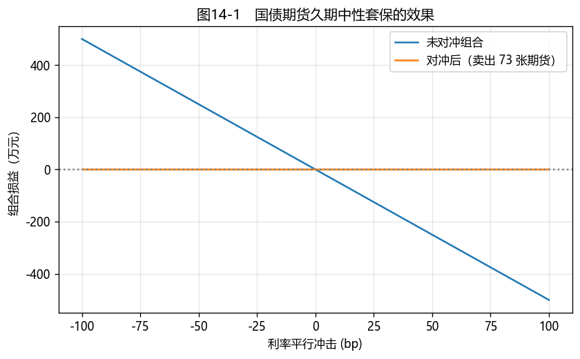

# 第14章　利率期货与远期

[](https://colab.research.google.com/github/albertandking/fixed-income/blob/main/notebooks/ch14_futures_forwards.ipynb) [](https://mybinder.org/v2/gh/albertandking/fixed-income/main?labpath=notebooks/ch14_futures_forwards.ipynb)

!!! info "配套代码"
    本章转换因子、CTD、套保比率与 FRA 由 `fi.futures` 实现；案例用国债期货对冲组合久期，离线即可运行。

## 14.1 本章导读与学习目标

前面我们用**现券组合**管理利率风险（第7章免疫、第6章久期）。但调整现券组合要买卖大量债券、占用大量资金、冲击市场。**利率衍生品**提供了更高效的工具：用少量保证金、高流动性的**国债期货**，就能快速调整整个组合的久期、对冲利率风险。这是利率风险管理从"重资产"走向"轻资本"的关键一跃。

但国债期货有个独特的复杂性：它对应的不是某一只具体的债，而是一个**名义标准券**，背后挂着**一篮子可交割券**。卖方可以选择交割哪一只——理性地选**最便宜可交割券（CTD）**。这个"转换因子 + CTD"机制是国债期货定价与套保的核心，也是本章的重点。本部分（第14–16章）大量用到第5章的曲线与第6章的久期。

!!! abstract "学习目标"
    学完本章，你应能：

    1. 解释国债期货的**合约要素、名义标准券、保证金与交割机制**；
    2. 计算**转换因子**，由一篮子可交割券确定**最便宜可交割券（CTD）**；
    3. 用**基差**与 **DV01/久期中性**方法计算套保比率，对冲组合利率风险；
    4. 理解**远期利率协议（FRA）**的机制与估值；
    5. 用 `fi.futures` 计算 CF/CTD/套保手数，回测对冲效果。

---

## 14.2 国债期货合约与机制

**国债期货**是约定未来某日按约定价格交割一篮子国债的标准化合约。中国金融期货交易所（**中金所/CFFEX**）上市 **2 年、5 年、10 年、30 年**国债期货，合约标的是**名义标准券**——票面利率 **3%** 的虚拟国债，实际可用一篮子符合期限要求的真实国债交割。

关键机制：

- **名义标准券**：报价基于虚拟的 3% 票息券，避免单一现券被逼仓；
- **一篮子可交割券**：剩余期限落在规定区间的国债均可交割；
- **保证金 + 每日盯市（mark-to-market）**：杠杆交易，每日结算盈亏；
- **实物交割**：到期由期货空头选择交割哪只可交割券，并按**转换因子**换算交割金额。

---

## 14.3 转换因子与最便宜可交割券（CTD）

### 14.3.1 转换因子：把实际券折算到名义券

不同可交割券票息、期限各异，价值不一。**转换因子（conversion factor, CF）**把每只券折算到名义标准券：概念上，**CF = 该券以名义票息（3%）为收益率定价所得的每元面值净价**。

- 票息 **>** 名义 3% → CF **> 1**（这券比名义券值钱）；
- 票息 **<** 3% → CF **< 1**。

空头交割时，多头支付的**发票价格（invoice price）= 期货价格 × CF + 应计利息**。

!!! note "中金所转换因子公式"
    中金所有明确的转换因子计算公式（基于名义票息 3%、按交割月折算到下一付息日）。本书 `fi.futures.conversion_factor` 用其**概念定义**（以 3% 收益率给该券定价 / 面值）实现，与官方公式在整年、规整情形下一致；实务请以中金所公布的 CF 为准。

!!! example "例14.1：转换因子"
    名义票息 3% 下，几只可交割券的转换因子：

    | 可交割券 | 转换因子 CF |
    |---|---|
    | 票息 2.8%、7 年 | 0.9875 |
    | 票息 3.2%、8 年 | 1.0140 |
    | 票息 3.0%、9 年 | 1.0000（票息=名义票息→CF=1） |

### 14.3.2 最便宜可交割券（CTD）

空头会选**交割成本最低**的券交割。衡量交割成本的常用指标是**毛基差（gross basis）**：

$$\text{毛基差}=\underbrace{\text{现券净价}}_{\text{买券成本}}-\underbrace{\text{期货价格}\times CF}_{\text{交割收入(近似)}}$$

毛基差最小的券就是 **CTD**（更精确用"隐含回购率最高"或"净基差最小"，需计入持有期 carry）。

!!! example "例14.2：确定 CTD"
    期货价格 100。三只可交割券的毛基差：

    | 可交割券 | CF | 现券净价 | 期货价×CF | 毛基差 |
    |---|---|---|---|---|
    | 券A(2.8%,7y) | 0.9875 | 99.10 | 98.75 | 0.346 |
    | **券B(3.2%,8y)** | 1.0140 | 101.55 | 101.40 | **0.146** |
    | 券C(3.0%,9y) | 1.0000 | 100.30 | 100.00 | 0.300 |

    **券B 毛基差最小（0.146），是 CTD。** 期货价格主要跟随 CTD 的现券价格，期货的利率敏感度也由 CTD 决定——这是套保计算的关键（下一节）。

!!! tip "CTD 会切换"
    CTD 不是固定的：利率水平、曲线形状、票息结构变化都会让 CTD 从一只券切换到另一只。经验规律：**收益率高于名义票息（3%）时，长久期/高久期券倾向成为 CTD；收益率低于 3% 时则相反**。CTD 切换会让期货的久期跳变，是套保中的隐藏风险。

---

## 14.4 基差与套期保值

### 14.4.1 期货的 DV01 由 CTD 决定

既然期货价格跟随 CTD，期货的利率敏感度（DV01）也由 CTD 决定：

$$\text{期货 DV01}\approx\frac{\text{CTD 的 DV01}}{\text{CTD 的转换因子}}$$

### 14.4.2 久期中性（DV01 中性）套保

要用国债期货对冲一个现券组合的利率风险，令**组合 DV01 = 期货头寸 DV01**（方向相反）。所需期货合约数：

$$\boxed{\;N=-\frac{\text{组合 DV01}}{\text{每张期货合约 DV01}}\;}$$

负号表示：持有多头债券组合（怕利率上行）应**卖出**期货。

!!! example "例14.3：用国债期货对冲组合久期"
    一个市值 1 亿元、修正久期 5 的现券组合，DV01 $=5\times10^8\times10^{-4}=50{,}000$ 元/bp。CTD（券B，3.2%/8年）每百元面值 DV01 ≈ 0.0696，CF = 1.0140，故期货每百元 DV01 ≈ 0.0686；每张合约（面值 100 万元）DV01 ≈ 686 元/bp。则：

    $$N=-\frac{50{,}000}{686}\approx -72.8\ \Rightarrow\ \textbf{卖出约 73 张}$$

    卖出 73 张国债期货后，组合对小幅平行利率变动的损益被对冲到接近零（图14-1）。

<figure markdown>
  { width="640" }
  <figcaption>图14-1　利率冲击下，未对冲组合损益随利率大幅波动；卖出久期中性数量的国债期货后，组合损益被对冲到接近水平线</figcaption>
</figure>

!!! warning "套保不是完美的"
    DV01 中性只对冲**一阶、平行**利率风险。残余风险包括：**基差风险**（期货与现券价格不完全同步）、**CTD 切换**（期货久期跳变）、**曲线非平行移动**（组合与 CTD 久期分布不同）、**凸性差异**。套保比率需随利率与 CTD 变化**动态调整**。

---

## 14.5 远期利率协议（FRA）

**远期利率协议（Forward Rate Agreement, FRA）**是锁定未来某段时期借贷利率的场外合约。多头（**付固定、收浮动**）在到期时，按名义本金结算"市场参考利率与约定利率之差"。其价值近似为：

$$V_{\text{多头}}=\text{名义本金}\times(\text{远期利率}-\text{合约利率})\times\tau\times DF$$

FRA 的公允约定利率就是第4章的**远期利率**——这把第4–5章的远期曲线与衍生品定价直接连了起来。

!!! example "例14.4：FRA 估值"
    名义本金 1 亿元，合约利率 2.5%，当前市场远期利率 2.8%，期限 $\tau=0.25$ 年（3 个月）。FRA 多头价值 ≈ $10^8\times(2.8\%-2.5\%)\times0.25=\mathbf{75{,}000}$ 元——利率比约定的高，付固定方占便宜。

---

## 14.6 Python 实现：`fi.futures`

```python
from fi import futures as fut

# 转换因子（例14.1）
fut.conversion_factor(coupon_rate=0.032, years_to_maturity=8)      # 1.0140

# 确定 CTD（例14.2）
bonds = [
    {"name": "A", "clean_price": 99.10, "conversion_factor": fut.conversion_factor(0.028, 7)},
    {"name": "B", "clean_price": 101.55, "conversion_factor": fut.conversion_factor(0.032, 8)},
    {"name": "C", "clean_price": 100.30, "conversion_factor": fut.conversion_factor(0.030, 9)},
]
best, table = fut.ctd(bonds, futures_price=100.0)     # best -> 券B

# 久期中性套保手数（例14.3）
ctd_dv01 = fut.bond_dv01(0.032, 8, 0.032)             # CTD 每百元 DV01
fut.hedge_ratio(portfolio_dv01=50000, ctd_dv01=ctd_dv01, ctd_cf=best["conversion_factor"])

# FRA 估值（例14.4）
fut.fra_value(notional=1e8, contract_rate=0.025, forward_rate=0.028, tau=0.25)   # 75000
```

`conversion_factor` 用概念定义实现；`ctd` 返回毛基差最小的券；`hedge_ratio` 用期货 DV01（= CTD DV01 / CF）算久期中性手数。

---

## 14.7 QuantLib 实现：远期利率

国债期货的 CTD/基差分析通常用上面的显式方法；QuantLib 这边可直接由曲线取**远期利率**（FRA 的公允利率），与第5章的曲线衔接：

```python
import QuantLib as ql

today = ql.Date(15, 6, 2026); ql.Settings.instance().evaluationDate = today
dc = ql.Actual365Fixed()
curve = ql.YieldTermStructureHandle(ql.FlatForward(today, 0.025, dc))
# 1 年后起、3 个月期的远期利率
d1, d2 = today + ql.Period(1, ql.Years), today + ql.Period(15, ql.Months)
fwd = curve.forwardRate(d1, d2, dc, ql.Simple).rate()   # 远期利率 ≈ FRA 公允利率
```

!!! tip "期货 vs 远期：凸性调整"
    理论上期货与远期价格略有差异：期货**每日盯市**，利率与期货价格的相关性会带来"**凸性调整（convexity adjustment）**"，使期货隐含利率略高于远期利率。短期、低波动时可忽略，但长期限利率期货需修正。这是期货与远期"看似一样、实则有别"的精微之处。

---

## 14.8 案例：用国债期货对冲组合久期

配套 notebook 演示完整的套保流程：

1. **确定 CTD**（例14.2）：从一篮子可交割券中找出 CTD，得到期货的 DV01；
2. **计算套保手数**（例14.3）：用 DV01 中性算出需卖出的期货张数；
3. **回测对冲效果**（图14-1）：模拟利率 ±100bp 冲击，对比未对冲与对冲后组合的损益曲线；
4. **残余风险**：观察曲线非平行移动、CTD 切换下对冲的不完美。

**结论要点**：国债期货以小博大地调整组合久期——既可对冲（久期归零）、也可主动加减久期（久期择时，第17章）。但 DV01 中性只管一阶平行风险，基差、CTD 切换、曲线风险都是残余敞口，套保需动态再平衡。中金所国债期货已成为中国机构管理利率风险的核心工具。

---

## 14.9 习题与编程实验

**概念题**

1. 国债期货为什么用"名义标准券 + 一篮子可交割券"，而不是单一现券？这避免了什么问题？
2. 转换因子的作用是什么？为什么票息高于名义票息的券 CF > 1？
3. 什么是 CTD？为什么期货的久期由 CTD 决定？CTD 会在什么情况下切换？
4. DV01 中性套保对冲了哪类风险？留下哪些残余风险？

**计算题**

5. 名义票息 3%，求票息 2.5%、5 年期券与票息 4%、10 年期券的转换因子（用概念定义）。
6. 组合 DV01 = 8 万元/bp，CTD 每张合约 DV01 = 700 元/bp，求久期中性套保所需期货张数与方向。

**编程实验**

7. 用 `fi.futures` 复现例14.1、例14.2，再改变期货价格，观察 CTD 是否切换。
8. 复现例14.3 与图14-1：用久期中性法对冲一个组合，模拟 ±100bp 冲击，画出未对冲 vs 对冲后的损益曲线。
9. 用 `fi.futures.fra_value` 复现例14.4；再用 QuantLib 由一条曲线取远期利率，作为 FRA 的公允约定利率。

---

## 14.10 习题参考答案与详解

!!! success "概念题 1"
    用"名义标准券 + 一篮子可交割券"，是为了**避免单一现券被逼仓（squeeze）**：若只许交割某一只券，空头到期必须买入该券，多头可囤券抬价。一篮子可交割让空头能选最便宜的券交割，市场更难操纵；名义标准券（3% 票息虚拟券）则提供统一报价基准。

!!! success "概念题 2"
    **转换因子**把各异的可交割券折算到名义标准券，使交割金额可比（发票价 = 期货价 × CF + 应计）。**票息 > 名义票息（3%）的券 CF > 1**：因为 CF = 该券以 3% 收益率定价的每元面值净价，高票息券在 3% 折现下溢价（价值 > 面值），故 CF > 1。

!!! success "概念题 3"
    **CTD（最便宜可交割券）**= 空头交割成本最低（毛基差最小）的券。**期货久期由 CTD 决定**：期货价格主要跟随 CTD 的现券价格，故其利率敏感度也由 CTD 决定（期货 DV01 ≈ CTD DV01 / CF）。**CTD 切换**：利率水平、曲线形状、票息结构变化都可能让 CTD 从一只券换到另一只——经验上收益率高于 3% 时长久期券倾向成 CTD，低于 3% 时相反。

!!! success "概念题 4"
    DV01 中性套保对冲**一阶、平行**利率风险。残余风险：① **基差风险**（期货与现券不完全同步）；② **CTD 切换**（期货久期跳变）；③ **曲线非平行移动**（组合与 CTD 久期分布不同）；④ **凸性差异**。故套保比率需随利率与 CTD 动态调整。

!!! success "计算题 5"
    用概念定义（以名义票息 3% 给券定价 / 面值）：

    - 票息 2.5%、5 年：以 3% 折现 → 折价 → $CF=\mathbf{0.9771}$（< 1，因票息 < 3%）；
    - 票息 4%、10 年：以 3% 折现 → 溢价 → $CF=\mathbf{1.0853}$（> 1）。

    （用 `fi.futures.conversion_factor(0.025, 5)`、`conversion_factor(0.04, 10)` 验证。）

!!! success "计算题 6"
    久期中性套保手数 $N=-\dfrac{\text{组合 DV01}}{\text{每张期货 DV01}}=-\dfrac{80000}{700}=\mathbf{-114.3}$，即**卖出约 114 张**期货（多头组合怕利率上行，用空头期货对冲）。

!!! success "编程实验 7–9（要点）"
    - **实验 7**：`fi.futures` 复现 CF（例14.1）与 CTD（例14.2，CTD=券B）；改变期货价格会改变各券毛基差，可能触发 **CTD 切换**。
    - **实验 8**：用 DV01 中性算套保手数（例14.3，N≈−73），±100bp 冲击下未对冲组合损益 ±500 万、对冲后接近水平线（图14-1）。
    - **实验 9**：`fra_value` 复现例14.4（75000 元）；QuantLib 由曲线 `forwardRate` 取远期利率作为 FRA 公允约定利率（注意期货与远期间的凸性调整）。

---

## 14.11 本章小结

- **国债期货**以**名义标准券（3% 票息）+ 一篮子可交割券**交易，保证金 + 每日盯市 + 实物交割。
- **转换因子**把实际券折算到名义券；空头交割 CTD（**毛基差最小**），期货价格与久期由 **CTD** 决定。
- **DV01 中性套保**：$N=-\text{组合 DV01}/\text{每张期货 DV01}$，期货 DV01 ≈ CTD DV01 / CF；只对冲一阶平行风险，留有基差、CTD 切换、曲线残余风险。
- **FRA** 锁定未来利率，公允约定利率 = 远期利率；价值 = 名义 ×（远期−合约）× τ × DF。
- `fi.futures` 实现 CF/CTD/套保/FRA；期货与远期间有**凸性调整**的精微差异。

下一章（第15章）进入**利率互换**：把"未来一系列利率"打包交换，是场外利率衍生品中体量最大、应用最广的品种，定价同样建立在第5章的曲线之上。

!!! quote "延伸阅读"
    - Hull, *Options, Futures, and Other Derivatives*，"Interest Rate Futures" 章（转换因子、CTD、久期套保的标准论述）；
    - Fabozzi, *Bond Markets, Analysis, and Strategies*，"Treasury Futures" 与套保章节；
    - 中国金融期货交易所国债期货合约规则、交割细则与转换因子计算说明。
