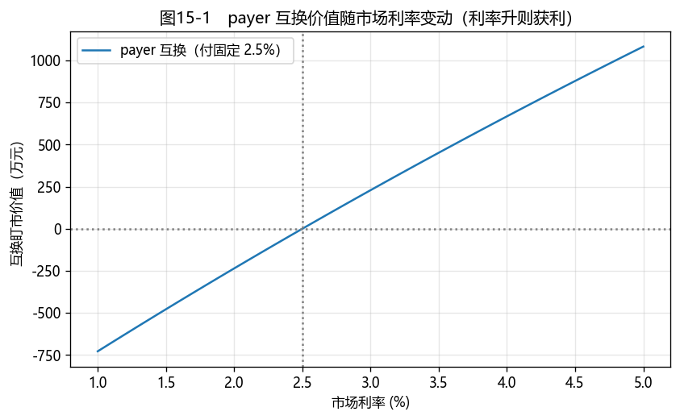

# 第15章　利率互换

[](https://colab.research.google.com/github/albertandking/fixed-income/blob/main/notebooks/ch15_swaps.ipynb) [](https://mybinder.org/v2/gh/albertandking/fixed-income/main?labpath=notebooks/ch15_swaps.ipynb)

!!! info "配套代码"
    本章平价互换利率、互换估值、DV01 与互换曲线 bootstrap 由 `fi.swap` 实现，并与 QuantLib `VanillaSwap` 对拍。

## 15.1 本章导读与学习目标

**利率互换（Interest Rate Swap, IRS）是场外利率衍生品中体量最大、应用最广的品种。** 它的想法朴素：两方在一段时间里**交换利息现金流**——一方付固定利率、收浮动利率，另一方相反。不交换本金，只按名义本金算利息、净额交收。

为什么这么有用？因为它让你可以**不动现券、只用一纸合约**，就把"浮动利率敞口"换成"固定"（或反之）：有浮动利率负债的企业，签一笔"付固定、收浮动"的互换，就把负债锁成了固定成本。互换是利率风险管理、表达利率观点、资产负债管理的瑞士军刀。它的定价完全建立在第5章的折现曲线之上——理解了曲线，互换定价水到渠成。

!!! abstract "学习目标"
    学完本章，你应能：

    1. 解释利率互换的**机制与应用**，认识中国的 **FR007 / Shibor / LPR 互换**；
    2. 推导**浮动腿与固定腿的现值**，求**平价互换利率**；
    3. 为存量互换**估值**并计算其 **DV01**；
    4. 由一组互换报价 **bootstrap 互换曲线**，了解 **OIS 折现**（双曲线）；
    5. 用 `fi.swap` 与 QuantLib `VanillaSwap` 定价并对拍。

---

## 15.2 利率互换的原理与应用

### 15.2.1 机制：交换利息，不换本金

一笔普通（vanilla）利率互换有两条腿：

- **固定腿**：按约定**固定利率**支付利息；
- **浮动腿**：按**浮动基准利率**（每期重置）支付利息。

双方在每个结算日**净额交收**两条腿利息之差，**名义本金不交换**（只用于计算利息）。约定"付固定、收浮动"的一方称 **payer**（互换买方），反之为 **receiver**。

### 15.2.2 中国的利率互换市场

中国 IRS 以**回购定盘利率 FR007**（7 天回购）为最主流基准，其次是 **Shibor 3M**，近年也有 **LPR** 互换。FR007 IRS 是中国机构管理货币市场利率风险、表达利率观点的核心工具。

### 15.2.3 应用

- **对冲利率风险**：把浮动负债"换成"固定（付固定、收浮动），锁定成本；或反向操作；
- **资产负债管理（ALM）**：调整资产/负债的久期缺口，无需买卖现券；
- **表达利率观点**：看涨利率→做 payer（利率升则获利）；看跌→做 receiver；
- **套利与相对价值**：互换利差（swap spread）= 互换利率 − 同期限国债收益率，反映银行间信用与供求。

!!! tip "互换为什么是"轻资本"的利率工具"
    调整现券组合久期要动用大量资金买卖债券；而互换**不交换本金**、初始价值为零（平价签订），只占用保证金/授信。用一笔互换就能改变整个组合对利率的敞口——这是它相对现券和期货的独特优势（期货虽也高效，但受合约标的、CTD 等约束）。

---

## 15.3 互换定价与平价互换利率

互换的价值 = 收到的腿现值 − 付出的腿现值。关键是两条腿的现值。

### 15.3.1 浮动腿现值

在标准假设下（浮动腿按曲线重置、无信用利差），**浮动腿在重置日的现值有一个漂亮的结论**：

$$PV_{\text{浮动}}=\text{名义}\times\big(1-DF(T_n)\big)$$

直觉：浮动腿等价于"期初借出名义本金、期末收回名义本金 + 浮动利息"，其现值就是名义本金减去期末本金的现值。（这与第9章浮息债"重置日平价"同源。）

### 15.3.2 固定腿现值与平价互换利率

固定腿现值 = 名义 × 固定利率 $s$ × **年金因子** $\sum_i \tau_i DF(T_i)$。令互换初始价值为零（浮动腿 = 固定腿），解出**平价互换利率**：

$$\boxed{\;s=\frac{1-DF(T_n)}{\sum_i \tau_i DF(T_i)}\;}$$

这正是"使互换公平、初始价值为零"的固定利率——和第5章平价收益率同形（平价互换利率 ≈ 平价债收益率）。

!!! example "例15.1：平价互换利率"
    用 3% 平坦零息曲线（$DF(t)=1.03^{-t}$）给 5 年期年付互换定价：

    $$s=\frac{1-1.03^{-5}}{\sum_{t=1}^{5}1.03^{-t}}=\mathbf{3.0000\%}$$

    平坦 3% 曲线下平价互换利率恰为 3%——合理（与曲线水平一致）。

### 15.3.3 存量互换估值与 DV01

已签订的互换，固定利率与当前平价利率不同，价值不再为零：

$$V_{\text{payer}}=\text{名义}\times\Big[\big(1-DF(T_n)\big)-s_{\text{合约}}\sum_i \tau_i DF(T_i)\Big]$$

!!! example "例15.2：存量互换估值"
    一笔 5 年期、名义 1 亿元、**付固定 2.5%** 的互换（payer），当前市场平价利率为 3%。其价值：

    $$V_{\text{payer}}\approx +2{,}289{,}854\ \text{元}$$

    付固定方只付 2.5%、却收着相当于 3% 的浮动——**付得比市场低，故为正价值**；对手方（receiver）价值恰好相反（−229 万元）。

!!! example "例15.3：互换 DV01"
    互换的利率敏感度集中在固定腿。其 **DV01（固定腿 PV01）= 年金因子 × 名义 × 1bp**。上例 5 年期 1 亿互换的 DV01 ≈ **45{,}797 元/bp**——利率每变动 1bp，互换价值变动约 4.58 万元。这是用互换做久期对冲时的核心数字。

---

## 15.4 互换曲线构建与 OIS 折现

### 15.4.1 由报价 bootstrap 互换曲线

市场报出各期限的**平价互换利率**。由于平价互换利率与平价债收益率同形，**bootstrap 互换曲线的递推与第5章债券 bootstrap 完全一致**：

$$1=s_n\sum_{j=1}^{n-1}DF_j+(1+s_n)DF_n\;\Rightarrow\;DF_n,\ z_n$$

!!! example "例15.4：由互换报价 bootstrap 折现因子"
    一组年付平价互换报价与反推的折现因子/即期利率：

    | 期限 | 平价互换利率 | 即期利率 | 折现因子 |
    |---|---|---|---|
    | 1y | 2.4% | 2.400% | 0.976562 |
    | 3y | 2.8% | 2.808% | 0.920291 |
    | 5y | 3.1% | 3.119% | 0.857637 |

    用 bootstrap 出的折现因子重算 5 年期平价互换利率，精确复原 3.1%——曲线自洽。

### 15.4.2 OIS 折现（双曲线）

2008 危机后，市场认识到"用什么利率折现"很重要。现代做法是**双曲线（dual-curve）**：用**预测曲线**（如 FR007/Shibor）投影浮动腿现金流，用**隔夜指数互换（OIS）曲线**折现（OIS 更接近无风险、抵押后的资金成本）。中国实务中，FR007 互换曲线兼任预测与折现的主力。本书 `fi.swap` 用单曲线展示核心机制，双曲线作为进阶了解。

---

## 15.5 Python 实现：`fi.swap`

```python
from fi import swap as sw

taus = [1, 1, 1, 1, 1]
dfs = [(1.03) ** -t for t in range(1, 6)]      # 3% 平坦曲线的折现因子

sw.par_swap_rate(dfs, taus)                    # 0.03（例15.1）
sw.swap_value(0.025, dfs, taus, notional=1e8, payer=True)   # +2,289,854（例15.2）
sw.swap_dv01(dfs, taus, notional=1e8)          # 45,797 元/bp（例15.3）

# 由 par swap 报价 bootstrap 互换曲线（例15.4）
zeros, dfs2 = sw.bootstrap_swap_curve([0.024, 0.026, 0.028, 0.030, 0.031])
```

`par_swap_rate`/`swap_value`/`swap_dv01` 基于年金因子与浮动腿"重置日平价"结论；`bootstrap_swap_curve` 复用与债券 par 曲线相同的递推。

---

## 15.6 QuantLib 实现：`VanillaSwap`

```python
import QuantLib as ql

today = ql.Date(15, 6, 2026); ql.Settings.instance().evaluationDate = today
dc, cal = ql.Actual365Fixed(), ql.NullCalendar()
disc = ql.YieldTermStructureHandle(ql.FlatForward(today, 0.03, dc))
idx = ql.IborIndex("Idx", ql.Period(1, ql.Years), 0, ql.CNYCurrency(), cal,
                   ql.Unadjusted, False, dc, disc)
sched = ql.Schedule(today, today + ql.Period(5, ql.Years), ql.Period(1, ql.Years), cal,
                    ql.Unadjusted, ql.Unadjusted, ql.DateGeneration.Forward, False)
swap = ql.VanillaSwap(ql.VanillaSwap.Payer, 1e8, sched, 0.025, dc, sched, idx, 0.0, dc)
swap.setPricingEngine(ql.DiscountingSwapEngine(disc))
swap.NPV()       # ≈ 250 万（与 fi 同量级，差异来自计息惯例/真实日历）
swap.fairRate()  # ≈ 3.05%（平价互换利率）
```

!!! tip "对拍差异来自计息惯例"
    `fi.swap` 用整年、规整折现因子；QuantLib 走真实日历与 Actual365 计息，年金因子 $\tau_i$ 略偏离 1，故 NPV（250 万 vs 229 万）与 fair rate（3.05% vs 3.00%）有小差异。机制完全一致，差异是工程化的计息细节——理解 fi 的透明实现，再读 QuantLib 就清楚了。

---

## 15.7 案例：中国利率互换市场与套保应用

配套 notebook 演示：

1. **bootstrap FR007 互换曲线**（例15.4）：由一组互换报价反推折现因子与即期曲线，并自检复原；
2. **存量互换估值与 MTM**（图15-1）：模拟市场利率平行移动，画出 payer 互换的盯市价值——利率上行时 payer 获利（斜率即 DV01）；
3. **用 IRS 对冲浮动负债**：一笔浮动利率负债 + 一笔"付固定、收浮动"互换 = 锁定为固定成本，展示对冲后净现金流的确定性；
4. **互换利差**：比较互换利率与同期限国债收益率，解读 swap spread 的信息。

**结论要点**：互换以零初始成本、不占本金的方式调整利率敞口，是 ALM 与利率观点表达的主力工具；其定价完全依赖折现曲线（第5章），风险用 DV01 衡量（第6章）。中国 FR007 IRS 市场的深度，是利率市场化与衍生品发展的重要标志。

<figure markdown>
  { width="640" }
  <figcaption>图15-1　付固定 2.5% 的 payer 互换：市场利率上行时价值上升、下行时下降，在市场利率=2.5% 处价值为零（斜率即 DV01）</figcaption>
</figure>

---

## 15.8 习题与编程实验

**概念题**

1. 利率互换为什么"不交换本金"也能管理利率风险？payer 与 receiver 分别在利率上行/下行时获利？
2. 浮动腿现值为什么等于"名义 ×(1−DF(Tₙ))"？这与浮息债的"重置日平价"有何联系？
3. 平价互换利率的公式是什么？它与平价债收益率为何同形？
4. 什么是 OIS 折现（双曲线）？2008 后为什么要区分预测曲线与折现曲线？

**计算题**

5. 用 2.5% 平坦零息曲线，求 3 年期年付互换的平价利率；再求一笔"付固定 3%"的存量 payer 互换（名义 1 亿）的价值与 DV01。
6. 一笔 payer 互换 DV01 = 5 万元/bp，若利率上行 20bp，互换价值变动约多少？方向如何？

**编程实验**

7. 用 `fi.swap.bootstrap_swap_curve` 复现例15.4，并用 bootstrap 出的折现因子重算各期限平价互换利率，验证复原。
8. 复现图15-1：对一笔付固定 2.5% 的 payer 互换，模拟市场利率从 1% 到 5%，画出其盯市价值，标出价值为零处与斜率（DV01）。
9. 用 `fi.swap` 与 QuantLib `VanillaSwap` 对同一笔互换定价，比较 NPV 与 fair rate 的差异，解释计息惯例的影响。

---

## 15.9 习题参考答案与详解

!!! success "概念题 1"
    互换交换的是**利息现金流之差**（按名义本金计算、净额交收），本金只用于计息、不交换——但利息差已足以改变利率敞口（如把浮动负债"换成"固定）。**payer**（付固定、收浮动）在**利率上行**时获利（收的浮动变多、付的固定不变）；**receiver**（收固定、付浮动）在**利率下行**时获利。

!!! success "概念题 2"
    标准浮动腿等价于"期初投出名义本金、每期收浮动利息、期末收回本金"，其现值 = 名义 −（期末本金现值）= 名义 ×(1−DF(Tₙ))。这与第9章浮息债"**重置日平价**"同源：浮动腿在重置日价值回到面值，差额就是 1−DF(Tₙ)。

!!! success "概念题 3"
    平价互换利率 $s=\dfrac{1-DF(T_n)}{\sum_i\tau_i DF(T_i)}$（使互换初始价值为零的固定利率）。它与**平价债收益率同形**，因为"付固定 = 一只平价债的票息、收浮动 = 平价的浮息腿"，令二者现值相等求出的固定利率，正是让"固定腿像一只平价债"的票息率。

!!! success "概念题 4"
    **OIS 折现（双曲线）**：用**预测曲线**（如 FR007/Shibor）投影浮动腿现金流，用**OIS 曲线**折现。2008 后区分二者，是因为危机暴露了"IBOR 含信用/流动性溢价、不再接近无风险"，而抵押后的资金成本更接近 OIS；用 OIS 折现才能正确反映有抵押衍生品的价值。

!!! success "计算题 5"
    2.5% 平坦曲线、3 年期年付：**平价互换利率 = 2.5%**（与曲线水平一致）。一笔"付固定 3%"的 payer 互换（付 3% > 市场 2.5%，付得比市场高）→ **价值为负**，约 **−142.8 万元**（名义 1 亿）；**DV01 ≈ 2.86 万元/bp**（= 年金因子 × 名义 × 1bp）。用 `fi.swap.swap_value(0.03, dfs, [1,1,1], 1e8, payer=True)` 与 `swap_dv01` 验证。

!!! success "计算题 6"
    payer 互换 DV01 = 5 万元/bp。利率**上行 20bp**：价值变动 ≈ $+5\text{万}\times20=\mathbf{+100\text{ 万元}}$。**方向为正**——payer（付固定、收浮动）在利率上行时获利。

!!! success "编程实验 7–9（要点）"
    - **实验 7**：`bootstrap_swap_curve` 复现例15.4，用反推的折现因子重算各期限平价互换利率，应**精确复原**输入报价（曲线自洽）。
    - **实验 8**：图15-1——payer 互换价值随市场利率线性上升，在市场利率 = 固定利率（2.5%）处价值为零，斜率即 DV01。
    - **实验 9**：`fi.swap` 与 QuantLib `VanillaSwap` 对拍，NPV（约 229 万 vs 250 万）、fair rate（3.00% vs 3.05%）有差异，来自计息惯例（Actual365 真实日历使年金因子略偏离整年）。

---

## 15.10 本章小结

- **利率互换**交换固定与浮动利息、不换本金；中国以 **FR007 互换**为主流；是对冲利率风险、ALM、表达观点的轻资本工具。
- **浮动腿现值 = 名义 ×(1−DF(Tₙ))**；**平价互换利率** $s=\dfrac{1-DF(T_n)}{\sum_i\tau_i DF_i}$，与平价债收益率同形。
- 存量互换价值 = 浮动腿 − 固定腿（payer）；**DV01 = 年金因子 × 名义 × 1bp**，集中在固定腿。
- **互换曲线 bootstrap** 与债券 par 曲线同形；现代用 **OIS 双曲线**折现。
- `fi.swap` 与 QuantLib `VanillaSwap` 机制一致，差异来自计息惯例。

下一章（第16章）进入本部分最后、也是最复杂的利率衍生品——**利率期权（Cap/Floor/Swaption）**：用 Black 模型给"利率的期权"定价，并构建波动率曲面。

!!! quote "延伸阅读"
    - Hull, *Options, Futures, and Other Derivatives*，"Swaps" 与 "OIS Discounting" 章节；
    - Tuckman & Serrat, *Fixed Income Securities*，关于互换与互换曲线的章节；
    - 全国银行间同业拆借中心利率互换交易规则与 FR007/Shibor 基准说明。
