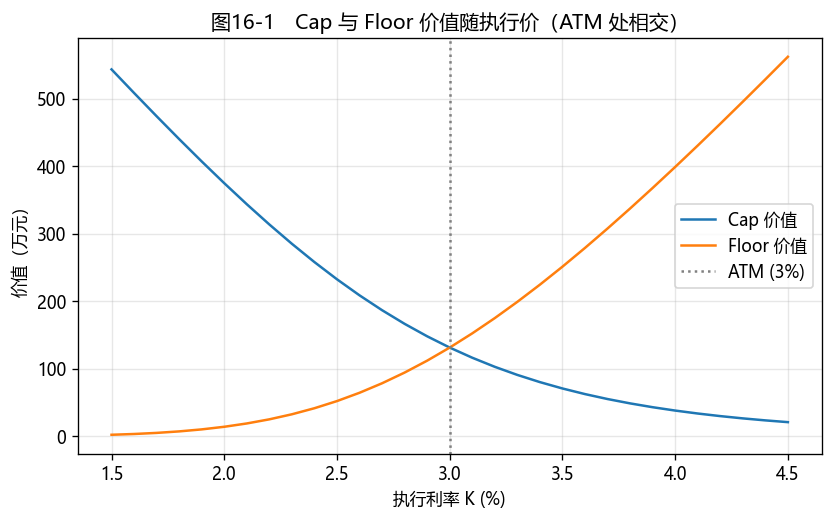

# 第16章　利率期权（Cap/Floor/Swaption）

[](https://colab.research.google.com/github/albertandking/fixed-income/blob/main/notebooks/ch16_ir_options.ipynb) [](https://mybinder.org/v2/gh/albertandking/fixed-income/main?labpath=notebooks/ch16_ir_options.ipynb)

!!! info "配套代码"
    本章 Cap/Floor/Swaption 的 Black 定价、隐含波动率由 `fi.rateopt` 实现，并与 QuantLib `CapFloor` 对拍。

## 16.1 本章导读与学习目标

第14章的期货、第15章的互换都是**线性**工具——损益与利率近似成正比。本章进入**非线性**的世界：**利率期权**。它给持有者"权利而非义务"，从而提供**不对称**的保护——只在利率朝不利方向变动时赔付，朝有利方向变动则保留收益。

有浮动利率贷款的企业怕利率上行，可以买一个**利率上限（Cap）**：利率超过上限就获赔，没超过则不行权，最多损失权利金。这正是期权"下有保底、上不封顶"的魅力。本章用 **Black 模型**给 Cap/Floor 与**互换期权（Swaption）**定价，并引入利率衍生品交易的核心——**波动率曲面**。这是 Part 7 的收尾，也把"期权"这条线（第10–11章的嵌入期权）推向显式的利率期权。

!!! abstract "学习目标"
    学完本章，你应能：

    1. 描述**利率上限、下限、双限（Cap/Floor/Collar）**与**互换期权（Swaption）**的结构与用途；
    2. 用 **Black 模型**为 caplet/floorlet/swaption 定价，理解**caplet 到期日 = 利率重置日**；
    3. 验证 **Cap−Floor 平价**（= 同执行价的 payer 互换）；
    4. 由价格反求**隐含波动率**，理解**波动率曲面/微笑**；
    5. 用 `fi.rateopt` 与 QuantLib 定价并对拍。

---

## 16.2 利率上限、下限与双限

### 16.2.1 Cap：一串看涨期权

**利率上限（Cap）**：买方在每个重置期，若浮动利率高于约定**执行利率（strike）$K$**，就收到 $(\text{利率}-K)$ 的赔付。它由一串**caplet** 组成——每个 caplet 是对该期浮动利率的**看涨期权**：

$$\text{caplet 赔付}=\text{名义}\times\tau\times\max(\text{利率}-K,\ 0)$$

Cap 是浮动利率借款人的"利率保险"：锁定融资成本上限，又保留利率下行时少付利息的好处。

### 16.2.2 Floor 与 Collar

- **利率下限（Floor）**：由 **floorlet**（看跌期权）组成，浮动利率低于 $K$ 时赔付——浮动利率投资者（怕利率下行）的保护；
- **双限（Collar）**：**买 Cap + 卖 Floor**，用卖 Floor 的权利金抵消买 Cap 的成本，把利率锁定在一个区间内（零成本 Collar 是常见结构）。

### 16.2.3 Cap−Floor 平价

相同执行价 $K$ 下，**买 Cap + 卖 Floor = 一笔付固定 $K$ 的 payer 互换**：

$$\boxed{\;\text{Cap}(K)-\text{Floor}(K)=\text{payer 互换}(K)\;}$$

直觉：caplet−floorlet 的赔付 $=\max(r-K,0)-\max(K-r,0)=r-K$，正是互换每期的净现金流。当 $K$ = 平价互换利率（ATM）时，payer 互换价值为零，故 **ATM 时 Cap = Floor**。这是第15章互换与本章期权之间的桥梁。

---

## 16.3 互换期权（Swaption）

**互换期权（Swaption）**是"进入一笔利率互换的权利"：

- **payer swaption**：未来按约定固定利率**付固定**进入互换的权利（看涨利率）；
- **receiver swaption**：**收固定**进入互换的权利（看跌利率）。

用途广泛：企业锁定未来融资的利率上限、对冲或表达对未来利率波动的看法；更重要的是——**第10章可赎回债的赎回权，本质就是一个内嵌的 receiver swaption**。Swaption 是连接含权债与显式利率期权的纽带。

---

## 16.4 Black 模型定价

### 16.4.1 Black（1976）公式

利率期权的标准定价用 **Black 模型**——把"远期利率/远期互换利率"当作对数正态分布的标的。caplet（对期间 $[T_{i-1},T_i]$ 的远期利率 $F$ 的看涨）：

$$\text{caplet}=\text{名义}\times\tau\times DF(T_i)\times\big[F\,N(d_1)-K\,N(d_2)\big]$$
$$d_1=\frac{\ln(F/K)+\tfrac12\sigma^2 T}{\sigma\sqrt T},\quad d_2=d_1-\sigma\sqrt T$$

Swaption 类似，把 $F$ 换成**远期互换利率**、把 $\tau DF$ 换成标的互换的**年金因子**。

!!! warning "关键细节：caplet 到期日 = 利率重置日，不是支付日"
    对期间 $[T_{i-1},T_i]$ 的 caplet，其浮动利率在**期初 $T_{i-1}$ 重置（观测）**、在**期末 $T_i$ 支付**。所以 Black 公式里的**到期时间 $T$ 用重置日 $T_{i-1}$**（波动累积到利率被观测为止），而**折现因子用支付日 $DF(T_i)$**。初学者常误用支付日作为到期日，会高估期权时间价值。此外，第一个 caplet 的利率在期初**已定盘**，无时间价值，通常**不计入** Cap。

### 16.4.2 定价示例

!!! example "例16.1：单个 caplet"
    一个 caplet：远期利率 3%、执行 3%、重置在 1 年后、支付在 2 年后、波动率 20%、名义 1 亿、$DF(2)=1.03^{-2}$。Black 价值 ≈ **225{,}249 元**。

!!! example "例16.2：ATM Cap 与 Floor"
    一个覆盖第 1–4 个重置期的 Cap（4 个 caplet，重置在 $t=1,2,3,4$，远期均 3%，vol 20%，名义 1 亿）。执行价 = 3%（ATM）：

    | 执行价 $K$ | Cap | Floor | Cap−Floor | payer 互换 |
    |---|---|---|---|---|
    | 2% | 3,746,102 | 137,268 | **3,608,833** | 3,608,833 |
    | 3%(ATM) | **1,310,756** | **1,310,756** | **0** | 0 |
    | 4% | 377,518 | 3,986,352 | **−3,608,833** | −3,608,833 |

    **Cap−Floor 在每个执行价都精确等于 payer 互换价值**（平价验证）；ATM 时 Cap = Floor。

!!! example "例16.3：Swaption"
    一个 1 年后进入 4 年期 payer 互换的 swaption，远期互换利率 3%、执行 3%、vol 20%、名义 1 亿。Black 价值 ≈ **862{,}392 元**。

---

## 16.5 隐含波动率与波动率曲面

### 16.5.1 隐含波动率

Black 公式里唯一不可直接观测的输入是**波动率 $\sigma$**。反过来，给定市场期权**价格**，可反解出令 Black 价格等于市价的 $\sigma$——即**隐含波动率（implied volatility）**。它是市场对未来利率波动的定价，是利率期权交易的"通用语言"（报价常直接报波动率而非价格）。

!!! example "例16.4：隐含波动率"
    用 20% 波动率算出例16.1 caplet 的价格，再由该价格反求隐含波动率，精确得回 **20.00%**——`fi.rateopt.implied_vol` 用 Brent 法求解。

### 16.5.2 波动率微笑与曲面

如果 Black 模型完美，所有执行价、所有期限的隐含波动率应当相同。但市场不是——隐含波动率随**执行价**变化（**波动率微笑/偏斜 smile/skew**）、随**期限**变化（**期限结构**）。把两者放在一起，就是**波动率曲面（vol surface）**：

- **Cap/Floor 波动率曲面**：维度 = 期限 × 执行价；
- **Swaption 波动率立方体（vol cube）**：维度 = 期权期限 × 互换期限 × 执行价。

交易台用整张曲面给一切利率期权一致定价、做风险管理。

!!! note "低利率/负利率：从对数正态到正态波动率"
    Black 模型假设利率**对数正态**（不能为负）。但 2010 年代欧日出现**负利率**，对数正态崩溃，市场转向 **正态（Bachelier）波动率** 或**移位对数正态（shifted lognormal）**。报价时务必分清是 **Black（对数正态）波动率**还是 **Normal（正态）波动率**——二者数值与含义不同。这是利率期权区别于股票期权的一个重要现实。

---

## 16.6 Python 实现：`fi.rateopt`

```python
from fi import rateopt as ro

# 单个 caplet（重置 1y、支付 2y、F=K=3%、vol=20%）—— 例16.1
ro.black_caplet(forward=0.03, strike=0.03, vol=0.20, t=1, tau=1, df=1.03**-2)   # ≈225,249

# Cap / Floor（4 个 caplet，重置 t=1..4）—— 例16.2
resets, pay_dfs = [1, 2, 3, 4], [1.03**-t for t in (2, 3, 4, 5)]
ro.black_cap([0.03]*4, 0.03, 0.20, resets, [1]*4, pay_dfs, kind="cap")    # ≈1,310,756
ro.black_cap([0.03]*4, 0.03, 0.20, resets, [1]*4, pay_dfs, kind="floor")  # = Cap（ATM）

# Swaption（1y -> 4y payer）—— 例16.3
ro.black_swaption(0.03, 0.03, 0.20, expiry=1, swap_annuity=sum(pay_dfs))   # ≈862,392

# 隐含波动率 —— 例16.4
ro.implied_vol(225249, 0.03, 0.03, 1, 1, 1.03**-2)   # ≈0.20
```

注意 `black_caplet` 的参数把**到期时间 `t`（重置日）**与**折现 `df`（支付日）**分开——这正是 16.4 强调的关键细节。

---

## 16.7 QuantLib 实现：`CapFloor`

```python
import QuantLib as ql

today = ql.Date(15, 6, 2026); ql.Settings.instance().evaluationDate = today
dc, cal = ql.Actual365Fixed(), ql.NullCalendar()
ts = ql.YieldTermStructureHandle(ql.FlatForward(today, 0.03, dc))
idx = ql.IborIndex("Idx", ql.Period(1, ql.Years), 0, ql.CNYCurrency(), cal,
                   ql.Unadjusted, False, dc, ts)
sched = ql.Schedule(today, today + ql.Period(5, ql.Years), ql.Period(1, ql.Years), cal,
                    ql.Unadjusted, ql.Unadjusted, ql.DateGeneration.Forward, False)
cap = ql.Cap(ql.IborLeg([1e8], sched, idx), [0.03])
cap.setPricingEngine(ql.BlackCapFloorEngine(ts, ql.QuoteHandle(ql.SimpleQuote(0.20))))
cap.NPV()   # ≈145 万（与 fi 同量级，差异来自计息惯例与远期/折现精度）
```

!!! tip "对拍差异"
    `fi.rateopt` 用整年、规整折现展示机制；QuantLib 走 Actual365 真实日历、由曲线计算各期远期与折现，故 Cap NPV（≈145 万 vs fi 的 ≈131 万）有差异。机制一致，差异是工程化的计息/曲线细节——与前几章 QuantLib 对拍一脉相承。

---

## 16.8 案例：波动率曲面构建与解读

配套 notebook 演示：

1. **Cap/Floor vs 执行价**（图16-1）：画出 Cap 与 Floor 价值随执行价的曲线，定位 ATM 交点，验证 Cap−Floor 平价；
2. **隐含波动率反求**：由一组（合成）市场价格反求隐含波动率，画出**波动率微笑**；
3. **波动率曲面**：构建期限 × 执行价的隐含波动率网格，观察期限结构与偏斜；
4. **Collar 构造**：用买 Cap + 卖 Floor 构造零成本 Collar，求使成本为零的 Floor 执行价。

**结论要点**：利率期权提供非线性、不对称的利率保护；定价靠 Black 模型，交易靠波动率曲面。中国利率期权市场（利率互换期权、国债期货期权等）仍在发展，但 Cap/Floor/Swaption 的定价框架是全球通用的。第10–11章的嵌入期权（可赎回债 = 内嵌 swaption、可转债 = 内嵌股票期权）至此与显式利率期权完全打通。

<figure markdown>
  { width="640" }
  <figcaption>图16-1　Cap 价值随执行价下降、Floor 随执行价上升，在 ATM（3%）处相交（此处 Cap=Floor）；二者之差 = payer 互换</figcaption>
</figure>

---

## 16.9 习题与编程实验

**概念题**

1. Cap、Floor、Collar 分别保护谁、对冲什么风险？零成本 Collar 如何构造？
2. 用 caplet−floorlet 的赔付证明 Cap−Floor 平价（= payer 互换）；为什么 ATM 时 Cap = Floor？
3. payer swaption 与 receiver swaption 各是什么权利？为什么说可赎回债内嵌了一个 receiver swaption？
4. 为什么 caplet 的 Black 到期时间用重置日而非支付日？误用支付日会高估还是低估期权价值？

**计算题**

5. 一个 caplet：远期 2.5%、执行 3%、重置 2 年、支付 3 年、vol 25%、名义 1 亿，求其 Black 价值（用 DF=1.03⁻³）。
6. 由市场报价：某 ATM caplet 价值 30 万元（F=K=3%、重置 1y、支付 2y、名义 1 亿），反求隐含波动率。

**编程实验**

7. 用 `fi.rateopt` 复现例16.1–16.4，并复现图16-1（Cap/Floor vs 执行价），验证 Cap−Floor 平价。
8. 构造一组不同执行价的（合成）caplet 价格，用 `implied_vol` 反求隐含波动率并画**波动率微笑**。
9. 用 `fi.rateopt.black_swaption` 计算不同期权期限 × 执行价的 swaption 价格，反求隐含波动率，构建一张小型**波动率曲面**。

---

## 16.10 本章小结

- **利率期权**提供非线性、不对称的利率保护：**Cap**（caplet=看涨）保护借款人、**Floor**（floorlet=看跌）保护投资者、**Collar**=买 Cap+卖 Floor。
- **Cap−Floor 平价**：同执行价下 = payer 互换；ATM 时 Cap = Floor——连接第15章互换与本章期权。
- **Swaption** 是进入互换的权利；可赎回债内嵌一个 **receiver swaption**——打通含权债与显式期权。
- **Black 模型**给 caplet/floorlet/swaption 定价；**caplet 到期 = 重置日、折现用支付日**是关键细节。
- **隐含波动率**是市场对波动的定价；**波动率曲面/微笑**是交易核心；低/负利率时改用**正态（Bachelier）波动率**。

下一部分（第17–18章）进入**综合应用**：把前面所有工具（定价、久期、曲线、衍生品）整合进**投资策略回测**与**风险管理系统**，完成从单一工具到完整框架的跨越。

!!! quote "延伸阅读"
    - Hull, *Options, Futures, and Other Derivatives*，"Interest Rate Derivatives: The Standard Market Models"（Black 模型、Cap/Floor、Swaption）；
    - Brigo & Mercurio, *Interest Rate Models — Theory and Practice*（波动率曲面、SABR、shifted lognormal 的系统论述）；
    - 全国银行间同业拆借中心利率期权（利率互换期权等）业务规则。
