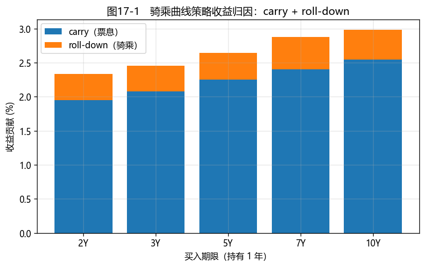

# 第17章　债券投资策略与回测

[](https://colab.research.google.com/github/albertandking/fixed-income/blob/main/notebooks/ch17_strategies.ipynb) [](https://mybinder.org/v2/gh/albertandking/fixed-income/main?labpath=notebooks/ch17_strategies.ipynb)

!!! info "配套代码"
    本章策略回测、绩效评估与收益归因由 `fi.backtest` 实现；案例用中国国债曲线做骑乘策略归因，离线即可运行。

## 17.1 本章导读与学习目标

前 16 章我们一件一件打磨工具：定价、收益率、曲线、久期、含权、信用、衍生品。本章把它们**组装成策略**——回答投资者真正关心的问题：**怎么配置才能赚钱、赚的钱从哪来、承担了多少风险？**

债券投资分两大流派：**主动管理**（预测利率/利差、择时择券，追求超额收益）与**被动管理**（复制指数、买入持有，追求低成本贴合基准）。无论哪种，都需要一套**回测框架**来检验策略、一套**归因方法**来拆解收益来源。本章用 `fi.backtest` 搭起这套框架，并揭示一个朴素而深刻的事实：**债券的收益主要来自 carry（票息）与 roll-down（骑乘），而非靠精准预测利率**。

!!! abstract "学习目标"
    学完本章，你应能：

    1. 区分**主动**（久期择时、骑乘曲线、子弹/哑铃、利差策略）与**被动**（买入持有、指数复制）管理；
    2. 解释**骑乘曲线（riding the yield curve）**策略，并对其收益做归因；
    3. 把债券收益**分解**为 carry + roll-down + 久期 + 凸性（+ 利差）；
    4. 用 `fi.backtest` 计算**绩效指标**（年化收益、波动、夏普、最大回撤）；
    5. 在中国国债数据上回测策略并做收益归因。

---

## 17.2 主动管理策略

主动管理试图通过预测和择时获取超额收益，常见手法：

### 17.2.1 久期择时（duration timing）

对利率方向下注：**看多债市（预期利率下行）→ 拉长组合久期**（放大价格上涨）；**看空 → 缩短久期**。久期是表达利率观点的总开关，可用现券、国债期货（第14章）或互换（第15章）快速调整。

### 17.2.2 骑乘曲线（riding / rolling down the yield curve）

**当收益率曲线向上倾斜且预期不变时**，买入期限长于投资期的债券，持有一段后卖出：债券随时间"变短"，沿曲线**下滚**到更低的收益率点，收益率下降带来价格上涨（**roll-down 收益**），叠加票息（**carry**），总收益高于直接持有短债。这是债券投资最经典、最稳健的"躺赢"策略之一。

!!! example "例17.1：骑乘曲线策略归因"
    用内置国债曲线：买入 **5 年期**国债（收益率 2.25%、修正久期 4.68），持有 **1 年**后它变成 4 年期债（曲线不变，收益率降到 2.165%）卖出：

    | 收益来源 | 贡献 |
    |---|---|
    | **carry**（票息收入） | +2.250% |
    | **roll-down**（−久期 ×(2.165%−2.25%)） | +0.398% |
    | **总收益** | **+2.648%** |

    而直接持有 1 年期国债只有 **1.75%**——**骑乘策略多赚约 0.90%**，且这部分超额收益不依赖任何利率预测，纯粹来自"曲线向上倾斜 + 时间流逝"。当然，前提是曲线不大幅上移（否则 roll-down 收益会被价格下跌吞没）。

### 17.2.3 曲线形态策略：子弹 / 哑铃 / 梯形

对曲线**形状变化**下注（第7章已见久期匹配）：

- **子弹（bullet）**：集中于某期限——押注曲线该段表现；
- **哑铃（barbell）**：两端配置——凸性更高，押注曲线变平/大波动；
- **梯形（ladder）**：均匀分布于各期限——分散再投资风险，被动型常用。

### 17.2.4 利差策略

在利率债之外赚**信用/品种利差**：信用下沉（买低评级博利差）、骑乘信用利差曲线、国开—国债利差交易等。收益更高，但承担信用风险（第12章）。

---

## 17.3 被动管理策略

被动管理不预测市场，只求**低成本贴合基准**：

- **买入持有（buy-and-hold）**：持有到期，赚票息与到期回收，交易成本最低；
- **指数复制（index replication）**：复制某债券指数的风险收益。债券指数成分多达数千只、且不断有新发/到期，**完全复制不现实**，实务用**分层抽样（stratified sampling）**——按期限、券种、评级分层，每层选代表性券，使组合的久期、券种分布贴合指数；
- **跟踪误差（tracking error）**：组合相对指数收益的标准差，是被动策略的核心考核指标。

!!! note "中国债券指数"
    中国主流债券指数有**中债-综合指数**、**中证全债**等。债券指数基金/ETF 以分层抽样复制为主。被动投资在中国债市快速发展，是机构低成本获取债市 beta 的工具。

---

## 17.4 回测框架与收益归因

### 17.4.1 债券收益的分解

一只债券单期总收益可近似分解为（结合第6章久期凸性）：

$$\boxed{\;r \approx \underbrace{y\cdot\Delta t}_{\text{carry}}+\underbrace{(-D\,\Delta y_{\text{roll}})}_{\text{roll-down}}+\underbrace{(-D\,\Delta y_{\text{mkt}})}_{\text{久期(利率变动)}}+\underbrace{\tfrac12 C\,\Delta y^2}_{\text{凸性}}\;(+\text{利差})\;}$$

- **carry**：持有期的票息/收益率收入；
- **roll-down**：曲线不变下，债券沿曲线下滚的价格收益；
- **久期项**：市场收益率变动带来的价格盈亏（主动久期择时的战场）；
- **凸性项**：二阶修正（大波动时显现）。

归因把"赚了多少"拆成"靠 carry/roll 躺赢 vs 靠择时主动赚"，是评价策略的关键。

### 17.4.2 绩效指标

回测产出收益序列后，用标准指标评价：**年化收益、年化波动、夏普比率、最大回撤**（沿用第5章风险度量的口径）。

!!! example "例17.2：绩效指标"
    对一段（合成）日收益序列，`fi.backtest.performance` 给出：年化收益 ≈ 2.55%、年化波动 ≈ 0.56%、夏普 ≈ 4.54、最大回撤 ≈ −1.4%。债券策略通常**低波动、高夏普、浅回撤**——这正是固定收益"压舱石"的体现。

<figure markdown>
  { width="640" }
  <figcaption>图17-1　不同买入期限的骑乘策略：总收益 = carry + roll-down；曲线越陡、期限越长，roll-down 贡献越显著</figcaption>
</figure>

---

## 17.5 Python 实现：`fi.backtest`

```python
from fi import backtest as bt

# 收益分解（单期）
bt.bond_period_return(yield_start=0.025, yield_end=0.027, duration=4.7,
                      convexity=25, coupon_rate=0.025, dt=1)
# -> carry + duration + convexity 分项

# 骑乘曲线归因（买 5y 持有 1y，卖出时为 4y）—— 例17.1
bt.riding_attribution(y_buy=0.0225, y_sell=0.02165, duration=4.68, coupon_rate=0.0225, horizon=1)
# -> {'carry': 0.0225, 'rolldown': 0.00398, 'total': 0.02648}

# 绩效指标 —— 例17.2
bt.performance(returns, periods_per_year=252)
# -> {'ann_return', 'ann_vol', 'sharpe', 'max_drawdown'}
```

`riding_attribution` 把骑乘收益拆为 carry 与 roll-down；`bond_period_return` 给出 carry/久期/凸性分解；`performance` 计算标准绩效指标。

---

## 17.6 案例：中国债券市场投资实践

配套 notebook 演示：

1. **骑乘曲线归因**（图17-1）：对不同买入期限（2/3/5/7/10 年）持有 1 年的骑乘策略，分解 carry 与 roll-down，观察"曲线越陡、roll-down 越显著"；
2. **久期择时回测**：用一段利率路径，比较"主动拉长/缩短久期"与"固定久期"的收益与回撤；
3. **主动 vs 被动**：比较一个择时策略与买入持有的绩效（年化收益、夏普、最大回撤），讨论主动管理能否覆盖其交易成本与风险；
4. **收益归因**：把策略总收益拆成 carry/roll-down/久期/凸性，看清"超额收益来自哪里"。

**结论要点**：债券收益的"大头"通常是 **carry + roll-down**（稳健、不依赖预测），而久期择时是"锦上添花也可能弄巧成拙"的主动部分。一个好的债券策略，往往是**在稳健 carry/roll 的基础上，谨慎地做久期与利差的主动暴露**。归因让我们诚实地分辨"运气（beta）"与"能力（alpha）"。

---

## 17.7 习题与编程实验

**概念题**

1. 骑乘曲线策略为什么能在"不预测利率"的情况下获得超额收益？它的前提与风险是什么？
2. 完全复制债券指数为什么不现实？分层抽样如何贴合指数？跟踪误差衡量什么？
3. 把债券单期收益分解为 carry/roll-down/久期/凸性，各项分别由什么驱动？哪些是"躺赢"、哪些是"主动下注"？

**计算题**

4. 买入 7 年期国债（收益率 2.40%、久期 6.3），持有 1 年后变成 6 年期（收益率 2.32%）。计算 carry、roll-down 与总收益，并与直接持有 1 年期（1.75%）比较。
5. 某策略年化收益 4%、年化波动 1.5%、无风险 2%，求夏普比率。

**编程实验**

6. 用 `fi.backtest.riding_attribution` 复现例17.1 与图17-1（不同买入期限的骑乘归因），验证 roll-down 随曲线陡峭度上升。
7. 用一段（真实或合成）利率路径回测一个久期择时策略，用 `fi.backtest.performance` 计算绩效，与买入持有对比。
8. 对一个策略做完整收益归因（carry/roll-down/久期/凸性），画出各来源的累计贡献，分辨 beta 与 alpha。

---

## 17.8 习题参考答案与详解

!!! success "概念题 1"
    **骑乘曲线**在曲线向上倾斜时，买入期限长于投资期的债券，持有后它沿曲线"下滚"到更低收益率点，收益率下降→价格上涨（roll-down），叠加票息（carry），无需预测利率即可获超额收益。**前提**：收益率曲线向上倾斜且大致不变。**风险**：若曲线大幅上移，roll-down 收益会被价格下跌吞没——它赚的是"曲线形状 + 时间"，不是免费午餐。

!!! success "概念题 2"
    债券指数成分多达数千只、不断有新发/到期，**完全复制**交易成本与运营成本过高、不现实。**分层抽样**：按期限、券种、评级分层，每层选代表性券，使组合的久期、券种/评级分布贴合指数，用少量券近似复制。**跟踪误差**衡量组合相对指数收益的标准差，是被动策略的核心考核指标。

!!! success "概念题 3"
    - **carry**（票息收入）：由持有收益率驱动，**躺赢**（不需预测）；
    - **roll-down**（骑乘）：由曲线陡峭度驱动，**躺赢**；
    - **久期项**（利率变动）：由市场收益率变动驱动，是**主动下注**（久期择时的战场）；
    - **凸性项**：二阶修正，大波动时显现。
    carry + roll-down 是稳健的 **beta**，久期择时是 **alpha**（也可能弄巧成拙）。

!!! success "计算题 4"
    买 7 年期（收益率 2.40%、久期 6.3），持有 1 年后变 6 年期（收益率 2.32%）：

    - **carry** $=2.40\%$（约等于持有收益率）；
    - **roll-down** $=-D\times(y_{\text{卖}}-y_{\text{买}})=-6.3\times(2.32\%-2.40\%)=+0.504\%$；
    - **总收益** $\approx 2.40\%+0.504\%=\mathbf{2.904\%}$。

    而直接持有 1 年期国债仅 1.75%，**骑乘多赚约 1.15 个百分点**——且不依赖利率预测。

!!! success "计算题 5"
    夏普比率 $=\dfrac{\text{年化收益}-\text{无风险}}{\text{年化波动}}=\dfrac{4\%-2\%}{1.5\%}=\mathbf{1.333}$。

!!! success "编程实验 6–8（要点）"
    - **实验 6**：`riding_attribution` 复现例17.1（2.65%）与图17-1——买入期限越长、曲线越陡，roll-down 贡献越大。
    - **实验 7**：用利率路径回测久期择时策略，`performance` 给年化收益/波动/夏普/最大回撤；与买入持有对比，注意"高收益≠高夏普"（主动策略波动更大）。
    - **实验 8**：把策略总收益拆成 carry/roll-down/久期/凸性，画累计贡献——carry+roll-down 是稳健 beta，久期项的正负体现择时 alpha 的成败。

---

## 17.9 本章小结

- 债券投资分**主动**（久期择时、骑乘曲线、子弹/哑铃、利差）与**被动**（买入持有、分层抽样复制指数）。
- **骑乘曲线**在上行曲线下不靠预测就能赚 carry + roll-down；roll-down 随曲线陡峭度与久期上升。
- 债券收益可分解为 **carry + roll-down + 久期 + 凸性（+ 利差）**；归因区分"躺赢的 beta"与"主动的 alpha"。
- `fi.backtest` 提供收益分解、骑乘归因与绩效指标（年化收益/波动/夏普/最大回撤）。
- 债券策略通常低波动、高夏普、浅回撤；好策略多是**稳健 carry/roll + 谨慎的主动暴露**。

下一章（第18章，全书收尾）将把视角从"赚多少"转向"亏多少的可能"——构建**风险管理系统**：VaR/CVaR、压力测试、情景分析，把全书的工具整合进一个完整的风险框架。

!!! quote "延伸阅读"
    - Fabozzi, *Bond Markets, Analysis, and Strategies*，"Active Bond Portfolio Management" 与 "Indexing / Passive Strategies" 章节；
    - Ilmanen, A. *Expected Returns*（carry、roll-down 等收益来源的系统论述）；
    - 中债/中证债券指数编制方法说明；债券指数基金招募说明书中的复制方法。
