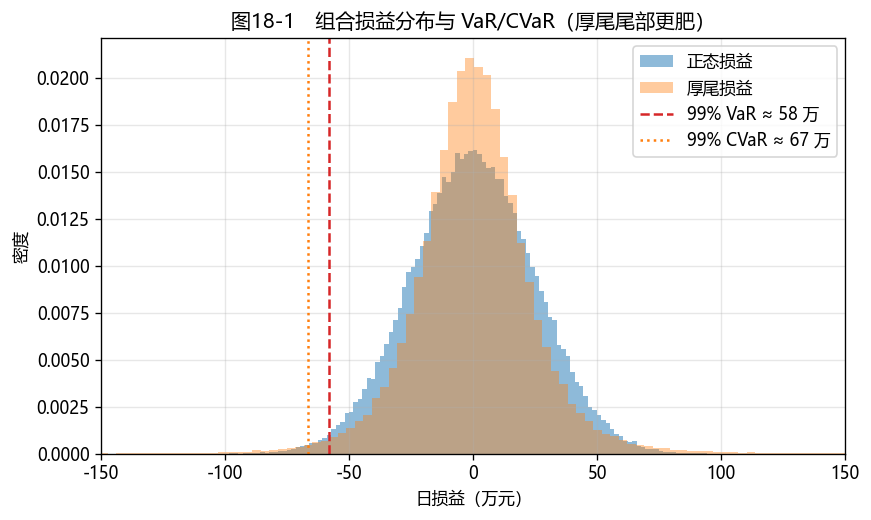

# 第18章　风险管理系统

[](https://colab.research.google.com/github/albertandking/fixed-income/blob/main/notebooks/ch18_risk_management.ipynb) [](https://mybinder.org/v2/gh/albertandking/fixed-income/main?labpath=notebooks/ch18_risk_management.ipynb)

!!! info "配套代码"
    本章 VaR/CVaR（历史/参数/蒙特卡洛）、压力测试与情景分析由 `fi.var` 实现；案例对国债+信用债组合做三法 VaR 对比，离线即可运行。

## 18.1 本章导读与学习目标

全书最后一章，我们把视角从"能赚多少"转向"可能亏多少"。前面所有工具——定价、久期、曲线、信用、衍生品、策略——最终都要汇入一个问题：**这个组合的风险有多大，会不会爆？** 这就是**风险管理系统**要回答的。

风险管理有三层武器：用 **VaR/CVaR** 量化"正常市场下的潜在损失"，用**压力测试**审视"极端但可能的灾难情景"，用**情景分析**推演"特定冲击下的损益"。2013 钱荒、2020 永煤、2022 理财赎回潮（第8、12 章）一再证明：**活下来比赚得多更重要**。本章是全书工具的总集成，也是从"会定价"到"会管风险"的最后一跃。

!!! abstract "学习目标"
    学完本章，你应能：

    1. 用**历史模拟、参数法、蒙特卡洛**三种方法计算债券组合 **VaR**，理解各自优劣；
    2. 解释 **CVaR（期望损失/ES）**及其相对 VaR 的优越性；
    3. 设计**压力测试与情景分析**（利率平移、曲线变陡、信用利差走阔）；
    4. 了解**监管资本与合规**框架（巴塞尔、IRRBB、流动性指标）；
    5. 用 `fi.var` 搭建组合风险度量，对中国债券组合做风险评估。

!!! note "本章知识结构"
    **VaR**（18.2，三要素：置信水平/持有期/分布）→ 历史 / 参数 / 蒙特卡洛三法
    　↓ 尾部里的真相
    **CVaR（ES）**（18.2.2，一致性、次可加性，巴塞尔转向 ES）
    　↓ 正常市场之外
    **压力测试与情景分析**（18.3，利率/信用/流动性、历史灾难）
    　↓ 制度化
    **监管（巴塞尔/IRRBB/流动性）**（18.6）→ 全书工具的风险集成（18.7）

---

## 18.2 风险价值 VaR 与条件风险价值 CVaR

### 18.2.1 VaR 的定义

**风险价值（Value at Risk, VaR）**回答：在置信水平 $\alpha$（如 99%）下，给定持有期（如 1 日）内，损失**不超过**某个数额的把握有多大。即"99% 的日子里，亏损不超过 VaR"。它把组合风险压成一个金额，是风控限额、监管资本的通用语言。

VaR 需三个要素：**置信水平**（99%/95%）、**持有期**（1 日/10 日）、**损益分布**。三种估计方法：

| 方法 | 做法 | 优点 | 缺点 |
|---|---|---|---|
| **历史模拟法** | 用历史损益的经验分布取分位数 | 不假设分布、自然含厚尾 | 依赖历史、样本有限 |
| **参数法（方差-协方差）** | 假设正态，VaR $=z_\alpha\sigma$ | 简单快速 | **正态假设低估厚尾** |
| **蒙特卡洛法** | 模拟大量情景取分位数 | 灵活、可含非线性 | 计算量大、依赖模型 |

债券组合的损益主要由久期驱动：损益标准差 $\sigma_{P\&L}\approx$ **久期 × 市值 × 收益率波动率**。

!!! example "例18.1：参数法 VaR/CVaR"
    组合市值 1 亿、修正久期 5、日收益率波动 5bp。损益标准差 $=5\times10^8\times0.0005=250{,}000$ 元/日。

    | 置信水平 | 1 日 VaR | 1 日 CVaR |
    |---|---|---|
    | 95% | 411,213 | 515,678 |
    | 99% | **581,587** | **666,304** |

    即"99% 的交易日，该组合 1 日亏损不超过约 58 万元"。

### 18.2.2 CVaR：尾部里的真相

VaR 只说"突破阈值的概率"，不说"突破后亏多少"。**条件风险价值（CVaR，也称期望损失 ES）**补上这一点：**一旦损失超过 VaR，平均会亏多少**。它永远 $\ge$ VaR（例18.1：99% CVaR 66 万 > VaR 58 万）。

CVaR 还有一个理论优势——它是**一致性风险度量（coherent）**，满足**次可加性**（组合的风险不超过各部分之和），而 VaR 不满足。因此巴塞尔新规（FRTB）已从 VaR 转向 **ES** 作为市场风险资本的基础。

!!! example "例18.2：三种方法对比，谁低估了风险"
    同一组合（$\sigma=25$ 万），用三法算 99% 1 日 VaR：

    | 方法 | 99% VaR |
    |---|---|
    | 参数法（正态） | 581,587 |
    | 蒙特卡洛（正态） | 585,738 |
    | **历史模拟（厚尾）** | **659,080** |

    **历史法（含厚尾）的 VaR 明显更高**——因为真实收益分布比正态**厚尾**（第5章），参数法的正态假设**系统性低估极端损失**。这是 2008 危机中 VaR 模型集体失灵的核心教训：用正态低估了尾部。

<figure markdown>
  { width="640" }
  <figcaption>图18-1　组合损益分布与 99% VaR、CVaR：厚尾分布的尾部远比正态肥厚，正态参数法低估尾部损失</figcaption>
</figure>

---

## 18.3 压力测试与情景分析

VaR 衡量"正常市场"，但风险往往爆发在"非正常"时刻。**压力测试**与**情景分析**补上这一盲区。

### 18.3.1 情景分析

对组合施加**特定的市场冲击**，直接重估损益（结合第6章久期凸性）：

$$\text{损益}\approx \text{市值}\times\big(-D\,\Delta y+\tfrac12 C\,\Delta y^2\big)$$

!!! example "例18.3：利率情景分析"
    组合市值 1 亿、久期 5、凸性 30。不同利率冲击下的损益：

    | 情景 | 组合损益 |
    |---|---|
    | +100bp | −4,850,000 |
    | +200bp | −9,400,000 |
    | −100bp | +5,150,000 |

    注意 +200bp 的损失（−940 万）小于 +100bp 的两倍（−970 万）——**正凸性减轻了大幅上行的损失**（第6章）。

### 18.3.2 压力测试

**压力测试**用**极端但可能**的情景（往往取自历史灾难）审视组合的生存能力：

- **利率情景**：平移、变陡/变平、扭曲；
- **信用情景**：利差全面走阔、评级下迁、违约率跳升（第12章）；
- **流动性情景**：资金面骤紧、回购续作失败（第8章）；
- **历史情景**：复现 **2013 钱荒、2016 债灾、2020 永煤、2022 理财赎回潮**的市场冲击。

压力测试不追求概率，而追问：**"如果那一天重来，我的组合扛得住吗？"**

---

## 18.4 Python 实现：`fi.var`

```python
from fi import var as v

# 债券组合损益标准差（久期×市值×收益率波动）
sigma = v.bond_pnl_sigma(value=1e8, duration=5, yield_vol=0.0005)   # 250,000

# 三种方法的 99% VaR
v.parametric_var(sigma, alpha=0.99)            # 581,587
v.monte_carlo_var(sigma, alpha=0.99)           # (var, cvar)
v.historical_var(pnl_series, alpha=0.99)       # 经验分位数

# CVaR（期望损失）
v.parametric_cvar(sigma, alpha=0.99)           # 666,304

# 情景分析 / 压力测试
v.scenario_pnl(value=1e8, duration=5, convexity=30, dy=0.01)   # -4,850,000
```

`bond_pnl_sigma` 把久期换成损益波动；`parametric/historical/monte_carlo_var` 三法并列；`scenario_pnl` 用久期+凸性重估特定冲击下的损益。

---

## 18.5 QuantLib 综合应用

风险管理是全书工具的集成：用 QuantLib 给组合中每只债券（普通债、含权债、衍生品）在各情景下**重新定价**，汇总成组合损益分布，再算 VaR/CVaR。本书各章的 QuantLib 对象（`FixedRateBond`、`CallableFixedRateBond`、`VanillaSwap`、`CapFloor`、`FlatHazardRate`……）正是这样一个**统一定价引擎**的零件——把它们装进情景循环，就是一套完整的风险系统。

!!! tip "全价值重估 vs 灵敏度法"
    风险系统有两条路线：**灵敏度法**（用久期/凸性/DV01 近似，快，本书 `fi.var` 走此路）与**全价值重估**（每情景对每只券完全重新定价，准但慢，QuantLib 适合）。含权债、衍生品因非线性，灵敏度法误差大，需全价值重估。实务中两者结合：日常用灵敏度，月度/压力测试用全重估。

---

## 18.6 监管要求与合规

风险管理也是监管要求。固定收益相关的主要框架：

- **巴塞尔协议（Basel III/IV）**：市场风险资本从 VaR 转向 **ES（FRTB）**；信用风险、交易对手风险资本计提；
- **银行账簿利率风险（IRRBB）**：用标准利率情景（如 ±200bp 及曲线情景）评估银行账簿的经济价值变动（ΔEVE）与净利息收入变动（ΔNII）——本质是第6章久期 + 本章情景分析；
- **流动性指标**：流动性覆盖率（LCR）、净稳定资金比率（NSFR）；
- **中国**：金融监管总局、央行的资本充足率、流动性、杠杆率（第8章）等监管，以及债券投资的久期/集中度/杠杆限额。

合规不是束缚，而是把"活下来"制度化。

---

## 18.7 案例：国债 + 信用债组合的风险评估

配套 notebook 综合演示一套迷你风险系统：

1. **三法 VaR 对比**（图18-1）：对一个国债 + 信用债组合，用历史/参数/蒙特卡洛三法算 1 日 99% VaR/CVaR，比较厚尾的影响；
2. **情景与压力测试**：施加 +100/+200bp 平移、曲线变陡、信用利差走阔等情景，重估组合损益；
3. **历史压力情景**：复现"永煤式"信用冲击下的组合损失；
4. **风险汇总报告**：把久期、DV01、VaR、CVaR、压力损失汇成一张组合风险仪表盘。

**结论要点**：VaR/CVaR 度量正常市场风险（注意正态低估厚尾），压力测试审视极端情景；二者互补，缺一不可。风险管理是全书的归宿——把定价、久期、曲线、信用、衍生品全部装进一个"如果市场变坏会怎样"的框架里。

---

## 18.8 习题与编程实验

**概念题**

1. VaR 的三要素是什么？历史/参数/蒙特卡洛三法各自的优缺点？
2. CVaR 相对 VaR 有何优势？为什么巴塞尔新规转向 ES？什么是次可加性？
3. 为什么参数法（正态）会低估极端损失？这与第5章的厚尾有何关系？
4. VaR 与压力测试分别回答什么问题？为什么二者缺一不可？

**计算题**

5. 组合市值 2 亿、久期 4、日收益率波动 6bp，求日损益标准差与 99% 1 日参数法 VaR、CVaR。
6. 组合久期 6、凸性 50、市值 1 亿，求 +150bp 与 −150bp 情景下的损益，比较凸性的作用。

**编程实验**

7. 对一个国债+信用债组合，用 `fi.var` 的三种方法计算 1 日 99% VaR/CVaR 并比较，复现图18-1（损益分布 + VaR/CVaR 线）。
8. 用 `fi.var.scenario_pnl` 做一组压力情景（利率平移、曲线变陡、信用利差走阔），生成组合压力损失表。
9. 综合全书：用 `fi` 各模块给一个含国债、信用债、可赎回债、利率互换的组合定价，在情景下重估，汇总成风险仪表盘。

---

## 18.9 习题参考答案与详解

!!! success "概念题 1"
    **VaR 三要素**：置信水平（如 99%）、持有期（如 1 日）、损益分布。三法：**历史模拟**（用历史损益经验分布取分位数）——不假设分布、自然含厚尾，但依赖历史样本；**参数法**（假设正态，$z_\alpha\sigma$）——简单快速，但正态假设低估厚尾；**蒙特卡洛**（模拟情景取分位数）——灵活、可含非线性，但计算量大、依赖模型。

!!! success "概念题 2"
    **CVaR（ES）** 刻画"突破 VaR 后的平均损失"，比 VaR 多看了尾部深度，且 $\ge$ VaR。**优势**：CVaR 是**一致性风险度量**，满足**次可加性**（组合风险 ≤ 各部分之和，即分散化不增加风险），而 VaR 不满足。巴塞尔新规（FRTB）因此从 VaR 转向 **ES**。次可加性即 $\rho(A+B)\le\rho(A)+\rho(B)$。

!!! success "概念题 3"
    参数法假设损益**正态分布**，但真实金融收益**厚尾**（第5章：超额峰度为正，极端事件远比正态频繁）。正态低估了尾部概率，因此**系统性低估极端损失**（VaR 偏小）。这正是 2008 危机中 VaR 模型集体失灵的核心原因——用正态度量了一个厚尾的世界。

!!! success "概念题 4"
    **VaR** 回答"正常市场下、给定置信水平的潜在损失"（概率性）；**压力测试**回答"特定极端但可能的情景下会亏多少"（情景性，不问概率）。二者缺一不可：VaR 衡量日常风险但盲于尾部极端；压力测试审视灾难情景（如钱荒、永煤），但不给发生概率。二者互补，才能既管常态、又防黑天鹅。

!!! success "计算题 5"
    日损益标准差 $\sigma=$ 久期 × 市值 × 收益率波动 $=4\times2\text{亿}\times0.0006=\mathbf{480{,}000}$ 元。

    - **99% 1 日参数法 VaR** $=z_{0.99}\sigma=2.326\times480000\approx\mathbf{1{,}116{,}647}$ 元；
    - **99% CVaR** $=\sigma\,\phi(z_{0.99})/(1-0.99)\approx\mathbf{1{,}279{,}303}$ 元（> VaR）。

    （用 `fi.var.bond_pnl_sigma`、`parametric_var`、`parametric_cvar` 验证。）

!!! success "计算题 6"
    情景损益 $=$ 市值 $\times(-D\,\Delta y+\tfrac12 C\,\Delta y^2)$，$D=6$、$C=50$、市值 1 亿：

    - **+150bp**：$10^8\times(-6\times0.015+\tfrac12\times50\times0.015^2)=\mathbf{-8{,}437{,}500}$ 元；
    - **−150bp**：$10^8\times(+6\times0.015+\tfrac12\times50\times0.015^2)=\mathbf{+9{,}562{,}500}$ 元。

    上行亏 843.75 万、下行赚 956.25 万——**不对称**：正凸性让下行赚得比上行亏得多（差额 $2\times\tfrac12 C\Delta y^2\times MV=112.5$ 万元，即凸性的贡献）。

!!! success "编程实验 7–9（要点）"
    - **实验 7**：对国债+信用债组合用三法算 99% VaR/CVaR——历史法（含厚尾）的 VaR 明显高于参数法（正态低估）；图18-1 画损益分布与 VaR/CVaR 线。
    - **实验 8**：`scenario_pnl` 跑利率平移、曲线变陡、信用利差走阔等情景，生成压力损失表——审视极端情景下的生存能力。
    - **实验 9**（综合全书）：用 `fi` 各模块给含国债（`pricing`）、信用债（`credit`）、可赎回债（`tree`）、互换（`swap`）的组合定价，在情景下重估、汇总久期/DV01/VaR/CVaR/压力损失成风险仪表盘——这正是全书工具的总集成。

---

## 18.10 本章小结

- **VaR** 用一个金额刻画置信水平下的潜在损失；三法各异：历史（含厚尾）、参数（正态、易低估）、蒙特卡洛（灵活）。
- **CVaR（ES）** 刻画尾部平均损失，$\ge$ VaR，且满足次可加性（一致性），巴塞尔新规已转向 ES。
- **压力测试与情景分析**审视极端情景（利率/信用/流动性、历史灾难），是 VaR 的必要补充。
- 风险系统是全书工具的集成：灵敏度法（快）+ 全价值重估（准）；监管（巴塞尔、IRRBB、流动性）把风险管理制度化。
- `fi.var` 提供三法 VaR/CVaR 与情景分析；风险管理的终极目标是**先活下来，再谈收益**。

---

!!! quote "全书结语"
    从第 1 章的"一串约定现金流"，到第 18 章的"整个组合会不会爆"，我们走完了固定收益的完整地图：**定价**（现值）→ **收益率与曲线**（折现率的结构）→ **风险度量**（久期、凸性）→ **品种**（浮息、含权、可转、信用、结构化）→ **衍生品**（期货、互换、期权）→ **应用**（策略、风险）。贯穿始终的是一条主线——**未来现金流的现值，以及它对利率与信用的敏感度**。

    每一章都配了可运行的 `fi` 代码与中国市场案例：理解了 `fi` 的透明实现，再用 QuantLib 做工业级计算，你就既懂"为什么"，也会"怎么做"。固定收益的世界远比本书广阔（SABR、HJM、信用衍生品、量化交易……），但掌握了这张地图与这套工具，你已经可以上路了。

!!! note "关键公式速查"
    | 概念 | 公式 |
    |---|---|
    | 组合损益标准差 | σ = 久期 × 市值 × 收益率波动率 |
    | 参数法 VaR | $z_\alpha\sigma-\mu$ |
    | 参数法 CVaR | $\sigma\,\phi(z_\alpha)/(1-\alpha)-\mu$ |
    | 历史模拟 VaR | 损益经验分布的 (1−α) 分位数 |
    | 情景损益 | 市值 ×(−D·Δy + ½C·Δy²) |
    | 预期损失 | EL = PD × LGD × EAD |

!!! quote "延伸阅读"
    - Jorion, P. *Value at Risk: The New Benchmark for Managing Financial Risk*（VaR 经典）；
    - Basel Committee, *Minimum Capital Requirements for Market Risk (FRTB)* 与 *IRRBB* 标准；
    - Fabozzi, *Bond Markets, Analysis, and Strategies*，风险管理相关章节；
    - 中国金融监管总局/央行关于市场风险、利率风险、流动性风险管理的监管办法。
